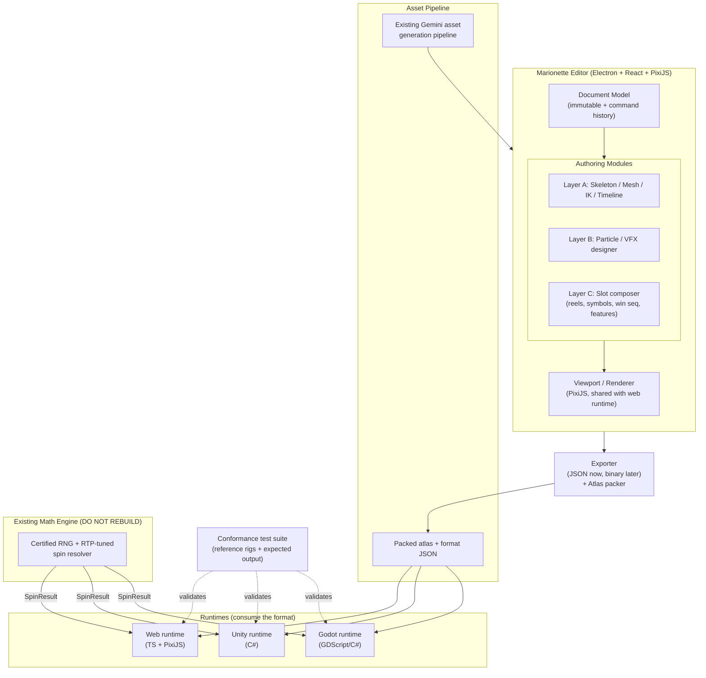

# Marionette — Slot Animation Editor: Engineering Handoff

> Working codename: **Marionette** (a puppet on strings, which is literally what 2D skeletal animation is). Rename freely.
>
> Audience: Claude Code, executing the build phase by phase. Secondary audience: Justin, as the architecture of record.
>
> Status: greenfield. Nothing exists yet except the integration target (an existing certified slot math engine, see §1.3).

---

## 0. How to read this document (instructions for Claude Code)

1. **Build in the phase order in §9. Do not skip ahead.** Each phase produces a usable artifact. Phase 4 (the slot layer) is worthless if Phase 1 (the animation foundation) is shaky. Resist the urge to scaffold everything at once.
2. **The data format in §6 is the contract.** It is the one thing that is expensive to change later because every runtime depends on it. Treat changes to it as breaking changes with a version bump. Get §6 right before writing much else.
3. **The math engine already exists. Do not rebuild it.** See §1.3 and §8.10. The editor authors presentation only. The presentation layer is a pure function of a `SpinResult` object that the math engine produces.
4. **Undo/redo is architected on day one, not retrofitted.** Every mutation to the document goes through the command system in §8.1. There is no other legal way to change the document. This is non-negotiable and is the single most common reason editor codebases rot.
5. **There is a hard legal boundary on Spine.** See §2.3. Implement skeletal animation from first principles. Do not copy Spine's runtime source, and do not claim format compatibility with Spine.

---

## 1. What we are building

### 1.1 Goal

A desktop authoring tool capable of producing the full visual presentation of a top-tier 2D slot game, at roughly the production quality of Pragmatic Play titles (Gates of Olympus, Sweet Bonanza, The Dog House, Sugar Rush, Big Bass Bonanza). That means animated characters that idle and react, symbol animations, tumble/cascade choreography, particle-heavy win presentation (coin showers, sparkle bursts, light rays, glow), feature and free-spin cinematics, and the win-escalation sequences (big win, mega win, etc.).

The editor exports a portable data format. Separate runtimes play that format back in web, Unity, and Godot. The existing math engine drives outcomes at runtime.

### 1.2 What "Pragmatic level" actually decomposes into

Three distinct capability layers, each of which is its own subsystem:

- **Layer A — Skeletal animation (the Spine-equivalent).** Bones, weighted meshes, IK, skins, a timeline. This is what animates a character.
- **Layer B — Particles and VFX.** Coin showers, sparkles, rays, glow, trails, blend modes. A large fraction of the "juice" in a Pragmatic game is this, not bone animation. Spine does not do this. It needs to be a real subsystem.
- **Layer C — Slot composition.** The grid/reels, symbol-to-animation mapping, the win presentation sequencer, feature and free-spin flow editing, and tumble/cascade choreography. This is what turns animations into a game.

Under all three sits a **shared runtime** (one per target platform) and the **existing math engine**.

### 1.3 The existing math engine (integration target, do not rebuild)

There is already a validated slot math engine: provably-fair HMAC-SHA256 RNG, double-entry ledger, RTP tuned and verified in the 95.5 to 96.2 percent band via Monte Carlo, and already ported to C# for Unity with confirmed parity. Marionette does not touch any of this. The math engine is the source of truth for outcomes. Marionette authors presentation, and the runtime feeds it a `SpinResult` from the math engine. See §8.10 for the exact boundary.

This is also why the architecture is certifiable: outcomes come from the certified RNG, and presentation is a deterministic display of those outcomes. Never let presentation influence outcome.

---

## 2. Scope, framing, and boundaries (read before estimating anything)

### 2.1 Honest framing

This is a large, multi-phase build. A full Spine-class editor plus a particle system plus a slot composer is, for a staffed team of three to five, a nine to eighteen month effort. Solo with heavy AI assistance, the wall-clock is longer and the variance is enormous, driven almost entirely by how much polish each subsystem demands rather than by the algorithms.

The way a senior team makes that tractable is **phase independence**: every phase ends with something you can actually use. After Phase 1 you have a working bone-puppet editor, which already covers a large share of real slot animation needs (idle loops, simple win reactions, sprite-on-bone motion). You do not need the whole thing to get value. Build to milestones, not to completeness.

### 2.2 Non-goals

- **3D.** Pure 2D skeletal. No 3D rigging, no skeletal-3D.
- **Frame-by-frame animation.** This is a skeletal tool. Hand-drawn cel animation is out of scope.
- **Rebuilding the math engine.** Covered above. Hard line.
- **A general-purpose tool for the public.** This is yours, scoped to your runtimes and your games. Skip every feature that exists only to serve users you do not have. The lack of a generality tax is your single biggest advantage over Spine. Use it.
- **Matching Spine feature-for-feature.** Path constraints, deep curve-editing ergonomics, and the eight-hours-a-day polish that took Esoteric years are explicitly deferred or dropped unless a specific game needs them.

### 2.3 Legal boundary on Spine (important)

The underlying techniques (skeletal animation, linear blend skinning, inverse kinematics, dopesheet timelines) are general computer science and are fine to implement independently. The specific Spine runtime source code and Spine's proprietary format details are licensed. Implement everything from first principles. Do not copy Spine runtime code, do not vendor it, and do not advertise or rely on binary format compatibility with Spine. The data format in §6 is modeled on the well-understood general structure of skeletal formats, which is fine; it is our own format.

---

## 3. System architecture



Key relationships:

- The **editor viewport and the web runtime share the same renderer** (PixiJS). Build the web runtime renderer first and let the editor viewport reuse it. This is the single largest leverage point in the whole project: one of your three runtimes is nearly free.
- The **exporter** is the only thing that writes the format. Runtimes only read it. Never let a runtime depend on editor internals.
- The **conformance suite** is how three runtimes stay honest. You already did exactly this discipline ("byte-for-byte parity") for the math engine port. Apply it here.

---

## 4. Tech stack (with rationale)

| Concern | Choice | Why |
|---|---|---|
| App shell | **Electron + React + TypeScript** | Plays to your TS strength, gives local filesystem access for projects and atlases, and shares code with the web runtime. Tauri is a smaller-binary alternative but the JS ecosystem leverage and your familiarity make Electron the lower-friction call. |
| Viewport + runtime renderer | **PixiJS v8 (WebGL)** | Mature, fast 2D WebGL. Handles skinned meshes, blend modes, and particles at 60fps. Backs both the editor viewport and the web runtime from one codebase. This choice is load-bearing; do not swap it casually. |
| Editor UI panels | **React** + a docking library (**dockview** or **rc-dock**) | Dockable, resizable panels are table stakes for a pro tool. Do not hand-roll docking. |
| State (UI/ephemeral) | **Zustand** | Selection, active tool, camera, panel layout. Ephemeral, not part of the document. |
| State (document) | **Custom immutable model + command history** (see §8.1) | The project being edited needs undo/redo and serialization. Zustand is for UI, not the document. Keep these separate. |
| Math | small custom 2D affine lib (2x3 matrices) | 2D affine is trivial and avoids 3D overhead. `gl-matrix` is acceptable if you prefer a dependency. |
| Triangulation | **earcut** to start; `cdt2d`/`poly2tri` later for quality | Ear clipping is fine for v1 meshes. Upgrade to constrained Delaunay when triangle quality on deformation matters. |
| Atlas packing | **maxrects-packer** (or similar) | Pack sprite regions into pages on export. |
| Particles | build on **@pixi/particle-emitter** as the runtime, custom designer UI in editor | Gives a proven emitter model; you author the configs in-editor. |
| Tests | **Vitest** (unit) + the conformance suite (cross-runtime) | The conformance suite is the important one. See §8.11. |
| Unity runtime | **C#**, Unity's `Mesh`/`MeshRenderer` API | You are already in Unity. Skinning via dynamic mesh updates. |
| Godot runtime | **GDScript** or **C#**, `MeshInstance2D`/`ArrayMesh` | Per target. |

---

## 5. Repository structure (monorepo)

Use a pnpm + Turborepo monorepo (matches your DankDeals stack experience).

```
marionette/
  apps/
    editor/                 # Electron + React app
      src/
        main/               # Electron main process (filesystem, windows)
        renderer/           # React app
          document/         # document model + commands + history
          editor-state/     # zustand stores (selection, tool, camera)
          viewport/         # PixiJS viewport, gizmos, overlays
          panels/           # dockable panels (hierarchy, timeline, inspector, assets)
          modules/
            skeleton/       # Layer A: bone tools
            mesh/           # Layer A: mesh edit + weight paint
            constraints/    # Layer A: IK / transform
            timeline/       # Layer A: dopesheet + curves
            particles/      # Layer B: particle designer
            slot/           # Layer C: reels, symbols, win seq, features
          export/           # exporter + atlas packer
  packages/
    format/                 # the data format types + schema + validators (SHARED)
    runtime-core/           # platform-agnostic skeleton solve (TS), shared logic
    runtime-web/            # TS + PixiJS playback (also powers editor viewport)
    math-bridge/            # SpinResult types + adapter to the existing engine
    conformance/            # reference rigs + expected outputs + harness
  runtimes/
    unity/                  # C# runtime (separate, mirrors runtime-core logic)
    godot/                  # Godot runtime
  docs/
```

The `packages/format` package is imported by the editor, the web runtime, and the conformance harness. The Unity and Godot runtimes reimplement the same logic in their languages and are validated against the same conformance fixtures.

---

## 6. The data format (the contract)

This is the most important section. Define these types in `packages/format` first. JSON for now; a binary encoding is a Phase 5 optimization with the same logical schema.

```typescript
// ---------- Root ----------
export interface SkeletonDocument {
  formatVersion: string;          // semver of THE FORMAT (bump on breaking changes)
  name: string;
  hash: string;                   // content hash, for runtime cache-busting
  bones: Bone[];                  // ordered; parents always precede children
  slots: Slot[];                  // setup-pose draw order
  skins: Skin[];
  ikConstraints: IkConstraint[];
  transformConstraints: TransformConstraint[];
  events: EventDef[];
  animations: Record<string, Animation>;
  atlas: AtlasRef;
}

// ---------- Setup pose ----------
export interface Bone {
  name: string;
  parent: string | null;          // null = root
  length: number;
  x: number; y: number;           // local translation relative to parent
  rotation: number;               // degrees
  scaleX: number; scaleY: number;
  shearX: number; shearY: number;
  transformMode:
    | 'normal'
    | 'onlyTranslation'
    | 'noRotationOrReflection'
    | 'noScale'
    | 'noScaleOrReflection';
}

export interface Slot {
  name: string;
  bone: string;                   // bone this slot rides on
  color: RGBA;
  darkColor?: RGBA;               // optional, for tint/two-color effects
  attachment: string | null;      // active attachment in setup pose
  blendMode: BlendMode;
}

export type BlendMode = 'normal' | 'additive' | 'multiply' | 'screen';

export interface Skin {
  name: string;                   // 'default' or a named variant
  // slot name -> attachment name -> attachment
  attachments: Record<string, Record<string, Attachment>>;
}

export type Attachment =
  | RegionAttachment
  | MeshAttachment
  | ClippingAttachment
  | PointAttachment
  | BoundingBoxAttachment;

export interface RegionAttachment {
  type: 'region';
  path: string;                   // atlas region name
  x: number; y: number;           // offset from slot bone
  rotation: number;
  scaleX: number; scaleY: number;
  width: number; height: number;
  color: RGBA;
}

export interface MeshAttachment {
  type: 'mesh';
  path: string;
  uvs: number[];                  // flattened (u,v) per vertex
  triangles: number[];            // index triples
  hullLength: number;             // count of perimeter (hull) vertices
  width: number; height: number;
  color: RGBA;
  edges?: number[];               // for editor wireframe display only
  // VERTEX ENCODING:
  // - Unweighted mesh: `vertices` is a flat [x,y,x,y,...] in slot-bone space,
  //   and `bones` is omitted.
  // - Weighted (skinned) mesh: `bones` is present, and `vertices` uses the
  //   variable-length encoding below.
  vertices: number[];
  bones?: number[];
  // Weighted encoding (when `bones` present), per vertex, concatenated:
  //   [ boneCount,
  //     boneIndex, vx, vy, weight,        // contribution of bone 1 (in that bone's space)
  //     boneIndex, vx, vy, weight, ... ]  // repeated boneCount times
  // Final vertex position = sum over bones of weight * (boneWorldMatrix * (vx,vy)).
}

export interface ClippingAttachment {
  type: 'clipping';
  end: string;                    // slot name where clipping ends
  vertices: number[];             // clip polygon
  color: RGBA;
}

export interface PointAttachment {
  type: 'point';                  // an anchor (muzzle flash origin, etc.)
  x: number; y: number;
  rotation: number;
}

export interface BoundingBoxAttachment {
  type: 'boundingbox';
  vertices: number[];             // hit/region polygon
}

// ---------- Constraints ----------
export interface IkConstraint {
  name: string;
  bones: string[];                // 1 or 2 bones in the chain
  target: string;                 // bone acting as the IK target
  mix: number;                    // 0..1 blend
  bendPositive: boolean;          // elbow/knee direction
}

export interface TransformConstraint {
  name: string;
  bones: string[];
  target: string;
  // mix factors per channel
  mixRotate: number; mixX: number; mixY: number; mixScaleX: number; mixScaleY: number; mixShearY: number;
  // offsets applied from target to constrained bones
  offsetRotation: number; offsetX: number; offsetY: number; offsetScaleX: number; offsetScaleY: number; offsetShearY: number;
}

// ---------- Animation ----------
export interface Animation {
  duration: number;               // seconds
  bones: Record<string, BoneTimelines>;
  slots: Record<string, SlotTimelines>;
  ik: Record<string, Keyframe<IkFrame>[]>;
  transform: Record<string, Keyframe<TransformFrame>[]>;
  deform: DeformTimelines;        // per skin -> slot -> attachment -> vertex offsets over time
  drawOrder: DrawOrderKeyframe[];
  events: EventKeyframe[];
}

export interface BoneTimelines {
  rotate?: Keyframe<{ angle: number }>[];
  translate?: Keyframe<{ x: number; y: number }>[];
  scale?: Keyframe<{ x: number; y: number }>[];
  shear?: Keyframe<{ x: number; y: number }>[];
}

export interface SlotTimelines {
  attachment?: { time: number; name: string | null }[];   // stepped by nature
  color?: Keyframe<{ color: RGBA }>[];
}

export interface Keyframe<T> {
  time: number;                   // seconds
  value: T;
  curve: CurveType;
}

export type CurveType =
  | 'linear'
  | 'stepped'
  | { type: 'bezier'; cx1: number; cy1: number; cx2: number; cy2: number };

export interface IkFrame { mix: number; bendPositive: boolean }
export interface TransformFrame { mixRotate: number; mixX: number; mixY: number /* ...as needed */ }

export type DeformTimelines = Record<string, Record<string, Record<string,
  Keyframe<{ offsets: number[] }>[]   // per-vertex (dx,dy) offsets from setup mesh
>>>;

export interface DrawOrderKeyframe { time: number; order: string[] }  // slot names in draw order
export interface EventKeyframe { time: number; name: string; intValue?: number; floatValue?: number; stringValue?: string }
export interface EventDef { name: string; intValue?: number; floatValue?: number; stringValue?: string }

// ---------- Atlas ----------
export interface AtlasRef { pages: AtlasPage[] }
export interface AtlasPage {
  file: string;                   // texture filename
  width: number; height: number;
  regions: AtlasRegion[];
}
export interface AtlasRegion {
  name: string;
  x: number; y: number; w: number; h: number;
  rotated: boolean;               // packed rotated 90deg
  offsetX: number; offsetY: number;     // trim offsets
  originalW: number; originalH: number; // pre-trim size
}

// ---------- Shared ----------
export interface RGBA { r: number; g: number; b: number; a: number }   // 0..1 each
```

Notes for Claude Code:

- **Bone ordering invariant:** bones are stored so every parent precedes its children. The world-transform pass is then a single forward iteration. Enforce this invariant in the exporter and validate it on load.
- **Setup pose vs animation:** the document stores a setup pose (the rest state). Animations store deltas/values that are applied on top of the setup pose per frame. The runtime resets to setup pose each frame, then applies the active animation(s), then solves constraints, then computes world transforms, then deforms meshes.
- **Per-frame solve order (memorize this, all runtimes must match):**
  1. Reset all bones to setup pose.
  2. Apply animation timelines (bone transforms, slot colors/attachments, deform offsets, draw order, fire events).
  3. Solve constraints in order: IK, then transform constraints.
  4. Compute world transforms (single forward pass given the ordering invariant).
  5. Skin meshes (weighted vertex positions from world matrices) and apply deform offsets.
  6. Render in current draw order with per-slot blend mode and color.
- Provide a JSON Schema and a runtime validator in `packages/format`. Validate on import. A malformed document should fail loudly, not silently render wrong.

---

## 7. Core principle: the math/presentation boundary

Stated once, here, because it governs the slot layer and the runtime:

> The certified math engine produces a `SpinResult`. The presentation authored in Marionette is a **pure, deterministic function of that `SpinResult`**. Presentation never decides anything about the outcome. Given the same `SpinResult`, the visuals are identical every time.

This is how real regulated slots are built, it matches how your existing engine is structured, and it is what keeps the games certifiable. Any design that lets the animation layer influence which symbols land or how much is won is wrong and must be rejected.

---

## 8. Subsystems in detail

### 8.1 Document model and command/history system (build this first, in Phase 0)

Every change to the document is a `Command`. There is no other way to mutate the document. This is the spine of the editor.

```typescript
export interface Command {
  readonly label: string;                 // for the undo menu
  do(doc: DocumentModel): void;
  undo(doc: DocumentModel): void;
  // Optional: merge a stream of small commands into one undo step.
  // e.g. dragging a bone fires many MoveBone commands -> coalesce into one.
  coalesceWith?(prev: Command): Command | null;
}

export class History {
  private past: Command[] = [];
  private future: Command[] = [];
  private coalesceWindowMs = 250;
  private lastAt = 0;

  execute(cmd: Command, doc: DocumentModel) {
    cmd.do(doc);
    const now = performance.now();
    const prev = this.past[this.past.length - 1];
    if (prev && cmd.coalesceWith && now - this.lastAt < this.coalesceWindowMs) {
      const merged = cmd.coalesceWith(prev);
      if (merged) this.past[this.past.length - 1] = merged;
      else this.past.push(cmd);
    } else {
      this.past.push(cmd);
    }
    this.future.length = 0;     // a new action clears redo
    this.lastAt = now;
  }

  undo(doc: DocumentModel) {
    const cmd = this.past.pop();
    if (!cmd) return;
    cmd.undo(doc);
    this.future.push(cmd);
  }

  redo(doc: DocumentModel) {
    const cmd = this.future.pop();
    if (!cmd) return;
    cmd.do(doc);
    this.past.push(cmd);
  }
}
```

Rules:

- The `DocumentModel` exposes mutation methods that are only ever called from inside `Command.do`/`undo`. UI never mutates the document directly.
- Coalescing matters for usability. A drag is hundreds of tiny moves but must be one undo step. Selection-driven gizmo edits, timeline scrubbing edits, and weight-paint strokes all coalesce.
- Serialization (`save`) snapshots the `DocumentModel`. Loading rebuilds it and resets `History`.
- Keep commands small and composable. A "create bone with attachment" is a composite command made of primitive ones.

### 8.2 Editor state vs document state (keep separate)

- **Document state** (in `DocumentModel`, undoable, saved): bones, slots, skins, attachments, constraints, animations, atlas refs.
- **Editor state** (in Zustand, ephemeral, not saved beyond layout prefs): current selection, active tool, viewport camera (pan/zoom), playback position, panel layout, which animation is being edited.

Mixing these is a classic mistake. Selecting a bone is not an undoable document change. Moving a bone is. Keep the wall between them.

### 8.3 Viewport and renderer

PixiJS viewport with:

- Pan/zoom camera (space-drag to pan, scroll to zoom around cursor).
- Layered rendering: the skeleton/meshes on the content layer, editor overlays (bone outlines, mesh wireframe, gizmos, selection highlights) on an overlay layer that is not part of the exported scene.
- **Gizmos** (move/rotate/scale handles). Budget real time here. Hit detection with a pixel tolerance, snapping (grid, angle increments with a modifier key), and modifier behaviors (shift to constrain axis, alt to duplicate). Gizmos that feel good are deceptively hard and are worth getting right because you live in them.
- Bone rendering as the standard tapered diamond shape from root to tip, with selection and hover states.

Build the **runtime renderer in `packages/runtime-web` first**, then have the viewport import it to draw the actual skeleton, and draw overlays on top. This guarantees the editor shows exactly what the web runtime will show, and it gets you the web runtime for free.

### 8.4 Skeleton system

- Bone CRUD as commands. Create-by-drag (click parent, drag to set length and initial rotation).
- Reparenting (with cycle prevention; reparenting must keep the bone's world transform stable by recomputing its local transform).
- The world-transform pass per §6 solve order. 2D affine via 2x3 matrices. Keep it in `runtime-core` so editor and runtime share it.
- Setup pose editing vs animation editing are different modes. In setup mode you edit the rest pose. In animation mode, edits create keyframes (see §8.7).

### 8.5 Mesh, skinning, and weight painting (the hard subsystem, Phase 2)

This is the largest single subsystem and where Spine's Professional tier (and most of the build difficulty) lives. Plan for it to take the longest.

Three sub-tools:

1. **Mesh creation/editing.** Start from a region attachment, generate a mesh. Add/move/delete vertices, define edges, triangulate (earcut on the hull plus interior points). Provide an automatic grid-fill and an auto-perimeter-trace as starting points so the artist is not placing every vertex by hand.
2. **Skinning / bone binding.** Bind a mesh to one or more bones. Convert unweighted vertices to the weighted encoding in §6.
3. **Weight painting.** A brush-based UI to paint per-vertex bone weights, with normalization (weights per vertex sum to 1), a per-bone heat-map view, and smoothing. This is the part that is genuinely hard to make usable. Give it: brush size/strength, add/subtract/smooth modes, a max-influences-per-vertex cap (4 is standard for runtime cost), and auto-normalization. Weight-paint strokes coalesce into single undo steps.

Skinning math is standard 2D linear blend skinning: final position is the weighted sum of each binding bone's world matrix applied to that vertex's bone-local coordinate. Put it in `runtime-core`.

Deform animation (animating the mesh vertices themselves over time, on top of skinning) is the `deform` timeline in §6. The editor edits per-vertex offsets at keyframes; the runtime interpolates and adds them after skinning.

### 8.6 IK and constraints

- **One-bone and two-bone IK:** analytic, closed-form. Two-bone IK (the law-of-cosines solution for an arm/leg with a target and a bend direction) covers the overwhelming majority of slot character needs. Implement these first and well.
- **Chain IK (FABRIK or CCD):** optional, deferred unless a game needs long chains (tentacles, tails, rope).
- **Transform constraints:** drive one bone's channels from another with mix factors and offsets. Useful for secondary motion and follow-through.
- Constraints are solved in §6 order (IK then transform) before world transforms. Constraint parameters are themselves animatable (the `ik`/`transform` timelines).

### 8.7 Timeline and animation system

The dopesheet is the second-biggest UX time sink after weight painting. It is a complex stateful UI; budget accordingly.

Requirements:

- A dopesheet showing tracks per bone/slot/etc. with keyframes.
- Keyframe selection (single, box, multi), drag to move in time, copy/paste, ripple.
- A curve editor for bezier easing per keyframe (drag the two control points), plus linear and stepped curve types.
- A playhead with scrubbing, play/pause/loop, and a frame/seconds display. Default working rate 30 or 60 fps but store times in seconds (rate-independent).
- Multiple named animations per document (idle, win, anticipation, land, etc.), switchable from the editor state.
- "Auto-key": in animation mode, editing a bone creates or updates a keyframe at the playhead. This is how animators expect to work.
- Onion-skinning (optional, deferred): ghost of previous/next frames.

The runtime's animation application (sampling timelines at time t with the right interpolation) lives in `runtime-core` and is exercised by the conformance suite.

### 8.8 Particle and VFX system (Layer B, Phase 3)

This is what makes it look like Pragmatic and what Spine alone cannot do. Build a particle designer that authors emitter configs played back by `@pixi/particle-emitter` (web) and reimplemented in Unity/Godot.

Author-time controls per emitter: spawn rate and shape (point, line, circle, rect), lifetime, start/end of velocity, acceleration/gravity, scale-over-life, color/alpha-over-life, rotation, blend mode, texture (or animated frames), and trails. Preview live in the viewport.

The slot-specific effects you will build presets for:

- **Coin shower / coin burst** (the big-win staple): gravity-driven coin sprites with rotation and a spawn arc.
- **Sparkle / star burst:** additive blend, short lifetime, scale-down.
- **Light rays / god rays:** rotating additive sprite fans (often a shader/sprite rather than particles; support both).
- **Glow and pulse:** additive sprites tweened on win-state.
- **Trails:** ribbon trails on moving elements.

Particle effects are referenced by name from the slot layer's win sequencer (§8.10) so a "mega win" can trigger "coinShowerLarge" plus "rayBurst" plus a screen flash.

### 8.9 Atlas pipeline

- Import sprites (your Gemini-generated 4K assets feed in here). Support per-sprite trim (strip transparent borders, store the offset).
- Pack into atlas pages on export (maxrects), respecting max page size for the target (mobile-friendly, e.g. 2048 or 4096). Allow multiple pages.
- Emit the `AtlasRef` in §6 and the packed PNGs. Support the existing `rembg` transparency handling already in your asset pipeline so generated assets drop in cleanly.

### 8.10 Slot composition layer (Layer C, Phase 4)

This is what turns the animation tool into a slot editor. It is where the math engine integrates.

Components:

- **Grid/reel definition.** Configurable: classic reel strips (5x3), scatter-pay grids (6x5, as in Gates of Olympus), cluster grids (7x7, as in Sugar Rush). Define grid dimensions and the symbol layout source (RNG-driven placement comes from the math engine, not authored here).
- **Symbol library.** Each symbol maps to a set of skeletal animations: `idle`, `win` (or `anticipation`), and `land`. Map symbol IDs to documents/animations authored in Layers A and B.
- **Win presentation sequencer.** A timeline/state-machine that, given a `SpinResult`, choreographs: which winning symbols animate, particle bursts, the win-amount counter rollup, and the big/mega/epic win escalation thresholds. Authored as named sequences keyed off result fields.
- **Feature and free-spin flows.** Trigger animations (scatter landing), intro/outro cinematics, multiplier displays (the Gates of Olympus multiplier orbs), retrigger handling. Authored as a flow graph: states and transitions driven by `SpinResult.features`.
- **Tumble/cascade choreography.** For Sweet Bonanza / Sugar Rush mechanics: given the ordered `cascades` steps in the result, choreograph explode-out of winning symbols, gravity-drop of survivors, and refill from the top, looping until the result's cascade list is exhausted.

The integration boundary, concretely:

```typescript
// packages/math-bridge

export type SymbolId = string;

// Produced by the EXISTING certified math engine. The editor never computes this.
export interface SpinResult {
  spinId: string;
  bet: number;
  grid: SymbolId[][];            // final symbol layout (post all cascades)
  wins: WinLine[];
  totalWin: number;
  features: FeatureEvent[];      // free spins, multipliers, etc.
  cascades?: CascadeStep[];      // ordered tumble steps, if any
  rngProof: string;              // provably-fair proof token (passthrough, displayed only)
}

export interface WinLine {
  symbol: SymbolId;
  positions: [row: number, col: number][];
  amount: number;
  multiplier?: number;
}

export interface FeatureEvent {
  type: 'freeSpinsAwarded' | 'multiplierApplied' | 'retrigger' | string;
  data: Record<string, number | string>;
}

export interface CascadeStep {
  removed: [row: number, col: number][];   // symbols that exploded this step
  refill: { col: number; symbols: SymbolId[] }[];  // new symbols dropping in
  stepWin: number;
}

// The presentation runtime consumes a SpinResult and plays the authored sequences.
// presentation: (result: SpinResult, scene: SlotScene) => deterministic playback.
// Same result in -> identical visuals out. Always.
export interface SlotScene {
  grid: GridConfig;
  symbols: Record<SymbolId, SymbolAnimSet>;
  winSequencer: WinSequenceConfig;
  featureFlows: FeatureFlowGraph;
}
```

Build a stub/mock math engine in `math-bridge` that emits canned `SpinResult` objects so the slot layer can be developed and tested before wiring the real engine. Then the adapter to the real engine is a thin layer that maps the engine's output into `SpinResult`.

### 8.11 Runtimes and conformance testing

Three runtimes (web, Unity, Godot). They must produce identical results from the same format. Enforce this with a conformance suite, the same discipline you used for the math engine port.

- `packages/conformance` holds reference rigs (small skeletons with meshes, IK, deform, events) plus **expected outputs**: bone world transforms and skinned vertex positions sampled at specified animation times, serialized to JSON fixtures.
- The web runtime runs these in CI and asserts it matches the fixtures within a tight epsilon.
- The Unity and Godot runtimes run the same fixtures (load the rig, sample at the same times, dump transforms/vertices) and a comparison script asserts parity against the same JSON.
- Any runtime that drifts fails CI. This is how three independent implementations stay honest over time. Generate the fixtures from `runtime-core` (the TS reference) and treat it as the source of truth for behavior.

---

## 9. Phased roadmap

Build in this order. Each phase has an acceptance milestone. Do not start a phase before the previous one's milestone passes. Effort bands are rough, solo with heavy AI assistance, and the variance is large.

| Phase | Scope | Acceptance milestone | Rough effort (solo + AI) |
|---|---|---|---|
| **0. Foundations** | Monorepo, Electron+React shell, PixiJS viewport, `packages/format` types + validator v0, `DocumentModel` + `History` (undo/redo), save/load, basic panels. | Create a bone, move/rotate it, save the file, reload it, undo/redo works. | 2 to 4 weeks |
| **1. Bone puppet (Tier 0)** | Bone hierarchy tools, region attachments, atlas import + pack, the dopesheet with keyframes + bezier curves, animation playback, `runtime-web` plays an exported animation. | Rig a sprite character, author an idle loop, play it identically in the editor and in the web runtime. | 4 to 8 weeks |
| **2. Rigging (Tier 2, the hard one)** | Mesh creation/edit, triangulation, skinning, weight painting, two-bone IK, transform constraints, skins, deform timelines. | A mesh-deformed character with a weighted, IK-driven limb animating smoothly, played in editor and web runtime. | 2 to 4 months |
| **3. VFX / particles (Layer B)** | Particle designer, emitter runtime, the slot effect presets (coin shower, sparkle, rays, glow, trails), blend modes. | Author a big-win coin-shower + ray-burst effect and play it. | 4 to 8 weeks |
| **4. Slot composer (Layer C)** | Grid/reel config, symbol library, win sequencer, feature/free-spin flows, tumble choreography, `math-bridge` integration with a mock then the real engine. | A playable slot scene driven by the real math engine: animated symbols, a win sequence, a free-spin trigger, and a working tumble cascade. | 2 to 4 months |
| **5. Production hardening** | Binary export, atlas optimization, Unity + Godot runtimes, conformance suite green across all three, mobile performance profiling, build pipeline. | One full game shipped through Marionette to web + Unity, conformance-parity verified. | 2 to 4 months |

A staffed team of three to five would compress the calendar substantially by parallelizing (one on the editor core, one on rigging, one on runtimes, one on the slot layer). Solo, it is sequential and long, but you have a usable bone-puppet tool after Phase 1 and a real character-animation tool after Phase 2.

---

## 10. Risk register (where it will hurt, and what to do)

| Risk | Severity | Mitigation |
|---|---|---|
| Weight painting UX is hard to make usable | High | Ship a basic-but-correct version in Phase 2 (brush, normalize, smooth, heat-map), iterate later. Do not gold-plate before the rest works. Provide auto-weight from bone proximity as a starting point so manual paint is touch-up, not from-scratch. |
| Timeline/dopesheet complexity balloons | High | Build the minimum that supports keying + bezier + scrub in Phase 1. Defer onion-skinning, ripple-edit niceties, graph-editor polish. |
| Undo/redo retrofitted late = rewrite | High | Already mitigated: §8.1 is Phase 0. Enforce "all mutations are commands" from commit one. |
| Three runtimes drift | High | Conformance suite (§8.11) from Phase 1 onward. `runtime-core` (TS) is the behavioral source of truth. |
| Format churn breaks everything | Medium | Lock §6 early, version it, validate on load, bump on breaking changes. Resist ad-hoc field additions; add deliberately. |
| Gizmos feel bad | Medium | Budget dedicated time in Phase 0/1. Pixel-tolerance hit testing, snapping, modifier keys. Test by actually using them daily. |
| Scope creep toward "general Spine" | Medium | §2.2 non-goals. Build only what your games need. Reject features that serve hypothetical users. |
| Particle perf on mobile | Medium | Cap particle counts, pool aggressively, profile on a real device in Phase 5. Pragmatic-level juice with mobile budgets is a real constraint. |
| Legal exposure re: Spine | Medium | §2.3. First-principles implementation, own format, no Spine runtime code. |
| Mesh deform was never actually needed | Low-but-worth-checking | If your symbol animations turn out to be mostly sprite-on-bone (many slot symbols are), Phase 2's mesh work could be deferred and you ship characters faster with Tier-0/1 rigs. Validate against your real symbol designs before committing the months. |

---

## 11. Engineering conventions (for Claude Code)

- **TypeScript strict mode** everywhere. No `any` in `packages/format` or `runtime-core`; those are the load-bearing packages.
- **Commands for all document mutations.** Reviewer rule: a PR that mutates `DocumentModel` outside a `Command` is rejected.
- **`runtime-core` is platform-agnostic and dependency-light.** No PixiJS imports in `runtime-core`; rendering is the renderer's job, solving is core's job. This is what lets the same logic move to C#/Godot.
- **Conformance fixtures are generated from `runtime-core`** and committed. Changing solve behavior requires regenerating fixtures and is a deliberate, reviewed act.
- **Tests:** Vitest for units (math, format validation, command do/undo round-trips). The do/undo round-trip test is mandatory for every command: do then undo must return the document to a deep-equal prior state.
- **Performance:** the viewport and runtime target 60fps. Pool objects (particles, sprites, mesh buffers). Avoid per-frame allocation in the solve/render loop.
- **No em-dashes** in docs, comments, or UI copy. Use commas, parentheses, or separate sentences.
- **Commit discipline:** one subsystem per branch, milestone-gated per §9.

---

## 12. Phase 0: literal first steps for Claude Code

Do these in order. Stop and verify each works before the next.

1. Scaffold the pnpm + Turborepo monorepo per §5. Set up `apps/editor` as an Electron + React + TypeScript app that opens a window with three empty dockable panels (hierarchy left, viewport center, inspector right) using dockview.
2. Create `packages/format` with the types from §6 and a JSON Schema validator. Add a Vitest test that validates a hand-written minimal document (one root bone, one slot, one region attachment, one one-second idle animation with two rotate keyframes).
3. Create `packages/runtime-core` with the 2D affine matrix lib and the world-transform pass (§6 solve order, steps 1 and 4 only for now). Unit-test that a parent rotation correctly transforms a child bone's world position.
4. Create `packages/runtime-web` with a PixiJS scene that loads a `SkeletonDocument`, builds bone graphics (tapered diamonds), and draws region attachments at their world transforms. No animation yet, just the setup pose.
5. Wire the editor viewport to import `runtime-web` and render the loaded document. Add pan/zoom camera.
6. Implement `DocumentModel` and `History` from §8.1. Implement two commands: `CreateBone` and `MoveBone` (with coalescing). Wire a "create bone by drag" tool and a "select + move" gizmo. Add undo/redo keybindings.
7. Implement save (serialize `DocumentModel` to the format JSON) and load (parse, validate, rebuild, reset history). Use Electron's filesystem APIs in the main process.

When you can create a bone by dragging, move it with a gizmo, undo/redo cleanly, save the file, and reload it to the same state, Phase 0 is done and Phase 1 begins.

---

*End of handoff. The data format (§6), the command system (§8.1), and the math/presentation boundary (§7) are the three things that must be right early. Everything else is replaceable.*
