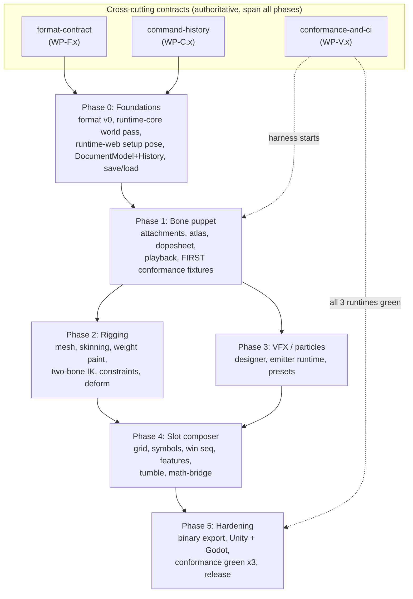

# Marionette: Master Development Plan

> Entry point for the build. This is the navigation and governance layer; it does not duplicate
> subsystem detail. Each phase and each cross-cutting contract has its own plan of record under
> `docs/plan/`. Read this first, then go to the document you are about to work in.
>
> Authoritative spec: `MARIONETTE_HANDOFF.md`. Session memory and the enforced rules: `CLAUDE.md`.
> Status: Phases 0 to 4 complete and green in CI-verifiable form (their acceptance harnesses pass; see the
> status tracker in section 9). Phase 5 is in progress: the headless-CI-verifiable spine is landed and green
> (G5.8 spinSeed, WP-5.1 binary codec + twins, WP-5.0 export-profile core, WP-5.5 cross-language vectors +
> native CI scaffold, WP-5.2 variant selector, the G5.3 A.2 coverage meta-test); the native-runtime,
> device, release, and one reviewed format-contract change are the remainder. Continue at
> `docs/plan/phase-5-production-hardening.md` (kickoff: `PHASE_5_KICKOFF.md`, section 0.1).

---

## 1. What we are building (one paragraph)

Marionette is a desktop authoring tool (Electron + React + PixiJS v8) that produces the full visual
presentation of top-tier 2D slot games (Pragmatic Play class). It is three subsystems over a shared
runtime: Layer A, a Spine-equivalent skeletal animation editor (bones, weighted meshes, IK, skins, a
timeline); Layer B, a particle and VFX designer (coin showers, sparkles, rays, glow, trails); and Layer C,
a slot composer (reels, symbol-to-animation mapping, a win-presentation sequencer, feature and free-spin
flows, tumble choreography). It exports one portable data format that web, Unity, and Godot runtimes play
back. A pre-existing certified math engine produces outcomes; Marionette authors presentation only, as a
pure deterministic function of those outcomes.

## 2. The five laws (full text in `CLAUDE.md`)

A reviewer rejects any PR that breaks one of these. They are restated in every phase plan and enforced by
lint, CI guard tests, and the do/undo round-trip harness, not by reviewer trust alone.

1. **Math/presentation boundary.** Presentation is a pure, deterministic function of a `SpinResult`.
   Presentation never influences outcome. Same `SpinResult` in, identical visuals out.
2. **All mutations are commands.** Every change to `DocumentModel` goes through the Command/History system.
   The do/undo round-trip test is mandatory per command.
3. **The format is the contract.** `packages/format` is the one expensive-to-change artifact. It is
   semver-versioned, validated on import, and changed only through the format-change checklist.
4. **Legal boundary on Spine.** First-principles implementation, our own format, no Spine runtime code,
   no binary-format compatibility claims.
5. **Phase independence, build in order.** Each phase ends with a usable artifact. Do not skip ahead.

## 3. How to use this plan

- **Build in phase order (0 to 5).** Do not start a phase until its predecessor milestone is green
  (Law 5). Each phase plan opens with an entry gate that lists exactly what must be green first.
- **Read the relevant cross-cutting contract before touching its layer.** The format, command, and
  conformance docs are authoritative and span all phases. The phase plans reference them rather than
  restating them, so a change to a contract is made in one place.
- **Work packages have stable IDs.** Phase work packages are `WP-<phase>.<n>` (for example `WP-2.3`).
  Cross-cutting work packages are lettered: `WP-F.x` (format), `WP-C.x` (command/history), `WP-V.x`
  (conformance, testing, CI). IDs are defined once in their owning document; if two documents disagree,
  the owning document wins and the other is the bug.
- **Every phase plan ends with a runnable Definition-of-Done acceptance script and a reviewer sign-off
  checklist.** A phase is not done until that script passes and the checklist is signed.

## 4. Document map

| Document | Owns | Read when |
|---|---|---|
| `MARIONETTE_HANDOFF.md` | The authoritative spec (format types, subsystem detail, roadmap, risks) | Always the final word on intent |
| `CLAUDE.md` | The enforced rules, solve order, state wall, Definition of Done, build order | Every session; loaded into context |
| `docs/DEV_PLAN.md` (this file) | Navigation, dependency graph, milestone gates, status, glossary | First, then go to the target doc |
| `docs/plan/cross-cutting/format-contract.md` | `packages/format`: types, validator, typed errors, JSON Schema, versioning, the slot-scene contract | Before touching anything that imports the format |
| `docs/plan/cross-cutting/command-history.md` | `DocumentModel`, `Command`, `History`, coalescing, the do/undo harness, the command catalog | Before adding or changing any command |
| `docs/plan/cross-cutting/conformance-and-ci.md` | Reference rigs, expected-output fixtures, the cross-runtime harness, the testing pyramid, CI/CD | Before touching solve behavior or the pipeline |
| `docs/plan/phase-0-foundations.md` | Monorepo, Electron shell, format v0, runtime-core world pass, runtime-web setup pose, DocumentModel + History, save/load | The active plan; start here |
| `docs/plan/phase-1-bone-puppet.md` | Bone tools, region attachments, atlas pipeline, the dopesheet, playback, first conformance fixtures | Phase 1 |
| `docs/plan/phase-2-rigging.md` | Mesh edit, triangulation, skinning, weight painting, two-bone IK, transform constraints, skins, deform | Phase 2 |
| `docs/plan/phase-3-vfx-particles.md` | Particle designer, emitter runtime, slot effect presets, blend modes, determinism | Phase 3 |
| `docs/plan/phase-4-slot-composer.md` | Grid/reel config, symbol library, win sequencer, feature flows, tumble, math-bridge | Phase 4 |
| `docs/plan/phase-5-production-hardening.md` | Binary export, atlas optimization, Unity + Godot runtimes, conformance green across three, mobile profiling, release | Phase 5 |

## 5. Phase roadmap and milestone gates

Each phase ships a usable artifact and is gated on its predecessor. Effort bands are the handoff estimates
(solo with heavy AI assistance; variance is large and is driven by polish, not algorithms).

| Phase | Exit milestone (the gate) | Effort band |
|---|---|---|
| **0. Foundations** | Create a bone by dragging, move and rotate it with a gizmo, undo/redo cleanly, save the file, reload to the same state. | 2 to 4 weeks |
| **1. Bone puppet (Tier 0)** | Rig a sprite character, author an idle loop, play it identically in the editor and the web runtime. | 4 to 8 weeks |
| **2. Rigging (the hard one)** | A mesh-deformed character with a weighted, IK-driven limb animating smoothly, played in editor and web runtime. | 2 to 4 months |
| **3. VFX / particles (Layer B)** | Author a big-win coin-shower plus ray-burst effect and play it. | 4 to 8 weeks |
| **4. Slot composer (Layer C)** | A playable slot scene driven by the real math engine: animated symbols, a win sequence, a free-spin trigger, and a working tumble cascade. | 2 to 4 months |
| **5. Production hardening** | One full game shipped through Marionette to web and Unity, conformance parity verified across runtimes. | 2 to 4 months |

The exact, runnable acceptance script for each gate lives in that phase's plan (its "Definition of Done"
section). A gate is binary: the script passes or the phase is not done.

## 6. Dependency graph

Notes on the graph:

- **The three contracts (format, command, conformance) are read first and built into Phase 0 and Phase 1.**
  `runtime-core` is the behavioral source of truth; conformance fixtures are generated from it.
- **Phase 3 (particles) depends on Phase 1, not Phase 2.** A staffed team could run particles in parallel
  with rigging. Solo, the order stays 0 to 5 as written, but the soft dependency is recorded so the
  sequencing is honest.
- **Phase 4 needs Phases 1 to 3 green** because a slot scene composes skeletal animations (1, 2) and named
  particle effects (3), then binds them to a `SpinResult` through `math-bridge`.
- **The conformance harness comes online in Phase 1** (web only) and reaches all three runtimes in Phase 5.

## 7. Global engineering standards (summary; enforced list in `CLAUDE.md`)

These hold from Phase 0. The machine-enforced Definition of Done is the checklist in `CLAUDE.md`; this is the
human-readable summary.

- **TypeScript strict everywhere.** No `any` and no unjustified `as` in `packages/format` or
  `packages/runtime-core` (the load-bearing packages); `no-explicit-any` is an error there.
- **Layered, feature-first, barrel-only.** Dependencies flow inward (UI to application to domain to
  infrastructure). Each module and package exposes one `index.ts`; consumers import only the barrel. No deep
  cross-feature imports. `runtime-core` has no PixiJS. All of this is lint-enforced with CI guard tests that
  prove the bans fire on injected violations.
- **Commands for all document mutations**, with a mandatory do/undo round-trip test per command (and the
  merged-sequence test for coalescing commands).
- **Validate on import, fail loudly** with typed errors at every external boundary (file load, IPC payload).
- **Conformance fixtures regenerated from `runtime-core`** whenever solve behavior changes, behind a
  behavior-change review gate; drift fails CI.
- **60fps target; no per-frame allocation in the solve or render loop; pool** particles, sprites, and mesh
  buffers.
- **No em-dashes** anywhere (docs, comments, UI copy); a grep guard is green in CI.
- **Conventional Commits**, one logical change per commit, refactor and behavior change never share a commit,
  one subsystem per branch, milestone-gated, never merge red CI.

## 8. Risk register (cross-phase summary)

The full register is `MARIONETTE_HANDOFF.md` section 10; each phase plan carries a phase-specific risk
section with mitigations. The load-bearing ones:

| Risk | Where it bites | Mitigation (and where it is planned) |
|---|---|---|
| Weight-painting UX is hard to make usable | Phase 2 | Ship basic-but-correct (brush, normalize, smooth, heat-map, auto-weight from proximity); do not gold-plate. `phase-2-rigging.md` §7. |
| Timeline/dopesheet complexity balloons | Phase 1 | Build the minimum (keying, bezier, scrub); defer onion-skin, ripple, graph-editor polish. `phase-1-bone-puppet.md` §4, §12. |
| Undo/redo retrofitted late becomes a rewrite | All phases | Mitigated by design: commands are Phase 0, Law 2 is enforced by lint. `command-history.md`. |
| Three runtimes drift | Phase 1 onward | Conformance suite, fixtures generated from `runtime-core`. `conformance-and-ci.md`. |
| Format churn breaks everything | All phases | Lock the format early, version it, validate on load, change via the checklist. `format-contract.md`. |
| Mesh deform may never be needed | Phase 2 entry | Risk-first `WP-2.0` validates against real symbol designs before committing months. `phase-2-rigging.md` §4. |
| Particle perf on mobile | Phase 3 and 5 | Cap counts, pool aggressively, profile on a real device. `phase-3-vfx-particles.md`, `phase-5-production-hardening.md` §6. |
| Presentation tempted to decide an outcome | Phase 4 | Law 1; golden-playback determinism tests. `phase-4-slot-composer.md` §10. |

## 9. Status tracker

**Remainder execution order (recorded 2026-07-02, grounded in the verified gap map
`docs/audit/spine-pro-parity-audit.md`).** The Phases 0-4 boxes below were ticked on their CI-verifiable
acceptance with the GUI and WebGL render explicitly carved out as the non-headless remainder. That
remainder is now the active work, executed in phase order BEFORE the remaining Phase 5
native/device/release packages, because a usable authoring artifact per phase (Law 5) requires it:

1. **Phase 2 remainder:** mesh attachment rendering in `runtime-web` and the editor viewport (the
   WP-2.11 renderer slice; every mesh authoring tool is invisible without it), then the authoring
   surfaces over the already-complete command layer: WP-2.1 (mesh tool UI), WP-2.3/2.4 (binding +
   weight painting), WP-2.6/2.7 (constraint authoring + gizmos), WP-2.8 (skins UI), WP-2.9 (deform
   authoring), closing with the WP-2.11 DoD rig visible end to end.
2. **Phase 3 remainder:** GL particle rendering (WP-3.5 remainder) and the designer-panel completion.
3. **Phase 4 remainder:** the GL slot renderer (WP-4.11 remainder) and the scene preview.
4. **Phase 5 continues as planned** (format 0.3.0 with migration + ADR, Unity/Godot runtimes, native
   conformance, device profiling, release pipeline).

Two capabilities the audit found in NO plan document enter through the normal governance process, not
ad hoc: an AnimationState (tracks, crossfade, additive layering) for `runtime-core`/`runtime-web` needs
an ADR plus a work-package home before code, and the parity-depth items (path constraints, physics
constraints, linked meshes, sequences) are format-contract changes gated by `format-contract.md` section 10.

Phases 0 to 4 are complete and green in CI-verifiable form: each phase's Definition-of-Done acceptance is
exercised by a green automated harness (the `phase3:acceptance` script, the Phase 4 golden-playback
determinism lock, and the per-phase conformance fixtures). The standing caveat (`CLAUDE.md`): the editor
GUI, the WebGL pixel-parity image diffs, the live real-engine acceptance step, and the byte-exact
fixture-determinism gate on the pinned Node 22.13.1 are not exercisable in this headless environment, and
the formal human reviewer sign-off in each phase plan is a separate manual step; both are tracked but not
machine-ticked here. A box is ticked when the phase's CI-verifiable acceptance is green.

- [x] **Cross-cutting contracts implemented and green** (format-contract, command-history, conformance-and-ci):
      the format validators/hash, the command/History spine, and the conformance suite (skeleton + effects +
      slot tracks) are landed and gating CI. Formal reviewer signatures remain a manual step.
- [x] **Phase 0 gate:** create, move and rotate, undo/redo, save, reload to identical state. (Model + History +
      `CreateBone`/`MoveBone` + save/load in `packages/document-core`; round-trip tests green.)
- [x] **Phase 1 gate:** rig a sprite, author an idle loop, identical playback in editor and web runtime;
      conformance harness live (web). (`rig-2bone` locked fixture; the `samplePlaybackWorlds` headless parity
      harness; the dopesheet + atlas pipeline.)
- [x] **Phase 2 gate:** mesh-deformed, weighted, IK-driven limb animating smoothly in editor and web runtime.
      (Mesh/skin/IK/transform/skin/deform commands + six conformance families + the `mesh-limb-rig` DoD rig.)
- [x] **Phase 3 gate:** big-win coin-shower plus ray-burst authored and played. (The `megaWin` bundle, the
      runtime-core emitter/sprite/ribbon solve, the particle conformance track, and `pnpm phase3:acceptance`
      11/11 green; the WebGL render + designer panel are the non-headless remainder.)
- [x] **Phase 4 gate:** playable scene driven by the real engine with a win sequence, free-spin trigger, and a
      working cascade. (The `math-bridge` engine boundary, the pure `sequence()` over all six stages, the
      `slot.*` commands, and the golden-playback determinism lock; the live real-engine step and the WebGL
      `TimelinePlayer` render are the non-headless remainder, validated by the committed golden fixtures.)
- [ ] **Phase 5 gate:** one full game shipped to web and Unity with three-runtime conformance parity. (In
      progress: the headless-CI-verifiable spine is landed and green; the native/device/release work and one
      reviewed format-contract change are the remainder. See `docs/plan/phase-5-production-hardening.md` and
      `PHASE_5_KICKOFF.md` section 0.1.) Landed headless slices: G5.8 (the pinned `spinSeed` derivation +
      golden vector), WP-5.1 (the MRNT binary codec + committed binary rig twins + lock), WP-5.0 (the Export
      Profile schema + main-process loader + disjoint-fields guard + frozen ship profile), WP-5.5 TS side
      (the cross-language seed/PRNG/CRC golden vectors + the `conformance-native.yml` scaffold), WP-5.2
      non-GPU (the NORMATIVE texture-variant selector), and the G5.3 A.2 coverage meta-test (gating every
      branch the current fixture schema observes; the unobserved branches are pending `it.todo` entries).
      Deferred: the Unity/Godot native runtimes (WP-5.3/5.4), three-runtime native CI, mobile profiling
      (WP-5.6), the release pipeline (WP-5.7), the ship integration (WP-5.8), the GPU/atlas-packing remainder
      of WP-5.2, and the G5.3 extended rig catalog, which needs bone `transformMode` in the solve plus a
      format MINOR bump (0.2.0 to 0.3.0) for the `drawOrder`/`event` timelines with migration + ADR.

## 10. Glossary

- **SpinResult.** The outcome object produced by the certified math engine (final grid, wins, features,
  cascades, RNG proof). Presentation is a pure function of it. Defined in `packages/math-bridge`.
- **Setup pose.** The rest state stored in the document. Animations store values and deltas applied on top of
  the setup pose; the runtime resets to setup pose each frame before applying the active animation.
- **Solve order.** The fixed six-step per-frame sequence every runtime must match exactly (reset, apply
  timelines, solve constraints IK-then-transform, world transforms, skin plus deform, render). See `CLAUDE.md`.
- **Command / coalesce.** A `Command` is the only legal document mutation, with `do`/`undo`. Coalescing folds
  a stream of small commands (a drag, a scrub, a weight-paint stroke) into a single undo step.
- **LBS (linear blend skinning).** A mesh vertex's final position is the weighted sum of each binding bone's
  world matrix applied to that vertex's bone-local coordinate. Lives in `runtime-core`.
- **Deform.** Animating mesh vertex offsets over time on top of skinning, via the `deform` timeline.
- **IK (inverse kinematics).** Solving bone rotations so a chain tip reaches a target. One-bone and two-bone
  analytic (law-of-cosines) solutions cover the slot character needs.
- **Conformance fixture.** A reference rig plus expected bone transforms and skinned vertex positions sampled
  at set times, generated from `runtime-core` and asserted by every runtime within a pinned tolerance.
- **Atlas.** Packed texture pages plus the `AtlasRef` describing each region (position, trim, rotation). The
  exporter is the only writer.
- **Layers A/B/C.** Skeletal animation (A), particles and VFX (B), slot composition (C). Phases 1 to 2 build
  A, Phase 3 builds B, Phase 4 builds C.
