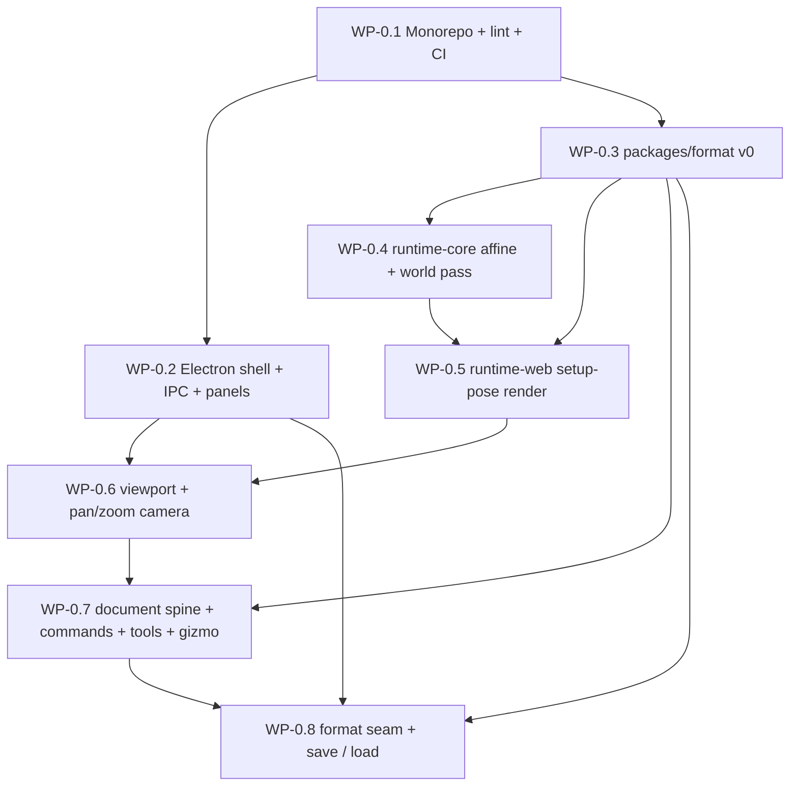

# Phase 0: Foundations

Status: plan of record. Requires senior reviewer sign-off before WP-0.1 starts.
Owner: editor-core. Source of truth: `MARIONETTE_HANDOFF.md` sections 5, 6, 7, 8.1, 8.2, 9, 11, 12.

## 1. Purpose and milestone

Phase 0 builds the smallest end-to-end vertical slice that proves the load-bearing
architecture is sound: the data format, the command/history system, the math/render
split, and the Electron security model. Everything authored after Phase 0 inherits these
decisions, so they must be right before Phase 1 begins.

Milestone (handoff 9 and 12), stated as the acceptance test in section 7 (Definition of Done):

> Create a bone by dragging, move and rotate it with a gizmo, undo and redo cleanly,
> save the file, and reload it to the same state.

Phase 0 is done when the section 7 manual script passes by hand AND the section 7
automated exit gate is green in CI.

## 2. Scope guardrails (what Phase 0 deliberately does NOT build)

Honoring LAW 5 (build in order, do not scaffold everything at once):

- No `packages/math-bridge`, no `packages/conformance`, no `runtimes/unity`, no
  `runtimes/godot`. They belong to Phases 1, 4, and 5. Creating them now is a LAW 5
  violation and a rejected PR.
- No atlas pipeline, no real textures. Region attachments render as a tinted unit
  texture sized to the attachment (real atlas is Phase 1, handoff 8.9).
- No animation playback. `runtime-core` implements solve steps 1 and 4 only (reset,
  world transforms). Steps 2, 3, 5, 6 (timelines, constraints, skinning, blend) are
  Phase 1 and later.
- No timeline, mesh, IK, particles, slot layer.
- No mesh-encoding validator (`packages/format` WP-F.5), no full animation validator
  (WP-F.6), no migration framework (WP-F.8). Per the format contract (section 13), these
  are scheduled in the Phase 0 to Phase 1 transition, before the first `formatVersion`
  bump. Phase 0 ships the format-contract subset listed in WP-0.3.
- Only four packages exist after Phase 0: `packages/format`, `packages/runtime-core`,
  `packages/runtime-web`, and `apps/editor`.

## 3. Cross-cutting documents (referenced, not duplicated)

This plan does not restate the three cross-cutting contracts it depends on. They are
authored and reviewed separately, they are normative, and where a work package here cites
one, the cited contract governs and wins over any summary in this file.

- `docs/plan/cross-cutting/format-contract.md` (`XC-FORMAT`): the data format (handoff 6):
  the type model, the bone-ordering invariant, the `code`-keyed `FormatError` model and
  `ValidationReport`, content hashing, the `CURRENT_FORMAT_VERSION` / `SUPPORTED_FORMAT_MAJOR`
  version gate, the `.` and `./types` export surface, and the change checklist. WP-0.3 and
  WP-0.8 implement the Phase-0 subset of this contract. LAW 3.
- `docs/plan/cross-cutting/command-history.md`: the Command plus History spine (handoff 8.1,
  8.2): the Mutator capability, the memento mandate, the stable-internal-ID identity model
  with `IdFactory`, the dual coalescing strategy (sessions primary, time window fallback),
  the injected clock and composition root, the load/export seam, and the do/undo round-trip
  harness. WP-0.7 and WP-0.8 implement the Phase-0 subset of this contract. LAW 2.
- `docs/plan/cross-cutting/conformance-and-ci.md` (workstream V): the CI pipeline, the
  lint and boundary gates, the testing pyramid, and the conformance fixture format. It OWNS
  the gates this plan relies on: no-Pixi lint plus the CI grep guard (WP-V.10), the em-dash
  lint (WP-V.9 / WP-V.10, INV-6), the commands-without-round-trip-test gate (WP-V.6 / WP-V.10),
  the format semver gate (WP-V.12), CI core and concurrency (WP-V.9 / WP-V.16), and the
  canonical affine/solve layout plus fixture format (appendix A). WP-0.1 and section 7 wire
  these up and prove they fire; they do not re-specify the gates divergently.

## 4. Law and invariant traceability

| Law / Invariant | Enforced primarily in | How it is verified in Phase 0 |
|---|---|---|
| LAW 1 math/presentation boundary | n/a in Phase 0 (no SpinResult yet) | Architecturally reserved. The Phase-0 solve is a pure function of the document: it consumes a `Pose` built from the document and takes NO time input and NO presentation feedback (steps 1 and 4 only). A SpinResult is introduced in Phase 4. |
| LAW 2 all mutations are commands | WP-0.7, WP-0.8 | Structural Mutator capability (unique-symbol brand, command-history Section 3.3) plus boundary lint (cross-cutting WP-V.10) plus the mandatory do/undo round-trip harness and discovery guard (cross-cutting WP-V.6, command-history Section 10). Comparison is over the `DocSnapshot` projection, since loaded models mint fresh internal IDs. |
| LAW 2 round-trip test is automated | WP-0.7 | A command file that exports a `Command` without a registered `CommandSpec` and a passing round-trip test fails the build (cross-cutting WP-V.6, WP-V.10; command-history Section 10.2 discovery guard). |
| LAW 3 format is the contract | WP-0.3, WP-0.8 | `validateDocument` returns a collect-all `ValidationReport` of `code`-keyed `FormatError`s on import; `CURRENT_FORMAT_VERSION` plus the `SUPPORTED_FORMAT_MAJOR` major gate; `HASH_MISMATCH` verification; malformed-fails-loudly tests. Format semver gate is cross-cutting WP-V.12. |
| LAW 4 Spine legal boundary | WP-0.3, WP-0.4 | First-principles types and solve; no vendored Spine source; our own format string. Review checklist item. |
| LAW 5 build in order | WP-0.1 | Only the four Phase-0 packages exist; the Phase-0 forbidden-package CI guard (section 7) fails if any package outside the allowed set appears. |
| INV runtime-core no PixiJS | WP-0.1, WP-0.4 | `no-restricted-imports` on `pixi.js` / `@pixi/*` inside `runtime-core` plus the CI grep guard (cross-cutting WP-V.10). |
| INV runtime-core imports format types only, `import type` only | WP-0.1, WP-0.4 | `runtime-core` imports `@marionette/format/types` with `import type` exclusively; lint bans the value barrel `@marionette/format` and any deep path from `runtime-core` (format WP-F.9, cross-cutting WP-V.10). `verbatimModuleSyntax` makes a non-type import of a type a compile error. |
| INV per-frame solve order | WP-0.4 | World pass is a single forward iteration relying on the validated parent-precedes-child ordering; affine layout and local compose order follow the canonical solve spec (cross-cutting appendix A.3). |
| INV strict TS, no `any`/`as` in format + runtime-core | WP-0.1, WP-0.3, WP-0.4 | tsconfig strict flags plus the no-`any` and no-unjustified-`as` lint scoped to those two packages (cross-cutting WP-V.10, INV-4). |
| INV 60fps, pooling, no per-frame alloc | WP-0.4, WP-0.5, WP-0.6 | WP-0.4 asserts zero allocation in the solve pass via an allocation probe. WP-0.5 (`sync`) and WP-0.6 (camera loop) are best-effort in Phase 0 and are gated for real by the cross-cutting allocation gate WP-V.8 in Phase 2. |
| INV no em-dashes | all | Em-dash lint (cross-cutting WP-V.9 / WP-V.10, INV-6) plus the Phase-0 CI grep guard (section 7). |
| INV conformance fixtures from runtime-core | WP-0.4 (seed), Phase 1 (harness) | WP-0.4 commits a frozen Phase-0 world-transform golden fixture in the canonical fixture layout (cross-cutting A.3) so Phase 1 fixture generation cannot silently change Phase-0 solve. The full harness and `packages/conformance` land in Phase 1 (WP-V.2). Regeneration is a deliberate, reviewed act. |

## 5. Work packages

Each WP lists objective, files created, design notes (with the law it touches), an
ordered task list with stable TASK ids, acceptance criteria, and the tests that must
exist. WPs are independently verifiable.

---

### WP-0.1: Monorepo, tooling, boundary lint, CI skeleton

Objective: a pnpm + Turborepo monorepo (handoff 5) with strict TypeScript, shared
ESLint/Prettier, enforced layer-boundary lint, and a CI workflow that typechecks, lints,
tests, and builds. This WP unblocks all others. It implements the Phase-0 slice of the
cross-cutting CI/lint workstream (conformance-and-ci.md WP-V.9 CI core, WP-V.10 lint
enforcement, WP-V.12 format semver gate, WP-V.16 concurrency and required checks); the
exact rule list, the no-Pixi grep guard, the em-dash rule, the commands-without-test gate,
and the semver gate are OWNED there and are not re-specified here. This WP wires them up,
adds the Phase-0-specific editor process-split boundaries below, and proves the guards fire.

Creates:

```
/
  package.json                 # root, private, workspace scripts, packageManager pin
  pnpm-workspace.yaml          # packages/*, apps/*
  turbo.json                   # build, typecheck, lint, test pipelines + caching
  tsconfig.base.json           # strict compiler options, path aliases
  eslint.config.mjs            # flat config; boundaries + import + type-only rules
  .prettierrc.json
  .prettierignore
  .editorconfig
  .gitignore
  .npmrc                       # pnpm settings (strict-peer-dependencies, etc.)
  .node-version                # pinned Node 22 LTS
  .github/workflows/ci.yml
  docs/plan/phase-0-foundations.md   # this file
  packages/format/package.json       # placeholder scaffolds (no logic yet)
  packages/runtime-core/package.json
  packages/runtime-web/package.json
  apps/editor/package.json
```

Design notes:

- Package manager pinned via root `package.json` `"packageManager": "pnpm@<x.y.z>"`.
  Node pinned via `.node-version` (Node 22 LTS). CI uses the same.
- `tsconfig.base.json` enables, at minimum: `strict: true`, `noUncheckedIndexedAccess`,
  `exactOptionalPropertyTypes`, `noImplicitOverride`, `noFallthroughCasesInSwitch`,
  `useUnknownInCatchVariables`, `noUnusedLocals`, `noUnusedParameters`,
  `forceConsistentCasingInFileNames`, `verbatimModuleSyntax`, `isolatedModules`,
  `skipLibCheck: false`. Module resolution `bundler`. `verbatimModuleSyntax` is
  load-bearing for the runtime-core invariant: it forces a non-type import of a type to be
  a compile error, which is half of the "import type only" enforcement (the other half is
  the boundary lint below). Each package extends base and sets its own `rootDir`/`outDir`.
- ESLint flat config with `@typescript-eslint` (type-checked rules), `eslint-plugin-import`,
  and `eslint-plugin-boundaries`. The repo-wide rules (layer direction, no-Pixi-in-core,
  commands-only, no-`any`, no-em-dash, conventional commits) come from conformance-and-ci.md
  WP-V.10 and are not duplicated here. This WP adds ONE Phase-0-specific concern: the
  editor process-split boundary matrix, which composes with the repo-wide rules.

  Editor process-split boundary elements and the one-allowed-dependency matrix. The split
  exists because the renderer is sandboxed (`sandbox: true`, WP-0.2) and the preload runs in
  an isolated, also-sandboxed context; mixing their import surfaces breaks at runtime:

  | Element type | Path | May import |
  |---|---|---|
  | `format` | `packages/format/**` | nothing in-repo (leaf of the dependency graph) |
  | `runtime-core` | `packages/runtime-core/**` | `@marionette/format/types` ONLY, with `import type` only; never the `format` value barrel, never a deep path, never PixiJS |
  | `runtime-web` | `packages/runtime-web/**` | `format`, `runtime-core`, `pixi.js` |
  | `editor-main` | `apps/editor/src/main/**` | `electron` (app, BrowserWindow, dialog, ipcMain), node builtins (`node:fs`, `node:path`), `editor-shared` |
  | `editor-preload` | `apps/editor/src/preload/**` | `electron` (`contextBridge`, `ipcRenderer`) and `editor-shared` ONLY. NO node builtins (a sandboxed preload importing `fs` fails at runtime), NO PixiJS, NO React, NO `format` value barrel |
  | `editor-shared` | `apps/editor/src/shared/**` | `zod` (isomorphic) and `@marionette/format/types` (`import type` only, zero runtime) ONLY. NO node builtins, NO `electron`, NO PixiJS, NO React, NO `format` value barrel. Must stay isomorphic so it cannot poison the sandboxed preload or renderer |
  | `editor-renderer` | `apps/editor/src/renderer/**` | `format`, `runtime-core`, `runtime-web`, `pixi.js`, `react`, `react-dom`, `zustand`, `dockview`, and `editor-shared` (types only) |

  Allowed importers of `editor-shared` are pinned to exactly `editor-main`, `editor-preload`,
  and `editor-renderer`. `editor-main` and `editor-renderer` may not import each other (the
  process split); `editor-preload` may not import `editor-main` or `editor-renderer`.

- `pixi.js` is explicitly in `editor-renderer`'s allow list: WP-0.6 creates a
  `PIXI.Application` and the content/overlay layers, and WP-0.7 draws gizmo handles with
  `PIXI.Graphics` on the overlay layer. The editor overlay layer is a legitimate Phase-0
  PixiJS site (alongside `runtime-web`). The no-Pixi ban applies to `runtime-core` and
  `packages/format`, never to the renderer.
- `turbo.json` pipelines: `build` (depends on upstream `^build`), `typecheck`, `lint`,
  `test`. Outputs cached: `dist/**`. `test` and `typecheck` declare no outputs.
- LAW 5: the workspace globs match only the four Phase-0 packages plus `apps/editor`. CI
  has a Phase-0 guard step that fails if any directory under `packages/` or `runtimes/`
  outside the allowed set appears (section 7). This guard is Phase-0-specific and is not the
  same as any cross-cutting gate.

Ordered tasks:

- TASK-0.1.1 Initialize root `package.json`, `pnpm-workspace.yaml`, `.npmrc`,
  `.node-version`, `.gitignore`, `.editorconfig`.
- TASK-0.1.2 Author `tsconfig.base.json` with the strict flag set above.
- TASK-0.1.3 Author Prettier config (print width 100, single quotes, trailing commas).
- TASK-0.1.4 Author the ESLint flat config: pull in the conformance-and-ci.md WP-V.10
  rule set, then add the editor process-split element matrix and the runtime-core
  `import type`-only rule (`no-restricted-imports` banning `@marionette/format` and
  `@marionette/format/*` except `@marionette/format/types` inside `runtime-core`).
- TASK-0.1.5 Create the four placeholder package manifests with `name`, `type: module`,
  an `exports` map (for `packages/format`, the `.` and `./types` subpaths per the format
  contract section 3), and per-package `tsconfig.json` extending base. No source logic yet
  beyond an empty `src/index.ts`.
- TASK-0.1.6 Author `turbo.json` pipelines and root scripts: `pnpm -w typecheck`,
  `pnpm -w lint`, `pnpm -w test`, `pnpm -w build`.
- TASK-0.1.7 Author `.github/workflows/ci.yml` per conformance-and-ci.md WP-V.9 / WP-V.16
  (checkout, setup-node pinned, pnpm install with store cache, `turbo run typecheck lint
  test build`, the `ci-pass` aggregation job, concurrency group with cancel-in-progress on
  PRs). Add the Phase-0 forbidden-package guard step and the Phase-0 em-dash grep step that
  back the repo-wide lint rules.
- TASK-0.1.8 Author root `README.md` quickstart (install, dev, test, build) per the
  per-package README convention.

Acceptance criteria:

- [ ] `pnpm install` succeeds from a clean checkout with a committed lockfile.
- [ ] `pnpm -w typecheck`, `pnpm -w lint`, `pnpm -w test`, `pnpm -w build` all exit 0.
- [ ] A deliberate `pixi.js` import added to a scratch file under
      `packages/runtime-core/src` makes `pnpm -w lint` exit non-zero (verified then reverted).
- [ ] A deliberate value import `import { validateDocument } from '@marionette/format'`
      inside `packages/runtime-core/src` makes lint exit non-zero, while
      `import type { SkeletonDocument } from '@marionette/format/types'` passes.
- [ ] A deliberate `any` in `packages/format/src` makes lint exit non-zero (verified then
      reverted).
- [ ] A renderer file importing from `apps/editor/src/main/**`, and a preload file importing
      `node:fs`, each make lint exit non-zero.
- [ ] CI runs green on a no-op PR and red when the forbidden-package guard finds an
      unexpected package directory.

Tests that must exist:

- A lint fixture suite (under `tools/lint-checks` or as CI assertions) that proves the
  runtime-core PixiJS ban, the runtime-core value-barrel ban, the format `any` ban, and the
  editor process-split bans all fire. This is the verification of the boundary guards, run
  in CI, not just documented. It composes with, and does not replace, the cross-cutting
  WP-V.10 lint fixtures.

---

### WP-0.2: Electron + React shell, three dockview panels, secure IPC

Objective: an Electron app that opens one window with three dockview panels (hierarchy
left, viewport center, inspector right), a hardened main/preload/renderer split, and a
typed, validated preload bridge. No file IO yet (that is WP-0.8); this WP defines the
secure channel shape.

Creates:

```
apps/editor/
  electron.vite.config.ts        # main / preload / renderer triple build
  index.html                     # renderer entry, strict CSP meta (prod)
  src/
    main/
      main.ts                    # app lifecycle, BrowserWindow creation, CSP header injection
      window-options.ts          # PURE factory: createWindowOptions() -> BrowserWindowConstructorOptions
      csp.ts                     # PURE: cspForMode('dev' | 'prod') -> string
      ipc/
        register-ipc.ts          # ipcMain.handle wiring, channel allowlist
    preload/
      preload.ts                 # contextBridge.exposeInMainWorld('marionette', api)
    shared/
      ipc-contract.ts            # channel names + Zod request/response schemas (isomorphic)
    renderer/
      main.tsx                   # React root
      App.tsx                    # dockview layout host
      panels/
        index.ts                 # barrel
        hierarchy-panel.tsx      # placeholder
        viewport-panel.tsx       # placeholder (filled by WP-0.6)
        inspector-panel.tsx      # placeholder
      env.d.ts                   # types the window.marionette bridge surface (from editor-shared)
```

Design notes:

- `createWindowOptions()` is a pure function returning the `webPreferences` so the security
  posture is unit-testable without launching Electron. It MUST set `contextIsolation: true`,
  `nodeIntegration: false`, `sandbox: true`, `webSecurity: true`, and a `preload` path. This
  is the single most security-sensitive decision in Phase 0; extracting it makes it
  assertable.
- CSP is split by build mode in `csp.ts`, because electron-vite / Vite HMR in `dev` needs a
  relaxed policy that must never ship to `prod` (ties to risk R0-6):
  - prod: `default-src 'self'; script-src 'self'; style-src 'self' 'unsafe-inline';
    img-src 'self' data:; connect-src 'self'; object-src 'none'; base-uri 'none';
    frame-src 'none'`. No remote origins. PixiJS v8 runs from bundled assets, so no CDN.
  - dev: the prod policy plus `connect-src 'self' ws://localhost:* http://localhost:*` for
    the HMR websocket, and `'unsafe-eval'` added to `script-src` only if the dev bundler
    requires it. The relaxation is gated by the build mode and is asserted by a unit test to
    be absent from the prod string.
  - The policy is applied both as a `<meta http-equiv>` in `index.html` (prod) and via
    `session.defaultSession.webRequest.onHeadersReceived` in `main.ts` (authoritative), so
    a header is always present even if the meta tag is stripped.
- IPC is request/response only (`ipcMain.handle` / `ipcRenderer.invoke`), namespaced
  channels (e.g. `app:getVersion`). The preload exposes a small typed object, never the raw
  `ipcRenderer`. Every channel name is a const in `editor-shared/ipc-contract.ts`; the main
  process rejects any channel not in the allowlist. The contract module is isomorphic (Zod
  plus `import type` from `@marionette/format/types` only), so it can be imported by main,
  preload, and the renderer without leaking node, electron, or PixiJS into the sandbox.
- Every IPC payload is validated with Zod at the main-process boundary before use
  (boundary-validation invariant). A schema failure returns a typed error, never throws raw.
  For WP-0.2 the only channel is `app:getVersion` (returns app version); the contract module
  is the pattern WP-0.8 extends with file IO.
- dockview hosts three panels with a persisted default layout (hierarchy 20% left, viewport
  center, inspector 20% right). Panel content is placeholder text in this WP.
- The process split is enforced by the WP-0.1 boundary matrix: renderer code cannot import
  `src/main/**`; preload cannot import node builtins; shared stays isomorphic.

Ordered tasks:

- TASK-0.2.1 Add Electron, electron-vite, React, react-dom, dockview, zod as `apps/editor`
  dependencies; wire `electron.vite.config.ts` for the main/preload/renderer triple.
- TASK-0.2.2 Implement `window-options.ts` pure factory with the hardened `webPreferences`.
- TASK-0.2.3 Implement `csp.ts` (`cspForMode`) and wire `main.ts`: app ready, create window
  from the factory, load the renderer, quit on all-closed (non-darwin), inject the
  mode-correct CSP header via `onHeadersReceived`.
- TASK-0.2.4 Implement `shared/ipc-contract.ts`: channel const map, Zod schemas for
  `app:getVersion`. Implement `register-ipc.ts` with the allowlist and per-channel
  validation. Implement `preload.ts` exposing the typed `marionette` bridge.
- TASK-0.2.5 Implement renderer `main.tsx` plus `App.tsx` mounting dockview with the three
  placeholder panels and a saved default layout.
- TASK-0.2.6 Add `apps/editor` scripts: `dev` (electron-vite dev), `build`, `start`.

Acceptance criteria:

- [ ] `pnpm --filter editor dev` opens one window showing three labelled panels in the
      hierarchy/viewport/inspector layout, with zero CSP violations in the dev console (the
      relaxed dev CSP permits the HMR websocket).
- [ ] A production build (`pnpm --filter editor build && pnpm --filter editor start`) opens
      with the strict prod CSP and zero CSP violations.
- [ ] Renderer DevTools console shows zero Node globals (`typeof require === 'undefined'`,
      `typeof process === 'undefined'` in the renderer).
- [ ] `window.marionette.getVersion()` returns the app version; `window.ipcRenderer` and
      `window.require` are undefined.
- [ ] An IPC call on a non-allowlisted channel is rejected with a typed error.

Tests that must exist:

- Unit (Vitest): `createWindowOptions()` returns `contextIsolation: true`,
  `nodeIntegration: false`, `sandbox: true`, `webSecurity: true`. A regression test that
  fails if any of the four flips. This is the security guard.
- Unit: `cspForMode('prod')` contains neither `'unsafe-eval'` nor any `ws:`/`http:` origin;
  `cspForMode('dev')` contains the HMR websocket origin. A regression test that fails if the
  dev relaxation leaks into the prod string.
- Unit: `ipc-contract` Zod schemas accept valid payloads and reject malformed ones with a
  typed error (no throw of a bare string).

---

### WP-0.3: packages/format v0 (Phase-0 subset of the format contract)

Objective: the data-format contract at version `0.1.0`, implementing the Phase-0 subset of
`docs/plan/cross-cutting/format-contract.md`: the Zod schema source of truth and derived
types (WP-F.1), the structural validator and typed error model (WP-F.3), the semantic graph
validator (WP-F.4), content hashing (WP-F.7), the public barrel and `./types` boundary
(WP-F.9), and the golden corpus with the Phase-0 minimal fixture (WP-F.10). The format
contract governs every decision here and wins over any summary. LAW 3 and LAW 4.

Mesh encoding (WP-F.5), the full animation validator (WP-F.6), the JSON Schema artifact
(WP-F.2), and the migration framework (WP-F.8) are deferred to the Phase 0 to Phase 1
transition per the format contract section 13 (LAW 5). The Phase-0 minimal fixture does not
exercise meshes or constraints, so the deferred validators are not on the milestone path.

Creates (mirrors the format-contract layout, Phase-0 subset only):

```
packages/format/
  package.json                # exports map: "." (validators) and "./types" (type-only)
  src/
    schema/                   # Zod schemas: the single source of truth
      color.ts                # rgbaSchema
      bone.ts                 # boneSchema, transformModeSchema
      slot.ts                 # slotSchema, blendModeSchema
      attachment.ts           # 5 attachment schemas + discriminated union
      animation.ts            # animationSchema + bone/slot timeline schemas, curve union
      atlas.ts                # atlasRefSchema, pageSchema, regionSchema
      document.ts             # skeletonDocumentSchema (root)
      index.ts                # internal barrel for schemas
    types.ts                  # z.infer derived types (type-only public surface)
    validate/
      errors.ts               # FormatError (code-keyed) + FormatErrorCode + FormatValidationError
      structural.ts           # Zod safeParse -> typed errors with JSON Pointer paths
      semantic.ts             # referential integrity + ordering invariant (graph layer)
      report.ts               # ValidationReport aggregation (collect ALL errors)
      index.ts                # validateDocument, parseDocument
    hash/
      canonicalize.ts         # deterministic canonical JSON (hash excluded)
      hash.ts                 # computeContentHash, verifyContentHash
    version/
      constants.ts            # CURRENT_FORMAT_VERSION, SUPPORTED_FORMAT_MAJOR
    index.ts                  # PUBLIC BARREL (validators, hash, version, types re-export)
  test/
    fixtures/
      minimal.json            # one root bone, one slot, one region, one 1s idle (2 rotate keys)
      invalid/                # one document per Phase-0-reachable error code, one fault each
    schema.accept.test.ts
    schema.reject.test.ts
    validate.purity.test.ts
    semantic.bones.test.ts
    semantic.refs.test.ts
    hash.stability.test.ts
    hash.verify.test.ts
    corpus.valid.test.ts
    corpus.invalid.test.ts
    barrel.surface.test.ts
```

Design notes:

- Single source of truth (format contract section 7): Zod schemas in `schema/*` are the
  source; types are derived via `z.infer` and re-exported through `types.ts`. There is no
  hand-written `.d.ts`. All object schemas are `.strict()` (closed unions and closed
  objects), every `number` is `.finite()`, and range refinements (`COLOR_RANGE`,
  `CURVE_BEZIER_X_RANGE`) are encoded per format contract section 4.1.
- `validateDocument` returns a `ValidationReport`, NOT a single-error `Result`. It collects
  ALL errors in one pass so an artist or tool sees every problem at once. It never throws on
  malformed data; malformed input is surfaced as errors. `parseDocument` is the throwing
  wrapper for call sites that prefer it (it throws `FormatValidationError` carrying the
  report). Signatures, from the format contract section 8.1:
  ```ts
  export function validateDocument(
    input: unknown,
    options?: { verifyHash?: boolean }  // default true
  ): ValidationReport;

  export interface ValidationReport {
    readonly ok: boolean;
    readonly document: SkeletonDocument | null; // non-null only when ok === true
    readonly errors: readonly FormatError[];    // ALL errors, not just the first
    readonly warnings: readonly FormatWarning[];
  }

  export function parseDocument(input: unknown, options?: { verifyHash?: boolean }): SkeletonDocument;
  ```
- The error model is `code`-keyed with a JSON Pointer `path`, per the format contract
  section 8.2 (NOT a `kind`-keyed union). Phase-0-reachable codes are a subset of
  `FormatErrorCode`:
  ```ts
  export interface FormatError {
    readonly code: FormatErrorCode;   // e.g. 'SCHEMA_SHAPE', 'BONE_ORDER_VIOLATION'
    readonly path: string;            // JSON Pointer, e.g. "/bones/3/parent"
    readonly message: string;         // human readable, no em-dashes
    readonly detail?: Readonly<Record<string, string | number | boolean>>;
  }
  ```
  The full `FormatErrorCode` union is owned by the format contract; Phase 0 implements and
  exercises at least: `SCHEMA_SHAPE`, `UNSUPPORTED_FORMAT_VERSION`, `BONE_NAME_DUPLICATE`,
  `BONE_PARENT_MISSING`, `BONE_ORDER_VIOLATION`, `SLOT_NAME_DUPLICATE`,
  `SLOT_BONE_MISSING`, `SLOT_ATTACHMENT_MISSING`, `SKIN_DEFAULT_MISSING`, `SKIN_SLOT_UNKNOWN`,
  `ATLAS_REGION_DUPLICATE`, `ATTACHMENT_REGION_MISSING`, `COLOR_RANGE`, `CURVE_BEZIER_X_RANGE`,
  and `HASH_MISMATCH`. (There is NO separate `BONE_NO_ROOT` code: a rootless or cyclic bone set
  surfaces as `BONE_ORDER_VIOLATION` per format-contract section 5.4 and Open Decision 8, which the
  contract governs over this summary.)
- Validation layers run in order, all errors collected (format contract section 8.3):
  (1) version gate, (2) structural Zod layer, (3) semantic graph layer, (6) hash layer. The
  mesh layer (4) and the full animation layer (5) are deferred; the Phase-0 semantic layer
  still checks animation bone/slot timeline-key resolution and strictly-ascending times for
  the simple idle fixture.
- Version gate (format contract section 8.5, 10): `version/constants.ts` exports
  `CURRENT_FORMAT_VERSION = '0.1.0'` and `SUPPORTED_FORMAT_MAJOR = 0`. The gate reads
  `formatVersion`; a MAJOR above current or an unparseable version yields
  `UNSUPPORTED_FORMAT_VERSION` and stops. WP-0.8 references these exact identifiers.
- Hash ownership (format contract section 9): `computeContentHash` and `verifyContentHash`
  live HERE, in `hash/`, not in the editor. Canonicalization sorts object keys ascending,
  preserves array order (array order is semantic), excludes the `hash` field, and SHA-256
  hex-encodes the canonical UTF-8 bytes. `validateDocument` verifies a non-empty `hash` on
  import (`HASH_MISMATCH`) unless `verifyHash: false`. A `hash: ""` draft skips verification.
- The bone-ordering invariant (format contract section 5) is enforced HERE on import: every
  bone's parent index is strictly less than its own; all parents resolve; at least one root;
  names unique. `runtime-core` then trusts this and does a single forward pass without
  re-sorting (boundary checks, core trusts).
- Export surface (format contract section 3): the package has TWO entry points,
  `.` (the value barrel: validators, hash, version, types re-export) and `./types`
  (type-only, zero runtime, so `runtime-core` imports types without pulling Zod). The
  WP-0.1 `import/no-internal-modules` rule is configured to allow exactly these two subpaths
  for `@marionette/format` and to forbid all deep imports; this reconciles the one-barrel
  house rule with the required `./types` subpath.
- LAW 4: types are modeled on the general structure of skeletal formats and are our own. No
  Spine source, no claim of Spine binary compatibility. Reviewer checklist item.
- No `any`, no non-const `as` (the one justified `as` is the post-parse narrow of validated
  `unknown` to `SkeletonDocument`, isolated to `structural.ts`).

Ordered tasks:

- TASK-0.3.1 Author Zod schemas for the Phase-0 type surface in handoff 6 (root, bone, slot,
  skin, the five attachment kinds, bone/slot animation timelines, atlas, RGBA), all
  `.strict()` and `.finite()` with the section 4.1 range refinements.
- TASK-0.3.2 Derive `types.ts` via `z.infer` and wire the `.` and `./types` exports.
- TASK-0.3.3 Implement `validate/errors.ts` (`FormatErrorCode`, `FormatError`,
  `FormatValidationError`) and `validate/report.ts` (collect-all `ValidationReport`).
- TASK-0.3.4 Implement `validate/structural.ts` (Zod safeParse to `FormatError[]` with JSON
  Pointer paths) and `validate/index.ts` (`validateDocument`, `parseDocument`).
- TASK-0.3.5 Implement `validate/semantic.ts`: bone ordering/uniqueness/root, slot bone and
  setup-attachment resolution, default-skin existence, skin-slot keys, atlas region
  uniqueness, region path resolution, and the simple animation timeline-key resolution and
  strict-ascending times for the idle fixture.
- TASK-0.3.6 Implement `hash/canonicalize.ts` and `hash/hash.ts`; integrate hash
  verification into `validateDocument` (step 6).
- TASK-0.3.7 Author `version/constants.ts`.
- TASK-0.3.8 Hand-write `test/fixtures/minimal.json` per the milestone fixture spec and the
  `invalid/` corpus (one fault per Phase-0-reachable code).
- TASK-0.3.9 Author the public barrel `index.ts` and write the test files below.

Acceptance criteria:

- [ ] `validateDocument(minimal.json)` returns `{ ok: true }` whose `document` deep-equals
      the parsed fixture, with zero errors and zero warnings.
- [ ] `validateDocument` is pure: the input object is referentially unchanged after the call,
      and two calls return deep-equal reports.
- [ ] Removing `formatVersion` from a copy yields a `SCHEMA_SHAPE` error with the correct
      JSON Pointer path; a `formatVersion` of `'1.0.0'` yields `UNSUPPORTED_FORMAT_VERSION`.
- [ ] Reordering bones so a child precedes its parent yields `BONE_ORDER_VIOLATION`; a
      missing parent yields `BONE_PARENT_MISSING`; a rootless or cyclic set yields
      `BONE_ORDER_VIOLATION` (no separate `BONE_NO_ROOT` code, per format-contract section 5.4).
- [ ] A slot referencing a missing bone yields `SLOT_BONE_MISSING`; an unknown attachment
      `type` yields `SCHEMA_SHAPE` (closed unions).
- [ ] A document with three independent shape faults reports three errors (collect-all), not
      one.
- [ ] `computeContentHash` is stable across runs and independent of object key insertion
      order; reordering the `bones` array changes it; a tampered `hash` yields `HASH_MISMATCH`
      and `verifyHash: false` suppresses that check.
- [ ] The barrel's exported keys match the allowed public surface exactly (no internal helper
      leak); `@marionette/format/types` is importable with `import type` and compiles to a
      side-effect-free module.

Tests that must exist:

- `schema.accept.test.ts`: the minimal document parses; it contains exactly one root bone,
  one slot, one region attachment, and one 1.0s animation with two rotate keyframes.
- `schema.reject.test.ts`: unknown key, `NaN`/`Infinity`, out-of-range RGBA, and bezier
  `cx` outside `[0,1]` each rejected with the right code.
- `validate.purity.test.ts`: input unchanged after validation; two calls deep-equal.
- `semantic.bones.test.ts`: duplicate name, missing parent, child-before-parent, no-root map
  to the right codes.
- `semantic.refs.test.ts`: slot bone missing, setup attachment missing, region path missing,
  duplicate atlas region.
- `hash.stability.test.ts` and `hash.verify.test.ts`: key-shuffle stability, bones-reorder
  change, tampered-hash `HASH_MISMATCH`, `verifyHash:false` and empty-hash paths.
- `corpus.valid.test.ts` and `corpus.invalid.test.ts`: the minimal fixture passes clean; the
  table-driven `invalid/` corpus asserts each fixture's single expected `code`.
- `barrel.surface.test.ts`: the barrel surface equals the allowed list exactly.

---

### WP-0.4: packages/runtime-core: affine 2x3 lib + world-transform pass

Objective: the platform-agnostic math and solve core (handoff 6 solve order, steps 1 and 4
only): a 2x3 affine matrix library and the world-transform pass that turns a setup pose into
world matrices in a single forward iteration. INV (no PixiJS; format types only via
`import type`; single forward pass; no per-frame allocation).

Creates:

```
packages/runtime-core/
  src/
    index.ts                   # public barrel
    math/
      affine.ts                # Mat2x3 type + ops
    skeleton/
      pose.ts                  # Pose: pre-allocated typed-array storage keyed by bone index
      build-pose.ts            # buildPose(doc): Pose (allocates once, ordered bone index)
      world-transform.ts       # resetToSetupPose(pose); computeWorldTransforms(pose)
  test/
    golden/
      phase0-world-transform.json  # frozen golden, canonical fixture layout (cross-cutting A.3)
    affine.test.ts
    world-transform.test.ts
    determinism.test.ts
    golden.test.ts
```

Design notes:

- The affine convention and the local compose order are NOT decided here. They are the
  cross-runtime solve spec OWNED by `conformance-and-ci.md` appendix A.3, which pins the
  serialized world transform as the 2x3 affine `[a, b, c, d, tx, ty]` in document bone order
  (column-vector form). `runtime-core` implements that layout exactly so Unity and Godot
  mirror it later. For reference, the layout is matrix `[[a, c, tx], [b, d, ty]]` stored as
  `[a, b, c, d, tx, ty]`, `transformPoint(m, x, y) = (a*x + c*y + tx, b*x + d*y + ty)`, world
  composition `child.world = parent.world * child.local`, and local composition
  `local = Translate * Rotate * Shear * Scale` with rotation in radians converted from the
  degrees stored in the format. Any change to this is a cross-runtime contract change under
  the conformance plan, not a local edit.
- `Pose` stores local and world matrices in pre-allocated `Float64Array`s sized to bone
  count, indexed by the document's bone order. `computeWorldTransforms` allocates nothing on
  repeated calls (60fps / no-per-frame-alloc invariant). The forward pass relies on the
  parent-precedes-child ordering invariant VALIDATED by `packages/format` (WP-0.3) on import;
  it does NOT re-sort. This is the validate-before-solve boundary: the editor and
  `runtime-web` validate a document via `packages/format` before constructing a `Pose`, so
  `runtime-core` trusts the ordering precondition.
- Steps 2, 3, 5, 6 are out of scope. The Phase-0 solve takes NO time input. It is pure: same
  `Pose` in, identical world matrices out (determinism, a precondition for LAW 1 later).
- `runtime-core` imports `@marionette/format/types` with `import type` ONLY. Zero rendering,
  zero PixiJS, zero DOM, zero Zod runtime weight. This is what lets the solve port to
  C#/Godot unchanged.
- Golden fixture (cross-cutting suggestion, INV-2): WP-0.4 commits
  `test/golden/phase0-world-transform.json`, the canonical serialized world-transform output
  for the minimal rig at the setup pose, in the conformance fixture layout (appendix A.3).
  This is a deliberate, reviewed seed so that when Phase 1 stands up `packages/conformance`
  and generates fixtures from `runtime-core`, the Phase-0 solve behavior is already pinned and
  cannot silently change. Regenerating it is a deliberate act under the conformance plan A.6,
  not a casual edit.

Ordered tasks:

- TASK-0.4.1 Implement `affine.ts`: `identity`, `multiply`, `compose(x,y,rotDeg,sx,sy,shx,shy)`,
  `transformPoint`, `invert`, `getRotationDeg`, `getTranslation`. Pure; no allocation in hot
  ops beyond returning the result tuple.
- TASK-0.4.2 Implement `pose.ts` storage and `build-pose.ts` (allocate once from a validated
  `SkeletonDocument`, capture parent indices).
- TASK-0.4.3 Implement `resetToSetupPose` (step 1) writing each bone's local matrix from its
  setup transform.
- TASK-0.4.4 Implement `computeWorldTransforms` (step 4): forward pass, root local==world,
  child world = parent world * child local.
- TASK-0.4.5 Generate and commit `test/golden/phase0-world-transform.json` from this code.
- TASK-0.4.6 Write the four test files.

Acceptance criteria:

- [ ] `multiply(identity, m)` deep-equals `m`; `multiply(m, invert(m))` is identity within
      epsilon 1e-9.
- [ ] The mandated parent-rotation test passes (see tests).
- [ ] `computeWorldTransforms` performs zero heap allocation across repeated calls, asserted
      by an allocation probe (run N calls under `--expose-gc`, force GC, assert heap delta is
      below a tight byte threshold), not merely by typed-array identity. Identity reuse proves
      the buffers are shared; the probe proves nothing new is allocated.
- [ ] Running the solve twice on the same `Pose` yields bit-identical world arrays.
- [ ] The committed golden fixture re-derives byte-identically from this code (drift check);
      a deliberate change to the compose order makes `golden.test.ts` fail.

Tests that must exist:

- `world-transform.test.ts` (MANDATED): root bone at origin rotated 90 degrees, child bone
  parented to root with local `x = length, y = 0`. After
  `resetToSetupPose` + `computeWorldTransforms`, the child's world translation equals
  approximately `(0, length)` within epsilon 1e-9 and its world rotation equals 90 degrees. A
  second case with parent translation plus rotation confirms composition.
- `affine.test.ts`: identity, multiply associativity on a fixed triple, invert round-trip,
  `transformPoint` against hand-computed values.
- `determinism.test.ts`: same document solved twice yields equal world arrays; the allocation
  probe asserts zero per-call heap growth.
- `golden.test.ts`: regenerate the world transform for the minimal rig and assert byte
  equality with the committed golden fixture.

---

### WP-0.5: packages/runtime-web: PixiJS scene, setup pose only

Objective: a PixiJS v8 renderer that takes a validated `SkeletonDocument`, builds the
setup-pose scene (tapered-diamond bones plus region attachments at their world transforms),
and renders it with no animation. This renderer is reused by the editor viewport (WP-0.6),
the largest leverage point in the project (handoff 8.3).

Creates:

```
packages/runtime-web/
  src/
    index.ts                    # public barrel: SkeletonView
    scene/
      skeleton-view.ts          # SkeletonView: owns a PIXI.Container, sync(doc) -> updates scene
      bone-graphics.ts          # tapered-diamond geometry from bone length + world matrix
      attachment-sprites.ts     # region attachment -> PIXI.Sprite at world transform
      map-transform.ts          # PURE: Mat2x3 -> { position, rotation, scale } for Pixi
    test/
      map-transform.test.ts
      scene-graph.test.ts
```

Design notes:

- Separation: `runtime-web` does NOT solve. It imports `runtime-core`, calls
  `buildPose` + `resetToSetupPose` + `computeWorldTransforms`, then maps the resulting world
  matrices onto Pixi display objects. Rendering is the renderer's job; solving is core's job
  (INV). The renderer is a Phase-0 PixiJS site, alongside the editor overlay layer.
- Validate-before-solve boundary (cross-cutting suggestion): the renderer's entry point
  validates the incoming document via `packages/format` `validateDocument` before handing it
  to `runtime-core`. A document that fails validation is rejected with the typed
  `FormatError` and never reaches the solve. `runtime-core` therefore trusts the
  parent-precedes-child precondition.
- Bones render as the standard tapered diamond from root to tip (handoff 8.3), drawn with
  `PIXI.Graphics`, positioned by the bone's world matrix. Draw order follows slot order.
- Region attachments render as `PIXI.Sprite`s. Phase 0 has no atlas, so the sprite uses a
  bundled 1px white texture, tinted by the attachment/slot color and sized to the attachment
  `width`/`height`, positioned and rotated by the slot bone's world transform composed with
  the attachment offset. Real atlas textures arrive in Phase 1 (8.9).
- Object reuse: `SkeletonView.sync(doc)` updates existing display objects in place when the
  bone/slot count is unchanged; it only creates or destroys objects on structural change. The
  no-per-frame-allocation claim for `sync` is BEST-EFFORT in Phase 0 (in-place update is
  designed in, but not gated by a test here). The hard allocation gate for the render path is
  the cross-cutting WP-V.8 allocation gate in Phase 2.
- `map-transform.ts` is pure (no Pixi import) so the matrix-to-display mapping is testable in
  CI without a GPU/WebGL context.

Ordered tasks:

- TASK-0.5.1 Add `pixi.js` v8 to `runtime-web`; implement `map-transform.ts` pure mapper and
  unit-test it.
- TASK-0.5.2 Implement `bone-graphics.ts` tapered-diamond geometry builder.
- TASK-0.5.3 Implement `attachment-sprites.ts` region-to-sprite builder (1px tinted texture,
  sized, transformed).
- TASK-0.5.4 Implement `SkeletonView`: validate via `packages/format`, build container,
  `sync(doc)` updating bones and attachments from the solved pose in draw order, in-place
  reuse.
- TASK-0.5.5 Write the two test files.

Acceptance criteria:

- [ ] Given the WP-0.3 minimal fixture, `SkeletonView` produces a container with exactly one
      bone graphic and one attachment sprite.
- [ ] The attachment sprite's world position equals the solved world position from
      `runtime-core` within epsilon 1e-6 (asserted via the pure scene-graph description).
- [ ] A document that fails `validateDocument` is rejected before any solve and `SkeletonView`
      surfaces the typed `FormatError`.
- [ ] Calling `sync(doc)` twice with the same doc creates no additional display objects.
- [ ] `runtime-web` builds and is importable by `apps/editor` (proven in WP-0.6).

Tests that must exist:

- `map-transform.test.ts`: world matrix to Pixi position/rotation/scale for a known matrix,
  including a rotated and scaled case.
- `scene-graph.test.ts`: build a `SkeletonView` from the minimal fixture and assert the number
  of bone graphics, number of sprites, draw order, and each sprite's mapped transform against
  `runtime-core` output. Uses a headless scene-description accessor so no WebGL context is
  required in CI.

---

### WP-0.6: Editor viewport: import runtime-web + pan/zoom camera

Objective: mount the `runtime-web` `SkeletonView` inside the dockview viewport panel and add
a pan/zoom camera (space-drag pan, scroll-zoom-around-cursor). Camera lives in Zustand
(ephemeral editor state), strictly separate from the document (handoff 8.2). Provides the
overlay layer that WP-0.7 draws gizmos on.

Creates:

```
apps/editor/src/renderer/
  viewport/
    viewport-panel-content.tsx   # mounts a PIXI.Application into the viewport panel
    camera.ts                    # PURE camera math: screenToWorld, worldToScreen, zoomAt, pan
    camera-controller.ts         # input handlers -> camera store updates (space-drag, wheel)
    layers.ts                    # content layer (SkeletonView) + overlay layer (gizmos)
  editor-state/
    camera-store.ts              # Zustand: { x, y, zoom }, ephemeral, never serialized
  viewport/test/
    camera.test.ts
```

Design notes:

- The viewport hosts two layers: a content layer holding the `runtime-web` `SkeletonView`
  (exactly what the web runtime shows) and an overlay layer for editor-only chrome (grid,
  gizmos, selection). The overlay is never part of the exported scene (handoff 8.3). Both
  layers are PixiJS, which is allowed in `editor-renderer` per the WP-0.1 matrix.
- Validate-before-solve: when the viewport loads a fixture (or an in-memory document) into a
  `SkeletonView`, the document is validated via `packages/format` first (the `SkeletonView`
  entry point does this, WP-0.5). The viewport never hands an unvalidated document to
  `runtime-core`.
- Camera is `{ x, y, zoom }` in a Zustand store. It is editor state: ephemeral, not in the
  `DocumentModel`, not serialized into the format. Mixing camera into the document is the
  classic mistake called out in handoff 8.2; the WP-0.1 boundaries keep them apart.
- `camera.ts` is pure: `screenToWorld` and `worldToScreen` are inverses; `zoomAt(cursor,
  factor)` keeps the world point under the cursor fixed (scroll-zoom-around-cursor). This is
  unit-tested independent of Pixi/DOM.
- Pan is space-drag (hold space, drag to pan), matching handoff 8.3. Wheel zooms around the
  cursor. The controller only writes to the camera store; the render loop reads the store and
  sets the content plus overlay root container transform. Per-frame allocation is BEST-EFFORT
  in Phase 0 (the camera loop reuses the root transform), with the hard allocation gate
  deferred to cross-cutting WP-V.8.

Ordered tasks:

- TASK-0.6.1 Implement `camera-store.ts` (Zustand) and `camera.ts` pure math.
- TASK-0.6.2 Implement `viewport-panel-content.tsx`: create a `PIXI.Application`, mount it into
  the viewport panel, add content + overlay layers via `layers.ts`.
- TASK-0.6.3 Validate and load the minimal fixture (or an in-memory document) into a
  `SkeletonView` on the content layer.
- TASK-0.6.4 Implement `camera-controller.ts`: space-drag pan and wheel zoom-around-cursor,
  writing to the camera store; the render loop applies the store transform each frame.
- TASK-0.6.5 Write `camera.test.ts`.

Acceptance criteria:

- [ ] The viewport panel shows the loaded skeleton (one diamond + one attachment) from the
      shared `runtime-web` renderer.
- [ ] Holding space and dragging pans the view; the skeleton stays under the cursor.
- [ ] Scrolling zooms around the cursor: the world point under the cursor does not move on
      screen (verified by the camera unit test and by eye).
- [ ] The camera is absent from any serialized document (asserted in WP-0.8 save test).

Tests that must exist:

- `camera.test.ts`: `screenToWorld(worldToScreen(p)) == p` within epsilon; `zoomAt` keeps the
  cursor world point fixed across a zoom-in and a zoom-out; pan applies the expected delta. No
  Pixi/DOM required.

---

### WP-0.7: Document mutation spine (model, Mutator, History, commands, tools, gizmo)

Objective: the document mutation spine, implementing the Phase-0 subset of
`docs/plan/cross-cutting/command-history.md` (WP-C.1 model and read model, WP-C.2 Mutator
capability, WP-C.3 command interface plus memento base plus composite, WP-C.4 History with
injected clock, WP-C.5 coalescing with sessions, WP-C.7 round-trip harness plus discovery
guard, and the WP-C.10 Phase-0 command set). It delivers `DocumentModel` (ID-keyed), the
Mutator capability, `History` with an injected clock, the `CreateBone`/`MoveBone`/`RotateBone`
commands, a create-bone-by-drag tool, a select-and-move-and-rotate gizmo, and undo/redo
keybindings. LAW 2 governs this entire WP. The command-history contract wins over any summary
here.

Creates:

```
apps/editor/src/renderer/
  composition-root.ts             # builds the production DocumentEnvironment (clock + IdFactory)
  document/
    index.ts                      # barrel: Command, CommandContext, History, DocumentReadModel,
                                  #   branded ids, commandRegistry; NOT Mutator/createMutator/internal
    model/
      ids.ts                      # branded Id<K>, IdFactory (monotonic counter)
      doc-state.ts                # DocState + entity value structs (id + value)
      read-model.ts               # DocumentReadModel accessors (frozen copies), snapshot()
      internal.ts                 # DocumentModelInternal (write-capable), beginBatch/commitBatch
      mutator.ts                  # MUTATOR_BRAND unique symbol, Mutator, createMutator
    command.ts                    # Command, CommandContext, SelectionHint, HistoryEvent, DocumentError union
    composite.ts                  # CompositeCommand
    history.ts                    # History (injected now, sessions, time-window fallback, depth bound)
    commands/
      create-bone.command.ts      # CreateBone (memento)
      move-bone.command.ts        # MoveBone (memento + coalesceWith), session on drag
      rotate-bone.command.ts      # RotateBone (memento + coalesceWith), session on gizmo
    registry.ts                   # commandRegistry: CommandSpec[] (auto-discovery point)
    test/
      round-trip.harness.test.ts  # generic do/undo/redo over registry x seeds (WP-C.7)
      discovery.guard.test.ts     # glob vs registry; command-without-test fails build
      create-bone.test.ts
      move-bone.test.ts
      rotate-bone.test.ts
      history.test.ts
      coalesce.test.ts
  editor-state/
    selection-store.ts            # Zustand: selected bone id (ephemeral)
    tool-store.ts                 # Zustand: active tool (ephemeral)
  viewport/
    tools/
      create-bone-tool.ts         # click parent, drag length+rotation -> CreateBone
      select-move-tool.ts         # click select; gizmo drag -> session (MoveBone/RotateBone)
    gizmo/
      move-rotate-gizmo.ts        # overlay handles + pixel-tolerance hit testing (PIXI.Graphics)
    keybindings.ts                # Cmd/Ctrl+Z undo, Cmd/Ctrl+Shift+Z and Ctrl+Y redo
```

Design notes:

- Identity model (command-history Section 2, decision D2): `DocumentModel` addresses every
  entity by a stable, opaque, branded internal `Id<K>` minted by an injected `IdFactory`.
  Names are mutable attributes, NOT identities. Internal IDs are NOT serialized; the format
  references entities by name, and names are resolved to IDs at load and IDs to names at
  export (WP-0.8). This makes equality comparisons in tests well-defined: they run over the
  `DocSnapshot` projection (which keeps internal IDs but is deterministically ordered), never
  over raw object identity, because a freshly loaded model mints new IDs.
- Mutator capability (command-history Section 3.3, structural LAW 2): the only write surface
  on the model is the `Mutator`, reachable only through a `unique symbol` brand that only the
  `document` module can produce. `History` receives the `Mutator` at construction; nothing
  else can obtain one. UI holds a `DocumentReadModel` (read-only) and a `History` handle, and
  never a `Mutator`. `someObject as Mutator` cannot satisfy the brand, so a bypass fails to
  compile. The boundary lint (cross-cutting WP-V.10, command-history Section 9.2) is the
  defensive second layer.
- Memento mandate (command-history Section 4.2, decision D3): commands store before/after
  deep value copies, NOT inverse operations. `undo` writes the before memento verbatim; `do`
  writes the after memento. This makes the round-trip BIT-EXACT (no floating-point drift from
  negating a delta), which is what lets the round-trip test be exact equality rather than an
  epsilon comparison. `CreateBone`, `MoveBone`, and `RotateBone` are all memento-based.
- Distinct primitives (command-history Section 11, reviewer requirement): `MoveBone`
  (`kind: 'bone.move'`) mutates ONE channel (local x, y) and `RotateBone`
  (`kind: 'bone.rotate'`) mutates ONE channel (local rotation in degrees). Rotation is NOT
  folded into `MoveBone`. Keeping them as one-logical-channel primitives is what makes the
  cross-target and cross-channel coalescing guard correct: a `MoveBone` never coalesces with a
  `RotateBone`, and neither coalesces across different target bones. Each has its own do/undo
  round-trip test.
- History and the injected clock (command-history Section 5, reviewer requirement): `History`
  takes its `now: () => number` from injected `HistoryDeps`. NO code under `document/**` reads
  `performance.now`. The single production `now` (and the concrete counter `IdFactory`) are
  constructed ONCE in `composition-root.ts` and passed in via the `DocumentEnvironment`. Tests
  inject a fake clock and a deterministic `IdFactory`, so command and history behavior is
  reproducible.
- Coalescing (command-history Section 5.2, decision D4, reviewer requirement): sessions are
  the PRIMARY mechanism and the time window is a FALLBACK only. A gizmo drag is an explicit
  interaction session: `pointerdown` calls `history.beginInteraction()` (which switches the
  model to BATCH mode for O(1) per-pointer-move allocation), each `pointermove` issues a
  `MoveBone` or `RotateBone` that is applied for live feedback and COALESCED into the session
  by same-kind/same-target merge, and `pointerup` calls `history.endInteraction(label)`, which
  takes a single copy-on-write boundary and pushes exactly ONE undo step with exactly ONE
  stored memento per distinct target. The time window (`coalesceWindowMs`, default 250) is
  reserved for rapid edits without a gesture boundary (for example, holding an arrow key to
  nudge). A drag tool that relies on the time window instead of a session is a review reject:
  window-only coalescing collapses the `past` stack to one entry but still allocates a command
  plus a memento per pointer-move, which violates the no-per-frame-allocation invariant. The
  session path is what bounds per-gesture memory.
- Editor vs document separation (handoff 8.2): selection and active tool are Zustand
  (ephemeral). Selecting a bone is NOT a command. Moving or rotating a bone IS. A command never
  reads or writes Zustand; a store never calls a `Mutator`.
- Create-by-drag tool (handoff 8.4): click sets the parent and bone origin; dragging sets
  length and initial rotation; release commits one `CreateBone`. `CreateBone` mints a `BoneId`
  and inserts it in `boneOrder` maintaining parent-before-child, and carries a `selectionHint`
  to select the new bone via the non-undoable store.
- Gizmo: move handles (axis plus free) and a rotate ring drawn on the overlay layer with
  `PIXI.Graphics`, using pixel-tolerance hit testing (handoff 8.3, 10: gizmo feel is a
  budgeted risk). The move handle drives a `MoveBone` session; the rotate ring drives a
  `RotateBone` session.
- Round-trip harness and discovery guard (command-history Section 10, cross-cutting WP-V.6 and
  WP-V.10, reviewer suggestion): every command file exports a `CommandSpec` appended to
  `commandRegistry`. A meta-test globs the command files, extracts each `kind`, and fails the
  build if any command is unregistered or any registered spec lacks its file. The generic
  harness runs do/undo and do/undo/redo over the registry against committed seed documents and
  asserts `do` then `undo` deep-equals the pre snapshot and `do` then `undo` then `redo`
  deep-equals the post-do snapshot, bit-exact. A command without a passing round-trip test
  cannot merge; this is the automated form of LAW 2's mandatory round-trip.
- Keybindings: Cmd+Z / Ctrl+Z undo; Cmd+Shift+Z / Ctrl+Shift+Z / Ctrl+Y redo. Bound at the
  renderer root; routed to `History`; each `HistoryEvent` applies its `selectionHint` through
  the selection store.

Ordered tasks:

- TASK-0.7.1 Implement `model/ids.ts` (branded `Id<K>`, `IdFactory`), `model/doc-state.ts`,
  `model/read-model.ts` (frozen-copy accessors, `snapshot()`), and `model/internal.ts`
  (`DocumentModelInternal`, discrete copy-on-write plus `beginBatch`/`commitBatch`, `revision`
  bump). (WP-C.1)
- TASK-0.7.2 Implement `model/mutator.ts` (`MUTATOR_BRAND`, `Mutator`, `createMutator`); ensure
  the barrel does not export `Mutator`/`createMutator`/internal. (WP-C.2)
- TASK-0.7.3 Implement `command.ts` (`Command`, `CommandContext`, `SelectionHint`,
  `HistoryEvent`, the `DocumentError` discriminated union) and `composite.ts`
  (`CompositeCommand`). (WP-C.3)
- TASK-0.7.4 Implement `history.ts` with injected `now`, past/future stacks, redo-clear on a
  new action, `beginInteraction`/`endInteraction` with BATCH mode and in-session memento
  coalescing, the time-window fallback, depth bounding, and `subscribe`/`commit`. (WP-C.4)
- TASK-0.7.5 Implement `commands/create-bone.command.ts`, `commands/move-bone.command.ts`
  (with `coalesceWith`), `commands/rotate-bone.command.ts` (with `coalesceWith`); register all
  three specs in `registry.ts`. (WP-C.5, WP-C.10)
- TASK-0.7.6 Implement `composition-root.ts`: construct the single production
  `DocumentEnvironment` (`now: performance.now`, `createIds`, defaults) and the initial
  `Document`.
- TASK-0.7.7 Implement `selection-store.ts`, `tool-store.ts`.
- TASK-0.7.8 Implement `create-bone-tool.ts` (drag to create).
- TASK-0.7.9 Implement `move-rotate-gizmo.ts` plus `select-move-tool.ts` (select, then gizmo
  drag wrapped in a session emitting `MoveBone`/`RotateBone`).
- TASK-0.7.10 Implement `keybindings.ts`, wire undo/redo to `History`, apply `selectionHint`,
  and re-sync the viewport on each `HistoryEvent`.
- TASK-0.7.11 Write the harness, discovery guard, and per-command test files.

Acceptance criteria:

- [ ] Dragging in the viewport with the create tool active adds a bone (one undo step) that
      appears as a diamond at the dragged length/rotation.
- [ ] With a bone selected, dragging the gizmo move handle moves it; releasing leaves exactly
      one undo step and exactly one stored memento regardless of pointer-move count (session,
      not window).
- [ ] The rotate ring drives `RotateBone`; one drag is one undo step and one memento.
- [ ] During a drag (BATCH mode) per-pointer-move allocation is O(1): no per-move clone of the
      bones map, confirmed by an allocation probe.
- [ ] Undo returns the document to a `snapshot()` deep-equal to the prior snapshot; redo
      reapplies to the post-do snapshot. Bit-exact (mementos).
- [ ] Changing selection produces zero undo steps (selection is not a command).
- [ ] No file under `document/**` references `performance.now`; the clock is injected from
      `composition-root.ts` (static check plus a reproducibility test under a fake clock).
- [ ] Adding a `*.command.ts` that exports a `Command` without a registered spec, or without a
      passing round-trip test, fails the discovery guard in CI.

Tests that must exist (do/undo round-trip is MANDATORY per command, LAW 2):

- `create-bone.test.ts`: `do` then `undo` returns a `snapshot()` deep-equal to the prior
  snapshot; `do` preserves the parent-precedes-child ordering invariant; the `selectionHint`
  targets the new bone.
- `move-bone.test.ts`: `do` then `undo` deep-equals prior; `coalesceWith` merges N same-bone
  moves in one session into one undo step whose `undo` restores the original position in a
  single step; `MoveBone(A)` then `MoveBone(B)` do NOT coalesce (cross-target guard).
- `rotate-bone.test.ts`: distinct `kind: 'bone.rotate'`; `do` then `undo` deep-equals prior;
  same-bone rotates coalesce in a session; a `RotateBone` never coalesces with a `MoveBone`
  (cross-channel guard).
- `history.test.ts`: a new `execute` clears redo; undo/redo round-trips a mixed sequence;
  `endInteraction` with one stored command pushes that command and with more than one pushes a
  single `CompositeCommand`; undo/redo on empty stacks return null and are no-ops; depth bound
  drops the oldest past entries.
- `coalesce.test.ts`: for a session of N (at least 5) same-target moves, exactly one undo
  entry, the stored memento count equals the number of distinct targets (not N), and a single
  undo deep-equals the pre-session snapshot; the time-window fallback merges same-kind
  same-target within 250ms and does not at 251ms (injected clock).

Note: `DeleteBone` (bone-subtree-only variant) and `RenameBone` are also Phase-0 commands in
the command catalog (command-history Section 11, WP-C.10) and each carries a mandatory
round-trip test and registry entry. They are not on the milestone's create/move/rotate critical
path; they ship in this WP per WP-C.10, but the section 7 acceptance script exercises create,
move, and rotate.

---

### WP-0.8: Save and load via the format seam + Electron main filesystem APIs

Objective: persist the document through the command-history load/export seam (WP-C.6) and the
Electron main process. Export projects the `DocumentModel` to format JSON (resolving internal
IDs to names, computing the content hash via `packages/format`), validates it, and writes it
through the main process. Load reads, validates with `packages/format`, mints fresh internal
IDs, and constructs a FRESH `Document` with empty history. LAW 3 (validate on import, fail
loudly) and the load-resets-history rule (handoff 8.1, command-history Section 7.2).

Creates:

```
apps/editor/src/
  main/
    file-io.ts                  # dialog + fs read/write in the main process
    ipc/register-ipc.ts         # add file:save, file:open channels (extends WP-0.2)
  shared/
    ipc-contract.ts             # add Zod schemas for file:save / file:open payloads
  renderer/
    document/
      export-document.ts        # exportDocument(model): SkeletonDocument (resolve ids->names, hash, validate)
      load-document.ts          # loadDocument(json, env): Document (validate, mint ids, fresh History)
      document-host.ts          # DocumentHost: owns current Document, atomic swap on load
    commands-host.ts            # save()/open() flows calling the bridge + the format seam
    document/test/
      format-roundtrip.test.ts
      load-invalid.test.ts
      load-resets-history.test.ts
```

Design notes:

- File IO lives in the MAIN process only (the renderer is sandboxed, no Node). The renderer
  invokes `file:save` / `file:open` over the typed preload bridge. The main process uses
  `dialog.showSaveDialog` / `showOpenDialog` so the user picks the path; the renderer never
  supplies an arbitrary filesystem path (path-injection defense). The secure-IPC posture from
  WP-0.2 extends here.
- Every IPC payload (the document JSON on save, the requested action on open) is validated with
  Zod at the main-process boundary before any `fs` call, using schemas in the isomorphic
  `shared/ipc-contract.ts`. Malformed payloads return a typed IPC error, never a bare string.
- Export (command-history Section 7.1): `exportDocument(model)` projects internal state to the
  format (resolve `BoneId` references to bone names, emit `boneOrder` as the ordered `bones[]`,
  stamp `formatVersion` from `CURRENT_FORMAT_VERSION`), then computes `hash` via the format
  package's `computeContentHash` (hash ownership lives in `packages/format`, NOT in the
  editor), then runs `packages/format` `validateDocument` on its own output and throws
  `ExportValidationError` if invalid. The editor never recomputes the hash itself.
- Load (command-history Section 7.2): `loadDocument(json, env)` runs `packages/format`
  `validateDocument`; on error it surfaces the collect-all `ValidationReport` to the UI and
  constructs NO `Document` (a malformed document fails loudly and does NOT partially mutate
  state). On success it mints fresh internal IDs via `env.createIds()`, resolves name
  references to IDs, builds the model, and constructs a FRESH `History({ model, now: env.now,
  ... })` with empty stacks. There is no `History.reset()`; load produces a new `Document`, and
  `DocumentHost` swaps it atomically and notifies subscribers (selection store cleared, old
  subscriptions disposed, viewport rebound).
- Because a loaded model has freshly minted internal IDs, the save/load fidelity test is the
  FORMAT-PROJECTION round-trip (command-history Section 7.3), not raw object identity:
  `exportDocument(loadDocument(savedJson, env))` deep-equals `savedJson`. This is well-defined
  because names are stable through the round-trip, arrays preserve `boneOrder`/`drawOrder`, and
  `hash` is recomputed by the same pinned function. The committed fixtures are pre-canonical and
  carry the hash this function produces.
- The camera, selection, and active tool (editor state) are NOT serialized; the saved file is
  exactly the document (handoff 8.2), asserted by the round-trip test.

Ordered tasks:

- TASK-0.8.1 Extend `shared/ipc-contract.ts` with `file:save` (document JSON in, written-path
  out) and `file:open` (no args in, raw JSON text or typed error out) Zod schemas.
- TASK-0.8.2 Implement `file-io.ts` in main: save/open dialogs, `fs.writeFile`/`readFile`,
  payload validation, typed error returns.
- TASK-0.8.3 Register the two channels in `register-ipc.ts` with the allowlist.
- TASK-0.8.4 Implement `export-document.ts` (resolve ids to names, stamp `CURRENT_FORMAT_VERSION`,
  `computeContentHash` via `packages/format`, validate, throw `ExportValidationError` on
  invalid) and `load-document.ts` (validate, mint ids, resolve names, fresh `History`).
- TASK-0.8.5 Implement `document-host.ts` (own current `Document`, atomic swap and notify on
  load) and wire `commands-host.ts` save/open flows plus menu/keybindings (Cmd/Ctrl+S save,
  Cmd/Ctrl+O open).
- TASK-0.8.6 Write the three test files.

Acceptance criteria:

- [ ] Saving writes a file that `validateDocument` accepts (`ok: true`), whose `hash` satisfies
      `verifyContentHash` and whose `formatVersion === CURRENT_FORMAT_VERSION`.
- [ ] `exportDocument(loadDocument(savedJson, env))` deep-equals `savedJson` (format-projection
      round-trip), using a deterministic `IdFactory` and fake clock in the test env.
- [ ] After load, the new `Document` has empty history (`history.canUndo === false`,
      `history.canRedo === false`); the old `Document`'s subscribers are disposed and the
      viewport and selection store are rebound to the new `Document`.
- [ ] Loading deliberately corrupted JSON surfaces the typed `ValidationReport`, constructs no
      new `Document`, leaves the current document and its history untouched, and does not crash
      the renderer.
- [ ] The saved JSON contains no camera, selection, or tool fields (editor state excluded).

Tests that must exist:

- `format-roundtrip.test.ts`: build a document with two bones via commands, `exportDocument` to
  JSON, then `loadDocument` and `exportDocument` again, and assert the second projection
  deep-equals the first; assert `formatVersion === CURRENT_FORMAT_VERSION`, `hash` is stable
  across identical content and satisfies `verifyContentHash`, and no editor-state keys are
  present.
- `load-invalid.test.ts`: `loadDocument` of malformed JSON returns the typed `ValidationReport`,
  constructs no `Document`, and leaves the in-memory document and history untouched.
- `load-resets-history.test.ts`: after a successful load the new `Document`'s history is empty
  and a prior document's undo stack does not bleed through (the host swapped, it did not reset
  in place).

---

## 6. Dependency and sequencing diagram



Critical path: WP-0.1 -> WP-0.3 -> WP-0.4 -> WP-0.5 -> WP-0.6 -> WP-0.7 -> WP-0.8.
Parallelism after WP-0.1: WP-0.2 (shell) runs concurrently with the WP-0.3/0.4/0.5 package
chain. WP-0.6 needs both WP-0.2 and WP-0.5 done.

Indicative effort (solo plus AI; high variance per handoff 9):

| WP | Band |
|---|---|
| WP-0.1 | 1.5 to 3 days |
| WP-0.2 | 2 to 4 days |
| WP-0.3 | 2 to 4 days |
| WP-0.4 | 1.5 to 3 days |
| WP-0.5 | 2 to 4 days |
| WP-0.6 | 2 to 3 days |
| WP-0.7 | 3 to 6 days |
| WP-0.8 | 1.5 to 3 days |

These bands sum to roughly 15.5 to 30 person-days. The critical path
(WP-0.1 -> 0.3 -> 0.4 -> 0.5 -> 0.6 -> 0.7 -> 0.8) is roughly 13.5 to 26 person-days, about 2.7
to 5.2 calendar weeks for a solo author with AI assistance, which exceeds the handoff's 2 to 4
week Phase-0 band at the upper end. The overage is deliberate and is called out rather than
hidden: this revision adds the Mutator capability, explicit interaction sessions with BATCH
mode, the `IdFactory` and the load/export seam, the full semantic graph validator, content
hashing in `packages/format`, and the round-trip harness with a discovery guard, none of which
the handoff's sketch costed. We accept the upper-band overage rather than cut the LAW 2 and
LAW 3 enforcement that makes the foundation sound. If the schedule is hard-capped at 4 weeks,
the cut line is WP-0.7's gizmo polish (R0-1) and the WP-0.8 ownership-swap edge cases, not the
mutation spine or the validator.

## 7. Definition of Done (acceptance test script and automated exit gate)

The milestone, restated as a concrete script. Phase 0 is accepted only when every step passes.
Run the UX steps manually; the bracketed automated checks must also be green.

Manual acceptance script:

1. `pnpm install && pnpm --filter editor dev`. The window opens with three panels (hierarchy
   left, viewport center, inspector right).
2. Activate the create-bone tool. Press and drag in the viewport. Release. A tapered diamond
   bone appears at the dragged position with the dragged length and rotation.
3. Hold space and drag: the view pans. Scroll: the view zooms around the cursor and the point
   under the cursor stays put.
4. Switch to the select tool. Click the bone: it shows selected. Drag the gizmo move handle:
   the bone moves. Drag the rotate ring: the bone rotates.
5. Press Cmd/Ctrl+Z repeatedly. The rotate, then the move, then the create each undo as single
   steps, ending at an empty document. Press Cmd/Ctrl+Shift+Z: each step redoes.
6. With the bone present, press Cmd/Ctrl+S, choose a path, and save.
7. Close the window. Relaunch the app. Press Cmd/Ctrl+O and open the saved file.
8. The reloaded document is identical to what was saved: same bone count, same bone transforms,
   same draw order. The undo stack is empty.
9. Open the saved JSON in a text editor: it validates against `packages/format` and contains no
   camera/selection/tool fields.

Automated exit gate (must be green in CI; the gates themselves are owned by
conformance-and-ci.md and wired up by WP-0.1):

- [ ] `pnpm -w typecheck` exits 0 (cross-cutting WP-V.9, INV-4).
- [ ] `pnpm -w lint` exits 0, including the runtime-core PixiJS ban, the runtime-core
      value-barrel ban, the format `any` ban, and the editor process-split bans firing on
      injected violations (WP-0.1 plus cross-cutting WP-V.10).
- [ ] `pnpm -w test` exits 0, including: every command's do/undo round-trip test and the
      discovery guard (WP-0.7, cross-cutting WP-V.6), the parent-rotation world-transform test
      and the golden-fixture drift check (WP-0.4), the minimal-fixture validation test (WP-0.3),
      the format-projection round-trip test (WP-0.8), and the window-security plus CSP
      regression tests (WP-0.2).
- [ ] `pnpm -w build` produces `dist/` for all four packages and the editor bundle.
- [ ] The Phase-0 forbidden-package guard confirms only the four Phase-0 packages exist (LAW 5).
- [ ] The em-dash grep guard finds none in `docs/`, comments, or UI copy (backs the cross-cutting
      em-dash lint, WP-V.9 / WP-V.10).
- [ ] The format semver gate (cross-cutting WP-V.12) is wired and green on a no-op PR.

## 8. Phase-0 risk register

| ID | Risk | Sev | Mitigation (Phase-0 concrete) |
|---|---|---|---|
| R0-1 | Gizmo feel is bad (handoff 10) | Med | Budget time in WP-0.7. Pixel-tolerance hit testing, distinct move vs rotate hit zones, snapping deferred but architected. Dogfood the create+move+rotate loop daily; treat sub-16ms drag latency as the bar. |
| R0-2 | IPC / Electron security regression | High | `createWindowOptions()` is pure and unit-tested to keep `contextIsolation`/`sandbox`/`webSecurity` on and `nodeIntegration` off (WP-0.2). Mode-split CSP with a test that the dev relaxation never leaks into prod, channel allowlist, Zod-validated payloads, isomorphic shared contract, file paths only from main-process dialogs (WP-0.8). |
| R0-3 | Format churn breaks downstream (handoff 10) | Med | Lock the Phase-0 type surface as `0.1.0` in WP-0.3, validate on import (collect-all), major-version gate on load, and route every change through the format contract change checklist plus the cross-cutting semver gate (WP-V.12) as a deliberate bump. No ad-hoc field additions. |
| R0-4 | DocumentModel mutated outside a command (LAW 2 rot) | High | The Mutator unique-symbol brand makes bypass a compile error; boundary lint (cross-cutting WP-V.10) plus the handoff-11 review rule; the do/undo round-trip harness and discovery guard make an unregistered or untested command a build failure. |
| R0-5 | runtime-core accidentally depends on PixiJS / DOM / the format Zod runtime | High | `no-restricted-imports` PixiJS ban plus the value-barrel ban (only `@marionette/format/types` with `import type`) plus the CI grep guard (cross-cutting WP-V.10). Keeps the C#/Godot port path open. |
| R0-6 | PixiJS v8 in Electron under strict CSP fails to render, or dev HMR breaks under CSP | Med | Bundle all assets locally (no CDN), split dev vs prod CSP so HMR works in `dev` and prod stays strict (WP-0.2), validate WebGL context creation in WP-0.5/0.6 manual check, keep `webSecurity: true`. |
| R0-7 | electron-vite triple-build (main/preload/renderer) friction | Low-Med | Adopt electron-vite early in WP-0.2; keep main and preload tiny and the shared contract isomorphic; verify `dev` and `build` both work before WP-0.6 layers on Pixi. |
| R0-8 | Coalescing collapses too much or too little, or a drag allocates per move | Med | Sessions are primary with BATCH mode; WP-0.7 tests pin one undo step and one memento per gesture, the cross-target and cross-channel guards, the O(1)-per-move allocation probe, and the 250ms time-window fallback boundary. A drag relying on the time window is a review reject. |

## 9. Reviewer sign-off checklist

- [ ] Only `packages/{format,runtime-core,runtime-web}` and `apps/editor` exist (LAW 5).
- [ ] No PixiJS import anywhere under `packages/runtime-core` or `packages/format` (INV).
- [ ] `runtime-core` imports `@marionette/format/types` with `import type` only; the value
      barrel ban fires on a planted value import (INV, format WP-F.9).
- [ ] No `any` and no non-const `as` in `packages/format` or `packages/runtime-core` (INV).
- [ ] The Mutator brand makes a planted out-of-command mutation a compile error; every command
      has a passing do/undo round-trip test and a registry entry, enforced by the discovery
      guard (LAW 2, cross-cutting WP-V.6 / WP-V.10).
- [ ] `MoveBone` and `RotateBone` are distinct single-channel primitives, each with its own
      round-trip test; neither coalesces across channels or targets.
- [ ] No code under `document/**` reads `performance.now`; the clock and `IdFactory` are
      injected from `composition-root.ts` (command-history Section 7.2).
- [ ] `validateDocument` returns a collect-all `ValidationReport` of `code`-keyed `FormatError`s
      and rejects each malformed Phase-0 case with the right code, including `HASH_MISMATCH` and
      `UNSUPPORTED_FORMAT_VERSION` (LAW 3).
- [ ] Content hashing lives in `packages/format`; the editor never recomputes the hash.
- [ ] Save/load fidelity is asserted as the format-projection round-trip
      (`exportDocument(loadDocument(R))` deep-equals R), not raw object identity; load builds a
      fresh `Document` with empty history.
- [ ] WP-0.4 commits the frozen Phase-0 world-transform golden fixture and gates it against the
      compose order (INV-2 seed).
- [ ] Camera/selection/tool never enter the serialized document (handoff 8.2).
- [ ] No em-dashes and no en-dashes in any added file (INV).
- [ ] Section 7 manual script reproduced by the reviewer end to end, and the section 7 automated
      exit gate is green.
