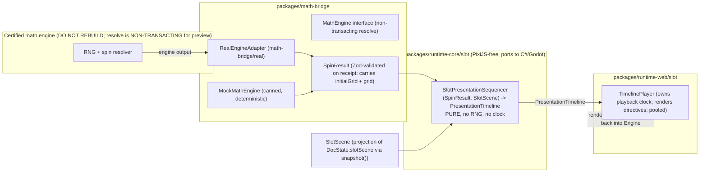

# Phase 4: Slot composer (Layer C)

- Plan ID: PHASE-4
- Status: Plan of record, awaiting senior reviewer sign-off
- Owner: Slot / Runtime
- Predecessor gate: PHASE-1, PHASE-2, PHASE-3 milestones all green (see Entry gate, section 2)
- Successor: PHASE-5 (Production hardening: binary export, Unity + Godot runtimes, full conformance) must not start until the Phase 4 Definition of Done passes
- Source of authority: `MARIONETTE_HANDOFF.md` sections 7 (math/presentation boundary, the GOVERNING law here), 8.10 (slot composition layer + the integration boundary), 6 (skeleton format), 8.1 (commands), 8.11 (conformance), 9 (roadmap), 11 (conventions)
- Companion plans (the systems of record this plan references rather than re-defines):
  - `docs/plan/phase-0-foundations.md` WP-0.1: the single one-allowed-dependency boundary matrix and lint config for the packages that exist in Phase 0 (`format`, `runtime-core`, `runtime-web`, the editor process split). The `packages/math-bridge` package does NOT exist in Phase 0 (phase-0 forbids it explicitly, LAW 5), so the Phase 4 rows for it (section 5.3) are a deliberate AMENDMENT owned by this plan and merged into the WP-0.1 lint config when `math-bridge` lands. They EXTEND, and never contradict, the Phase 0 rows.
  - `docs/plan/cross-cutting/format-contract.md` section 15: the SYSTEM OF RECORD for `packages/format`, including (now landed there) the `SlotSceneDocument` envelope, the independent `slotSceneFormatVersion`, the `SlotScene` aggregate and its sub-schemas, the `SymbolId` / authoring-config relocation (CD-1), the slot validator, and the slot content hash (which reuses the format-contract section 9.2 canonicalizer, section 9.4). Section 6 of this plan REFERENCES section 15; it does not fork it.
  - `docs/plan/cross-cutting/command-history.md`: the Phase 4 command catalog (section 11), `slotScene` in `DocState` (now enumerating its five members including `tumble`), the `no-outcome-in-commands` LAW 1 lint rule (section 9.2), and the `ui` allow-list amendment (section 9.2) that lets `editor-state` hold the ephemeral `currentSpinResult`. The three flow delete/rename variants and the reconciled `SetGridConfig` row are landed in that catalog.
  - `docs/plan/cross-cutting/conformance-and-ci.md`: WP-V.5 is the single owner of the slot-determinism check (L1). Phase 4 WP-4.13 IMPLEMENTS WP-V.5; the slot corpus layout, the exact-deep-equal `compareSlot`, and the pinned rollup-value check are ratified there.

---

## 1. Milestone (the one sentence that gates the phase)

UNCONDITIONAL milestone (gates Phase 5):

> A playable slot scene driven by the REAL certified math engine through a NON-TRANSACTING resolve: symbols land on
> the engine's board and idle, a winning spin animates exactly the engine's winning cells with named VFX and a counter
> rollup to exactly the engine's win amount, a free-spin trigger runs the feature flow, an escalation tier matches the
> engine's win multiple, and the editor preview and `runtime-web` play the identical timeline, all proven to be a pure
> deterministic function of the `SpinResult` by a committed golden-playback test.

CONDITIONAL tumble clause (does NOT gate Phase 5 until activated; see section 5.6 and Appendix A):

> When the math-engine owner confirms in writing (Appendix A) that the engine exposes the PRE-CASCADE board
> (`initialGrid`) and a per-step authoritative running total (`CascadeStep.cumulativeWin`) at the agreed
> `BOUNDARY_CONTRACT_VERSION`, the tumble cascade clause activates: landing renders the initial board, cascades
> explode / drop / refill exactly the engine's cascade steps from the initial board to the engine's final board, and a
> per-step counter rollup chain ends on exactly `SpinResult.totalWin`.

Why the split: the unconditional milestone depends only on contract surfaces the certified engine exposes today. The
tumble clause depends on an engine contract change that is escalated but not yet confirmed (section 5.5). A plan of
record must not gate a phase on an unconfirmed external change, so tumble is engineered against the deterministic mock
(unconditional engineering, section 5.6) while its REAL-ENGINE proof and milestone credit are deferred until Appendix A
is signed. If the acceptance script in section 12 does not pass against the real engine for the unconditional milestone
AND the hermetic golden-playback test in CI is not green, Phase 4 is not done. There is no partial credit on the
unconditional milestone.

---

## 2. Entry gate: Phases 1 to 3 must be green before any WP-4.x starts

Verify all of the following before opening the first Phase 4 branch. Checklist, not a vibe.

- [ ] PHASE-1 DoD green: rig + idle loop plays identically in editor viewport and `runtime-web`; transform parity and pixel parity on `idle-sprite` within tolerance; `two-bone-rotate` conformance within `1e-6`.
- [ ] PHASE-2 DoD green: mesh-deformed, weighted, IK-driven limb animates and plays in editor and `runtime-web`; deform + IK + transform-constraint conformance fixtures committed and green.
- [ ] PHASE-3 DoD green: a big-win coin-shower + ray-burst VFX authored and played; VFX presets are addressable BY NAME (e.g. `coinShowerLarge`, `rayBurst`), which is the contract Phase 4 win sequences call.
- [ ] `DocumentModel` + `History` (command-history cross-cutting WP-C.x) shipped; `DocState` is ready to gain a `slotScene` aggregate (command-history section 3.1, now enumerating its five members) without touching skeleton/mesh/constraint code.
- [ ] `runtime-core` solve (steps 1 to 6) and `runtime-web` renderer are stable and PixiJS-free in core; symbol skeletons can be instantiated as independent playback heads.
- [ ] CI green: lint (no-Pixi-in-core, no `any`/unjustified `as` in `format` and `runtime-core`, em-dash guard, `no-outcome-in-commands`), typecheck, unit, conformance.

If any box is unchecked, fix the prior phase first. Phase 4 instantiates Layer A/B artifacts as symbols and fires Layer B
VFX by name; it builds nothing it could have built earlier.

---

## 3. Non-negotiable laws this phase touches (and where)

| Law / Invariant | Where it bites in Phase 4 | Enforcing WP |
|---|---|---|
| LAW 1 Math/presentation boundary (GOVERNING) | The entire phase. Presentation is a pure deterministic function `(SpinResult, SlotScene) -> PresentationTimeline`. The engine decides outcomes; presentation only displays them. Symbol placement (board), win amounts, feature triggers, and cascade contents come from `SpinResult` and are NEVER authored, computed, or altered by presentation. The near-miss temptation (let presentation "decide" a tease) is rejected by construction (section 10.4). | WP-4.1, WP-4.2, WP-4.3, WP-4.7, WP-4.10, WP-4.13, WP-4.14 |
| LAW 2 All mutations are commands | Every `SlotScene` change (grid, symbol mapping, win sequence, feature flow, tumble timing) is a `Command` with a mandatory do/undo round-trip test. The catalog is fixed in command-history section 11 (`slot.grid.set`, `slot.symbol.map`, `slot.winseq.*`, `slot.flow.*` including the delete/rename variants, `slot.tumble.set`). The live `SpinResult` is engine output and is NEVER a command input or document field. | WP-4.5, WP-4.6, WP-4.8, WP-4.9, WP-4.10 |
| LAW 3 Format is the contract | The `SlotScene` serializes as its OWN versioned envelope (`SlotSceneDocument`, `slotSceneFormatVersion`), landed in format-contract section 15 (the system of record) alongside the skeleton format, both semver'd independently, both validated on import, both fail loudly. `SpinResult` is a runtime boundary type with a Zod schema validated on receipt and a `BOUNDARY_CONTRACT_VERSION`; it is not a document format, and its `initialGrid` / `cumulativeWin` refinements (section 5.5) are deliberate, reviewed contract bumps. | WP-4.1, WP-4.4, WP-4.13 |
| LAW 4 Spine legal boundary | No Spine surface in this layer (Spine has no slot composer). The slot format, the sequencer, and the timeline are our own design. Reviewer checklist item. | WP-4.4, WP-4.7 |
| LAW 5 Phase independence, build in order | Phase 4 ends with a playable, engine-driven slot scene. No Phase 5 work (binary export, Unity/Godot runtimes) leaks in. The slot sequencer is authored in `runtime-core` so Phase 5 can port it, but Phase 4 ships the web path only. `packages/math-bridge` is introduced HERE, not pre-scaffolded earlier. | All |
| INV runtime-core is PixiJS-free, ports to C#/Godot | The deterministic slot sequencer `(SpinResult, SlotScene) -> PresentationTimeline` lives in `runtime-core/slot`, with no renderer imports and no engine imports beyond the `math-bridge` value types. The renderer (`runtime-web/slot`) only PLAYS the timeline. | WP-4.7, WP-4.10, WP-4.11 |
| INV Conformance generated from runtime-core | Golden `PresentationTimeline` fixtures (including the pinned per-sample rollup values, section 5.4.2) are generated FROM the `runtime-core` sequencer and committed; regeneration is a reviewed act gated in CI. | WP-4.13 |
| INV Editor state vs document state | `currentSpinResult`, the active engine, the selected mock scenario, and spin transport live in Zustand (editor-state); the playback clock is owned by the shared player and mirrored one-way into Zustand for scrub UI (section 7). The `SpinResult` (an outcome) MUST NEVER enter the document. The authored `SlotScene` IS the document. | WP-4.11, WP-4.12, section 7 |
| INV 60fps, no per-frame allocation | The grid symbol instances, particle emitters (Phase 3 pools), counter glyphs, and timeline cursor are pooled. The PLAYER advances over a pre-resolved directive list with zero per-frame allocation. The sequencer runs once per spin (single allocation pass, no per-frame work). | WP-4.11 (player), WP-4.7 (sequencer) |
| INV Bounded concurrency, idempotency | Spins are issued one at a time through the transport; no unbounded `Promise.all`. The engine resolve is idempotent in its `SpinInput` (same seed in, same `SpinResult` out): an engine guarantee the adapter passes through and a test asserts. | WP-4.2, WP-4.3 |
| INV No em-dashes or en-dashes | All copy, comments, docs, UI strings in this phase. | All |

---

## 4. Scope

### 4.1 In scope

- `packages/math-bridge`: `SpinResult` (including the `initialGrid` and `CascadeStep.cumulativeWin` refinements, section 5.5) / `WinLine` / `FeatureEvent` / `CascadeStep` types + Zod schemas (the engine boundary), the `MathEngine` interface (a NON-TRANSACTING resolve, section 4.3), a deterministic `MockMathEngine` emitting canned `SpinResult`s, the `SymbolVocabulary` accessor (the math model's known symbol ids, section 5.2), and the thin real-engine adapter behind a separate sub-path.
- `SlotScene` format (its own semver'd envelope `SlotSceneDocument`) in `packages/format`, defined normatively in format-contract section 15 and referenced by section 6 here: `GridConfig` (with `AnticipationConfig`), `SymbolAnimSet` map, `WinSequenceConfig`, `FeatureFlowGraph`, `TumbleChoreography`, plus the validator and a project manifest tying skeletons + VFX presets + scene together by name and content hash.
- Grid/reel definition: classic reel strips (5x3), scatter-pay grids (6x5, Gates of Olympus class), cluster grids (7x7, Sugar Rush class). Geometry and timing authored; symbol placement RNG-driven from the engine.
- Symbol library: map each `SymbolId` to a `SymbolAnimSet` (`idle`, `win` / `anticipation`, `land`) referencing skeleton documents and animation names authored in Layers A/B.
- Win presentation sequencer: named sequences keyed off `SpinResult` fields; winning-cell animation, VFX bursts by name (Phase 3), win-amount counter rollup, big/mega/epic escalation thresholds.
- Feature and free-spin flow graph: states + transitions driven by `SpinResult.features`; scatter-landing triggers, intro/outro cinematics, multiplier-orb displays (Gates class), retrigger handling.
- Tumble / cascade choreography (engineered against the mock; real-engine proof is the conditional track, section 5.6): render the engine's INITIAL board, then explode winning cells, gravity-drop survivors, refill from the top, looping until `SpinResult.cascades` is exhausted, ending on `SpinResult.grid`.
- The deterministic slot sequencer in `runtime-core/slot` and its renderer in `runtime-web/slot`.
- Editor slot-composer panels (grid, symbol mapper, win-sequence timeline, feature-flow graph, tumble timing) plus a spin-preview transport driven by the mock then the real engine (non-transacting resolve).
- Golden-playback conformance: committed `SpinResult` fixtures + committed expected `PresentationTimeline` outputs (with pinned per-sample rollup values) generated from `runtime-core` (implements conformance WP-V.5).

### 4.2 Explicitly out of scope (deferred, do not build)

| Deferred item | Reason | Lands in |
|---|---|---|
| Unity and Godot slot runtimes | They reimplement the sequencer against the same golden fixtures | Phase 5 |
| Binary export of `SlotSceneDocument` | Optimization; logical schema is frozen here | Phase 5 |
| Rebuilding or re-tuning the math engine, RNG, RTP, or ledger | Hard line (handoff 1.3, 2.2). We integrate, we do not touch outcomes. | Never (out of project) |
| Wallet, session, double-entry ledger, real-money BET TRANSACTIONS | The engine host owns money. Preview and acceptance use the engine's NON-TRANSACTING resolve only (section 4.3): no wallet debit, no ledger advance, ever. | Out of project |
| New skeleton / mesh / IK / particle authoring features | Layers A/B are done in Phases 1 to 3; Phase 4 consumes them | Phases 1 to 3 |
| Server-side spin orchestration, regulatory reporting | The engine and its host own outcomes and money; the editor authors presentation | Out of project |
| Authoring-time symbol placement or "force a result" tooling | A LAW 1 violation by definition: presentation must not set outcomes | Rejected |
| Reverse reconstruction of the initial board from the final board | Lossy under the current contract (section 5.5); replaced by the engine exposing `initialGrid` | N/A (rejected) |
| Multi-currency / localization of the win counter beyond number formatting | Polish | Later |

Anything in 4.2 appearing in a Phase 4 PR is grounds for rejection. A "set the grid to these symbols for a demo" code
path in non-test code is an automatic LAW 1 rejection. A code path that calls a TRANSACTING engine endpoint from the
editor or the acceptance harness is an automatic money-boundary rejection (section 4.3).

### 4.3 The money boundary: preview and acceptance are NON-TRANSACTING

Per handoff 1.3 the certified engine carries a double-entry ledger. Presentation must never perform a money operation.
Therefore:

- `MathEngine.spin(input)` in the editor and conformance binds to the engine's NON-TRANSACTING RESOLVE entry point: a
  deterministic, provably-fair resolution of a `SpinInput` (seed) that returns a `SpinResult` with NO wallet debit and NO
  ledger advance. It is a pure read of "what would this seed produce", not a bet. The transacting production spin (wallet
  plus ledger) is the game host's concern and is out of project (section 4.2).
- The `RealEngineAdapter` (WP-4.3) is configured ONLY with the sandbox/replay/non-transacting handle. A CI guard and a
  boot check assert the transacting endpoint symbol is never imported or called by the editor or the acceptance harness.
- Acceptance criterion (WP-4.3, WP-4.14): against the stubbed engine client, a test asserts the transacting API is never
  invoked and no ledger entry is created during preview or DoD acceptance. Recorded-fixture replay (WP-4.3) is inherently
  non-transacting.

---

## 5. Architecture and decisions of record (read before any WP)

The defining decisions of Phase 4 are where the math integrates and how determinism is made structural. They are fixed
here so reviewers can reject deviations.

### 5.1 The integration boundary (handoff 7 and 8.10), made concrete



Hard rules encoded by this shape:

1. The arrow from the engine to presentation is one-way. There is no edge from `PLAYER`, `SEQ`, or `SCENE` back to
   `Engine`. Presentation cannot influence an outcome because it has no channel to.
2. `SpinResult` is validated by a Zod schema the instant it enters `math-bridge` (real adapter) or is returned by the
   mock. A malformed result fails loudly (LAW 3) before any sequencing.
3. The sequencer is a pure function. It reads `SpinResult` FIELDS and the authored `SlotScene`. It calls no clock, no
   RNG, no I/O. Same inputs, deep-equal `PresentationTimeline`, always (LAW 1).
4. The renderer is a dumb player of a fully pre-resolved `PresentationTimeline`. It introduces no new timing decisions,
   no randomness, and no outcome logic. It owns its OWN playback clock (section 7), so it has zero editor-state
   dependency.

The sequencer input `SlotScene` is a value projection of the live `DocState.slotScene`, produced by `snapshot()`
(command-history WP-C.1). The editor preview and `runtime-web` BOTH feed the sequencer a `SlotScene` value: the editor
via `snapshot()`, `runtime-web` via the validated `SlotSceneDocument.scene` it loaded. Neither reads files inside the
sequencer; the sequencer sees only plain values.

### 5.2 Where the types live (decision of record; refines handoff 8.10, landed as CD-1)

Handoff 8.10 lists `SpinResult` and `SlotScene` together in a `packages/math-bridge` comment block. They have OPPOSITE
lifecycles, so they are split. This split is CD-1, OWNED by format-contract section 15.2 and consumed by command-history
section 14; this plan restates it for convenience and binds the WPs.

| Type group | Package | Lifecycle | Governing law |
|---|---|---|---|
| `SymbolId` and shared slot scalars | `packages/format` (format-contract section 15.3) | Authored-side vocabulary brand | LAW 3 |
| `SpinResult` (`spinId`, `bet`, `initialGrid`, `grid`, `wins`, `totalWin`, `features`, `cascades?`, `rngProof`), `WinLine`, `FeatureEvent`, `CascadeStep` (with `cumulativeWin`), `SpinInput`, `SpinSeed`, `MathEngine`, `SymbolVocabulary` | `packages/math-bridge` | Runtime engine output / boundary; validated on receipt; NEVER serialized into a document; NEVER authored | LAW 1 |
| `SlotScene` = `{ grid, symbols, winSequencer, featureFlows, tumble }` | `packages/format` (format-contract section 15.3) | Authored, command-mutated, the value the sequencer consumes | LAW 2, LAW 3 |
| `SlotSceneDocument` = the serialized envelope wrapping `SlotScene` (`slotSceneFormatVersion`, `name`, `hash`, `scene`, `refs`) | `packages/format` (own `slotSceneFormatVersion`) | Serialized to disk, validated on import | LAW 3 |
| `PresentationTimeline` and its directive union, `CurveType`, `rollupValueAt` | `packages/runtime-core/slot` | Derived artifact (sequencer output); the golden-test surface | LAW 1, INV conformance |

The dependency direction is correct by construction: `math-bridge` MAY import `format` (so `SpinResult` cells are typed
as `SymbolId`), but `format` never imports `math-bridge`. Placing `SymbolId` in `format` is the only direction-correct
choice; placing it in `math-bridge` would force `format` to depend on the outcome package, which is forbidden. The
concrete SYMBOL VOCABULARY for a given math model (which ids the engine emits) is supplied by `math-bridge` as a
`SymbolVocabulary` (a `readonly Set<SymbolId>`), consumed by the symbol library (WP-4.6) and validated against the scene
on import (R4.10). The `SymbolId` TYPE/brand lives in `format`; the VALUES a model uses are engine metadata.

Naming reconciliation: `SlotScene` is the in-memory/format scene content the sequencer consumes; `SlotSceneDocument` is
the on-disk envelope wrapping a `SlotScene` plus version, name, hash, refs. The sequencer signature is
`sequence(result: SpinResult, scene: SlotScene)`, never `SlotSceneDocument`. `DocState.slotScene` holds the `SlotScene`
content plus `SceneRefs`; `snapshot()` projects it to the `SlotScene` value passed to the sequencer.

### 5.3 Package boundary updates (Phase 4 amendment to the WP-0.1 matrix; owned here, applied when math-bridge lands)

`packages/math-bridge` does not exist in Phase 0 (phase-0 forbids it under LAW 5). The rows and lint rules below are the
Phase 4 AMENDMENT to the single WP-0.1 matrix; they are merged into the WP-0.1 lint config when `math-bridge` lands and
they EXTEND the Phase 0 rows without contradiction. The editor-state import edit also lands in command-history section
9.2 (the system of record for the editor document/command/ui boundaries), amended there as part of this change set.

| Element type | Path | May import (Phase 4 amendment) |
|---|---|---|
| `math-bridge` | `packages/math-bridge/src/**` (except `real/**`) | `format` only. PixiJS-free, dependency-light, ports to C#/Godot. |
| `math-bridge-real` | `packages/math-bridge/src/real/**` | `format`, the external certified engine client (the NON-TRANSACTING resolve handle only). Imported ONLY by editor-host and runtime-host wiring, never by `runtime-core`. |
| `runtime-core` (slot) | `packages/runtime-core/src/slot/**` | `format`, `math-bridge` (value types only, NOT `math-bridge/real`). Still no PixiJS, no clock, no RNG. |
| `runtime-web` (slot) | `packages/runtime-web/src/slot/**` | `format`, `runtime-core`, `math-bridge` (value types), `pixi.js`. NO editor-state, NO Zustand. |
| `editor-renderer` transport + `editor-state` | `apps/editor/src/renderer/**` (transport + Zustand store) | EXTENDS the Phase 0 editor-renderer row with `math-bridge` VALUE types and engines (`SpinResult`, `SpinInput`, `SpinSeed`, `MathEngine`, `MockMathEngine`) and, at host wiring only, `math-bridge/real`. This is the command-history section 9.2 `ui` allow-list amendment. `command`/`document-model`/`history` still must NOT import `math-bridge`. |

Lint guards in the WP-0.1 config (CI errors; single enforcement point, not a Phase-4-local duplicate):

- `no-restricted-imports`: forbid `math-bridge/real` (the engine client) anywhere under `packages/runtime-core/**`.
- `no-restricted-imports`: forbid `pixi.js`, `@pixi/*`, `Math.random`, `Date.now`, and `performance.now` anywhere under
  `packages/runtime-core/src/slot/**` (the sequencer must be pure and deterministic; INV + LAW 1).
- `@typescript-eslint/no-explicit-any` and the non-`const` `as` ban now also cover `packages/math-bridge/**` (held to the
  same bar as `format` and `runtime-core`).
- `no-outcome-in-commands` (command-history section 9.2): inside `apps/editor/src/renderer/document/commands/**`, error
  on importing any binding in the OUTCOME denylist (`SpinResult`, `WinLine`, `CascadeStep`, `FeatureEvent`, `MathEngine`,
  `RngProof`, plus patterns `/^rng/i`, `/spinresult/i`, `/totalwin/i`, `/initialgrid/i`) regardless of source, and ban
  the whole `math-bridge` package by name inside commands. It explicitly ALLOWS the authoring-config types in
  `packages/format` (`SlotScene`, `GridConfig`, `WinSequenceConfig`, `FeatureFlowGraph`, `SymbolAnimSet`, `SymbolId`).
  Phase 4 commands import their config types from `format` and must not import an outcome symbol.

### 5.4 The `PresentationTimeline` (the determinism surface)

The sequencer output is a flat, time-ordered, fully resolved list of typed directives. It is the artifact the
golden-playback test pins (section 10). It contains no live objects, no functions, no engine handles: pure data, JSON
serializable, deep-equal comparable.

```ts
// packages/runtime-core/slot
export type EscalationTier = 'big' | 'mega' | 'epic';
export type SymbolAnimSlot = 'idle' | 'anticipation' | 'win' | 'land';
export type CurveType = 'linear' | 'easeInQuad' | 'easeOutQuad' | 'easeInOutCubic';  // closed enum (section 5.4.2)
export interface GridCell { row: number; col: number }
export interface SymbolMove { from: GridCell; to: GridCell; symbol: SymbolId }
export type GridAnchor = { kind: 'cell'; row: number; col: number } | { kind: 'screen'; x: number; y: number };

export interface PresentationTimeline {
  spinId: string;                 // copied from SpinResult, for traceability only
  durationMs: number;             // total resolved length, integer milliseconds
  directives: readonly PresentationDirective[];  // sorted by (atMs asc, seq asc); see section 5.4.1
}

// Every directive carries an integer atMs and a globally unique, deterministic emission index `seq`.
interface DirectiveBase { atMs: number; seq: number }

export type PresentationDirective =
  | ({ kind: 'reelStop'; col: number } & DirectiveBase)
  | ({ kind: 'symbolLand'; row: number; col: number; symbol: SymbolId } & DirectiveBase)
  | ({ kind: 'symbolAnimate'; row: number; col: number; set: SymbolAnimSlot } & DirectiveBase)
  | ({ kind: 'vfxBurst'; preset: string; anchor: GridAnchor } & DirectiveBase)           // preset = Phase 3 VFX name
  | ({ kind: 'counterRollup'; fromUnits: number; toUnits: number; startMs: number; endMs: number; curve: CurveType } & DirectiveBase)
  | ({ kind: 'escalation'; tier: EscalationTier } & DirectiveBase)
  | ({ kind: 'flowEnter'; state: string } & DirectiveBase)
  | ({ kind: 'flowExit'; state: string } & DirectiveBase)
  | ({ kind: 'multiplierOrb'; valueX: number; anchor: GridAnchor } & DirectiveBase)      // Gates-class orbs
  | ({ kind: 'cascadeExplode'; cells: readonly GridCell[] } & DirectiveBase)
  | ({ kind: 'cascadeDrop'; moves: readonly SymbolMove[] } & DirectiveBase)
  | ({ kind: 'cascadeRefill'; col: number; symbols: readonly SymbolId[] } & DirectiveBase);
```

Decisions pinned for cross-runtime stability (so Phase 5 Unity/Godot reproduce byte-for-byte):

- Times are stored as INTEGER MILLISECONDS (`atMs`, `startMs`, `endMs`, `durationMs`). Conversion to seconds happens only
  at the renderer (a single `/ 1000` at the edge). No float seconds are ever stored, so the cross-runtime byte surface is
  integer-exact and there is no IEEE division in the golden.
- Win amounts in directives are in integer base units (cents/credits as the engine reports), never floats, so the rollup
  target is exact.

#### 5.4.1 Directive ordering (provably total, no hidden priority key)

Directive ordering is a PROVABLY TOTAL comparator with TWO keys only: `(atMs asc, seq asc)`. There is NO third
`KIND_PRIORITY` key. `seq` is a globally unique, 0-based monotonic emission index assigned in the documented construction
order below, so two distinct directives never share a `seq`, so the comparator never returns 0 for distinct directives.
The ordering of two same-`atMs` directives is therefore decided ENTIRELY by `seq`, which is itself pinned by the
construction order, so there is no unpinned input to the byte-exact surface (an earlier draft sorted by a
`KIND_PRIORITY[kind]` table whose values were never committed; because `seq` already made the comparator total, a
totality test could not see a `KIND_PRIORITY` that differed between TS and the C#/Godot ports, so the key was a hidden
cross-runtime hole and is removed). The sort is order-stable WITHOUT relying on a stable sort: C# `List.Sort` and Godot
sorts (not stable) produce the identical sequence, because `(atMs, seq)` is a total order.

The construction order that assigns `seq` is fixed and identical across all runtimes:

  1. Landing: per column left-to-right, per row top-to-bottom: `reelStop`, then `symbolLand`, then `symbolAnimate(idle)`.
  2. Anticipation: `symbolAnimate(anticipation)` per anticipating column, left-to-right.
  3. Win sequence: steps in authored order; within a step, targets resolved in `(col, row)` order; the single
     non-cascade `counterRollup` (section 5.4.3) is emitted at its authored step.
  4. Feature flow: walk `SpinResult.features` in array order; per matched transition emit `flowExit`, `flowEnter`, then
     the state's cinematic directives, then any `multiplierOrb`s in `FeatureEvent.data` order.
  5. Cascades (conditional track, section 5.6): `SpinResult.cascades` in array order; within a step emit
     `cascadeExplode`, then `symbolAnimate(win)` for removed cells in `(col, row)` order, then the authored `vfxBurst`,
     then `cascadeDrop`, then `cascadeRefill` per column left-to-right, then this step's `counterRollup` chain link
     (section 5.4.3).
  6. Escalation: `escalation` for each crossed tier in ascending tier order.

`seq` increments globally across all six stages. Because the emission order is a pure function of the inputs, every
runtime assigns identical `seq` values, which is what makes the tiebreak portable.

Iteration guard (closes the "map iteration order" hazard by construction): the sequencer performs NO output-affecting
iteration over any `Record` map. `SlotScene.symbols` (a `Record<SymbolId, SymbolAnimSet>`) is accessed by KEYED LOOKUP
only (`symbols[id]`). All iteration that affects emission order is over ARRAYS in a fixed order: `initialGrid` rows then
columns, `wins[]`, `features[]`, `cascades[]`, and the authored win-sequence/flow arrays. This removes the risk that a
numeric-looking string `SymbolId` reorders object-key iteration differently across engines. WP-4.7 ships a lint/review
check plus a test asserting the directive output is invariant under a shuffle of `symbols` insertion order.

#### 5.4.2 Counter rollup value (pinned integer/fixed-point evaluation)

The displayed rollup value is a CORE cross-runtime deliverable, so its evaluation is pinned, not left to each renderer.
`CurveType` is the closed enum above. `runtime-core/slot` exports a pure integer/fixed-point function:

```ts
// FP = 65536 (2^16). All intermediate products use 64-bit integer math (BigInt in TS, i64/long in C#/Godot).
// Rounding is floor toward negative infinity. Result is clamped to [fromUnits, toUnits] by construction.
export function rollupValueAt(
  fromUnits: number, toUnits: number, startMs: number, endMs: number, atMs: number, curve: CurveType
): number;
```

Definition (identical in every runtime):

- If `atMs <= startMs` return `fromUnits`. If `atMs >= endMs` return `toUnits`.
- `linearFP = floor(FP * (atMs - startMs) / (endMs - startMs))` (integer division), a fixed-point progress in `[0, FP]`.
- Eased progress `eFP` from `linearFP` (all in fixed point, integer ops only):
  - `linear`: `eFP = linearFP`.
  - `easeInQuad`: `eFP = floor(linearFP * linearFP / FP)`.
  - `easeOutQuad`: `r = FP - linearFP; eFP = FP - floor(r * r / FP)`.
  - `easeInOutCubic`: documented two-branch cubic in fixed point (committed reference in `runtime-core`), `eFP` in `[0, FP]`.
- `value = fromUnits + floor((toUnits - fromUnits) * eFP / FP)` using 64-bit integer multiply then floor.

Because every operation is integer with a single defined rounding mode and a defined `FP`, the displayed integer rollup
value at any `atMs` is identical across TS, C#, and Godot. The golden corpus (WP-4.13) commits `rollupValueAt` evaluated
at the conformance sample times for each `counterRollup` directive, so a Phase 5 runtime that reproduces the timeline
byte-for-byte but evaluates the curve differently still fails (conformance WP-V.5).

#### 5.4.3 The two rollup models (mutually exclusive; no double-count)

A spin emits EXACTLY ONE rollup channel. The model is selected by whether `SpinResult.cascades` is present and
non-empty, so the two never both fire (this resolves the prior conflict where a single `0 -> totalWin` rollup and a
per-step rollup could both be emitted for a tumble win).

- LINE-WIN model (no cascades): WP-4.8 emits a SINGLE `counterRollup { fromUnits: 0, toUnits: SpinResult.totalWin }` over
  the authored duration/curve. Terminal value is `totalWin` exactly. There are no steps, so no per-step rollup exists.
- CASCADE-WIN model (cascades non-empty; conditional track, section 5.6): WP-4.10 emits ONE `counterRollup` PER cascade
  step, forming a CONTIGUOUS chain. Step k's link is `{ fromUnits: prevCumulative, toUnits: cascades[k].cumulativeWin }`,
  where `cumulativeWin` is the engine's AUTHORITATIVE running total through step k (read, never summed by presentation).
  `prevCumulative` is `0` for the first step and `cascades[k-1].cumulativeWin` thereafter, so the chain is contiguous and
  non-overlapping (each link starts exactly where the previous ended). The chain's terminal `toUnits` is
  `cascades[last].cumulativeWin`, which validation requires to equal `SpinResult.totalWin` exactly (WP-4.1). The WP-4.8
  single `0 -> totalWin` rollup is SUPPRESSED when `cascades` is non-empty.

No double-count proof: exactly one model emits per spin (selector on `cascades`); within the cascade model each unit of
displayed win is covered by exactly one contiguous, non-overlapping link; the terminal equals the engine's authoritative
`totalWin`. `totalWin` stays authoritative: presentation NEVER sums `stepWin` or recomputes money; it reads the engine's
`cumulativeWin` and only checks the last equals `totalWin` (a structural consistency check, like the forward-cascade
check, not a money recomputation). Real engines that apply a final global multiplier are accommodated because
`cumulativeWin` is the engine's own running total including that multiplier.

### 5.5 The board and cumulative contract (decision of record; refines handoff 8.10 and escalates a contract change)

Handoff 8.10 defines `SpinResult.grid` as the "final symbol layout (post all cascades)". For any cascade spin the landing
phase must show the INITIAL (pre-cascade) board and then cascade to the final board, and the per-step rollup needs an
authoritative running total. Neither the initial board nor a per-step cumulative is in the handoff `SpinResult`. This is
resolved, not finessed.

Reverse reconstruction of the initial board is rejected because it is LOSSY under the current contract:

- `CascadeStep.removed` stores POSITIONS only (`[row, col][]`), not the symbols that occupied those cells before they
  exploded. Reconstructing a step's pre-explosion board requires the identity of each exploded symbol, which the contract
  does not carry.
- `SpinResult.wins` is not attributed per cascade step, so the exploded symbols cannot be recovered from `wins` either.

Reconstructing the initial board would therefore require presentation to INVENT the exploded symbols. That is authoring an
outcome, a direct LAW 1 violation. We will not do it.

Forward application, by contrast, is LOSSLESS and deterministic. Given the initial board G0 and the ordered `cascades`:

- Step i: remove the symbols at `removed_i` (their identities are known from the current forward board), gravity-drop the
  survivors (the documented per-topology gravity rule, section 5.5.1), then refill the now-empty top cells from
  `refill_i[col].symbols` top-down. The next board is fully determined with no unknowns.
- After the last step the board MUST equal `SpinResult.grid`. This is checked as a validation invariant (WP-4.1).

Decision of record (escalation + contract bump):

1. ESCALATE to the math-engine / handoff owner: the handoff 8.10 `SpinResult` (final `grid` only, no per-step cumulative)
   is insufficient for tumble landing and the per-step rollup. The certified engine already produces the initial board
   and the running total internally; it (or its host) must expose them. If it genuinely cannot, the tumble clause cannot
   proceed and we do NOT invent the data (section 5.6). This escalation is tracked in Appendix A.
2. AMEND the `math-bridge` boundary contract (ours to define as the mapping target, semver'd by `BOUNDARY_CONTRACT_VERSION`):
   add `SpinResult.initialGrid: SymbolId[][]` (the board as first presented, pre-cascade) and `CascadeStep.cumulativeWin:
   number` (the engine's authoritative running total through that step, integer base units). For non-cascade results,
   `initialGrid` deep-equals `grid` and there are no cascade steps.
3. The sequencer renders LANDING from `initialGrid`, plays cascades FORWARD, asserts (via WP-4.1 validation) the forward
   result equals `grid`, and reads `cumulativeWin` for the rollup chain (section 5.4.3). Anticipation derives from
   `initialGrid` (section 10.4).
4. The `RealEngineAdapter` maps `initialGrid` and `cumulativeWin` from the engine's native output (WP-4.3); the
   `MockMathEngine` fixtures carry them (WP-4.2); validation enforces presence and shape (WP-4.1).

Non-cascade note (why the unconditional path needs no engine change): for a non-cascade spin the board that lands IS the
final board, so the adapter sets `initialGrid := grid` as a LOSSLESS identity (not a fabrication), and validation asserts
`initialGrid` deep-equals `grid`. Only GENUINE cascade games require the engine to expose a distinct pre-cascade board and
a per-step cumulative; that is the external dependency, isolated to the conditional track (section 5.6).

#### 5.5.1 The gravity rule (documented, per-topology, so the forward check is exact)

The forward cascade uses one documented gravity rule per topology, configured on `GridConfig` (`gravity`) so the
consistency check matches the specific certified model rather than second-guessing it:

- `column-down` (reelStrip, scatterPay): survivors in a column fall to the lowest empty cells preserving their relative
  vertical order; refills enter from the top in `refill.symbols` order. This is the standard Sweet Bonanza / Gates rule.
- `cluster-down` (cluster): same column-down gravity; cluster wins remove arbitrary cells, survivors still fall straight
  down. (Side-fill variants are out of scope for Phase 4; a model needing one is a new documented `gravity` value with
  its own forward solver and golden, decided before that model ships.)

The drop solver (WP-4.10) implements exactly this rule and nothing else. The validation in WP-4.1 forward-applies it to
prove `initialGrid` + `cascades` reaches `grid`; a mismatch is a loud LAW 3 failure (malformed boundary data or a gravity
rule mismatch), never a silently-wrong board.

### 5.6 External dependency and the conditional tumble track

The tumble clause depends on the engine exposing `initialGrid` (genuinely distinct from `grid`) and
`CascadeStep.cumulativeWin`, which it does not today. A plan of record must not gate a phase on an unconfirmed external
change, so the dependency is isolated:

- UNCONDITIONAL (gates Phase 5): everything that needs only contract surfaces the engine exposes today. Non-cascade
  landing (with `initialGrid := grid`), anticipation on non-cascade boards, win sequences, the single line-win rollup,
  feature flows, escalation, the sequencer core, the player, editor/runtime parity, and the non-cascade golden corpus.
- CONDITIONAL (the tumble follow-on, activated by Appendix A): the cascade-distinct `initialGrid` + `cumulativeWin`
  mapping in the REAL adapter (WP-4.3), the REAL-ENGINE tumble acceptance (section 12.2 step 5), and the milestone's
  tumble clause. The tumble ENGINEERING (WP-4.10: `TumbleChoreography`, the cascade sequencer extension, the drop solver,
  the per-step rollup chain) is built and unit-tested against the deterministic MOCK (`tumble-cascade` scenario, which is
  our own fixture and carries `initialGrid` + `cumulativeWin`), so the code is ready the moment Appendix A is signed. What
  is conditional is the REAL-ENGINE PROOF and the phase-gating credit, not the engineering.

Until Appendix A is signed, the tumble goldens in the corpus are MOCK-driven and are not part of the Phase 5 gate, and
the live tumble acceptance step is marked CONDITIONAL in section 12. If the engine owner confirms it cannot ever expose
the data, presentation cannot proceed for tumble games and the tumble clause is formally descoped to a future phase under
a new contract decision; the rest of Phase 4 is unaffected.

---

## 6. Format posture (LAW 3): the SlotScene serializes as its own contract

This section REFERENCES the system of record (format-contract section 15) and binds it to work packages; it does not
fork it. The same discipline this plan applies to the boundary matrix (section 5.3), the command catalog (section 9.1),
and the conformance check (WP-4.13) now applies to the most expensive contract too: the `SlotSceneDocument` envelope, the
`slotSceneFormatVersion` second-version decision, the `SymbolId` / authoring-config relocation (CD-1), and the slot
content hash are LANDED in format-contract section 15. The shapes restated below are for reading convenience and are
authoritative ONLY as they appear in format-contract section 15.3.

### 6.1 Two independent semver'd formats (format-contract section 15.1)

- The skeleton format (`SkeletonDocument`, `formatVersion`, handoff 6) is unchanged in Phase 4. Phase 4 ships ZERO
  breaking changes to it.
- The `SlotSceneDocument` envelope at `slotSceneFormatVersion = '0.1.0'` is semver'd and validated independently (a slot
  game references many skeletons; bumping one format must not force-bump the other).

```ts
// Restated from format-contract section 15.3 (the system of record). SymbolId lives in packages/format (CD-1).

export interface SlotScene {
  grid: GridConfig;                          // owned by WP-4.5
  symbols: Record<SymbolId, SymbolAnimSet>;  // owned by WP-4.6 (keyed-lookup only; section 5.4.1 iteration guard)
  winSequencer: WinSequenceConfig;           // owned by WP-4.8
  featureFlows: FeatureFlowGraph;            // owned by WP-4.9
  tumble: TumbleChoreography;                // owned by WP-4.10 (refinement: handoff 8.10 omitted tumble; conditional track)
}

export interface SlotSceneDocument {
  slotSceneFormatVersion: string;   // semver of THIS contract; bump on breaking change
  name: string;
  hash: string;                     // section 6.1.1: covers a canonical serialization EXCLUDING this field
  scene: SlotScene;
  refs: SceneRefs;                  // referenced skeletons + VFX presets, by name + hash
}

export type GridTopology = 'reelStrip' | 'scatterPay' | 'cluster';
export type GravityRule = 'column-down' | 'cluster-down';
export interface GridConfig {
  topology: GridTopology;
  cols: number; rows: number;       // 5x3 reelStrip, 6x5 scatterPay, 7x7 cluster
  cellWidth: number; cellHeight: number; cellGap: number;
  reelStopStaggerMs: number;        // per-column stop delay (timing only), integer ms
  gravity: GravityRule;             // the documented forward cascade rule (section 5.5.1)
  anticipation: AnticipationConfig; // deterministic, fed by the engine board only (section 10.4); owned by WP-4.5
  // LAW 1: there is NO symbol-placement and NO symbol-source field. Placement comes from SpinResult at runtime.
}

export interface AnticipationConfig {  // owned and specified by WP-4.5
  triggerSymbols: readonly SymbolId[]; // which symbols are scatter/trigger symbols (the math model's known ids)
  thresholdCount: number;              // start anticipating once this many trigger symbols have landed in stopped columns
  maxAnticipatingCols: number;         // cap on how many not-yet-stopped columns may anticipate at once (>= 1)
}

export interface SymbolAnimSet {       // owned by WP-4.6
  skeletonRef: string;              // name of a SkeletonDocument in refs.skeletons
  idle: string; land: string; win: string;  // animation names; win is reused for anticipation when absent
  anticipation?: string;
}

export interface SceneRefs {           // owned by WP-4.4
  skeletons: { name: string; hash: string }[];   // validated against the referenced docs on import
  vfxPresets: { name: string; hash: string }[];   // Phase 3 named presets
}
```

`WinSequenceConfig`, `FeatureFlowGraph`, and `TumbleChoreography` are specified in their owning WPs (WP-4.8, WP-4.9,
WP-4.10) and mirrored as Zod schemas in `packages/format/src/slot`. `GridConfig` (with `AnticipationConfig`) is OWNED
outright by WP-4.5 and `SymbolAnimSet` by WP-4.6. WP-4.4 assembles the `SlotScene` aggregate and the `SlotSceneDocument`
envelope and owns the validator framework. See the ownership table in WP-4.4 for the build-order resolution.

#### 6.1.1 The content hash (reuses the format-contract section 9.2 canonicalizer)

`SlotSceneDocument.hash` is `computeSlotSceneHash`, defined in format-contract section 15.5 as `computeContentHash`
(format-contract section 9.2) applied to the CANONICAL serialization of `{ slotSceneFormatVersion, name, scene, refs }`
(the envelope with `hash` removed). There is exactly ONE canonicalizer in the system (format-contract section 9.4): the
same sorted-object-keys, preserved-array-order, standard-number-formatting, SHA-256-via-`@noble/hashes` algorithm used
for the skeleton hash, parameterized only by which self-referential `hash` field to exclude. `snapshot()` canonical
projection (command-history section 7.3) and the conformance timeline canonicalization (conformance A.6) DEFER to this
same algorithm; they do not agree by assertion, they call the same code. On import the validator recomputes and compares
(typed `hashMismatch` on failure); on save the serializer computes the hash last. WP-4.4 wires the recompute-on-import
check and a round-trip test (save then load yields a matching hash; flipping one byte of `scene` changes the hash and is
rejected).

### 6.2 Project bundle and validation (format-contract section 15.4)

- A slot project on disk is: N `SkeletonDocument` files (symbols, backgrounds), the Phase 3 VFX preset bundle, and one
  `SlotSceneDocument`, plus a `project.manifest.json` listing every artifact with its content hash.
- Validate-on-import (LAW 3) for `SlotSceneDocument`, per format-contract section 15.4: closed-union shape; topology/dims
  consistency; gravity/topology consistency (cluster requires `cluster-down`); anticipation bounds; `SymbolAnimSet`
  skeleton-ref and animation-name existence; VFX-preset-name existence; referenced-artifact hash match; top-level hash
  match (6.1.1); `slotSceneFormatVersion` routed by the same migration-key gate as the skeleton format; and the
  structural LAW 1 check that NO symbol-placement field exists.
- Each failure is a discriminated `SlotSceneError` with a JSON path, never a bare string. A negative-test corpus is
  committed under `packages/format/fixtures/slot-scene/` (WP-4.4 / WP-4.13).

### 6.3 What never serializes

`SpinResult` and any engine output (including `initialGrid`, `cumulativeWin`, board contents) never enter
`SlotSceneDocument` or the skeleton format. The grid contents shown on screen are a runtime overlay from
`SpinResult.initialGrid` (landing) and `SpinResult.grid` (final); the document stores only geometry and timing. This is
asserted by WP-4.4 acceptance (the schema has no symbol-placement field) and WP-4.14 (the rendered final grid equals
`SpinResult.grid` exactly, proving placement was not authored).

---

## 7. Editor state additions (Zustand, ephemeral, NOT the document)

Declared here so reviewers can reject any attempt to put these in the document. The first row is the LAW 1 tripwire.
`editor-state` holding a `SpinResult` is permitted by the command-history section 9.2 `ui` allow-list amendment
(math-bridge value types in `editor-state`); commands still may not import `math-bridge`.

| State | Type | Notes |
|---|---|---|
| `currentSpinResult` | `SpinResult \| null` | Engine OUTPUT. Ephemeral. MUST NEVER be serialized or written into the document. Cleared on document load. (math-bridge value type; allowed in editor-state per command-history 9.2.) |
| `activeEngine` | `'mock' \| 'real'` | Which `MathEngine` drives the preview transport (non-transacting resolve). Default `mock`. |
| `mockScenario` | `MockScenarioId \| null` | Selected canned scenario id (mock only): `base-win`, `freespin-trigger`, `tumble-cascade`, `mega-escalation`, `retrigger`. Passed to the `MockMathEngine` constructor (NOT smuggled through `SpinInput`). |
| `spinSeed` | `SpinSeed \| null` | The seed used for the current spin (so a spin is reproducible from the UI). Identical `SpinInput` shape on mock and real. |
| `isSpinning` | `boolean` | Transport state for the spin preview. |
| `presentationPlayhead` | `number` (milliseconds) | A ONE-WAY MIRROR of the player's internal clock for scrub UI, written by the editor each frame from `player.currentTimeMs`. The PLAYER owns the authoritative clock (section 10.3); Zustand never drives playback. Scrubbing calls `player.seek(ms)`; the mirror follows. Never mutates the document. |
| `composerView` | `'grid' \| 'symbols' \| 'winseq' \| 'flow' \| 'tumble'` | Active slot sub-editor. |
| `sceneSelection` | `SceneSelectionRef` | Authoring selection (selected sequence/step/flow-state/transition). Not undoable, not a command. |

Round-trip rule: serializing then loading a `SlotSceneDocument` restores none of the above. A test asserts the saved JSON
contains no `currentSpinResult`, `spinSeed`, playhead, or selection keys (WP-4.4, WP-4.12).

---

## 8. Work packages

Each WP is independently verifiable. Format: Goal, Laws touched, Depends on, Tasks, Deliverables, Acceptance criteria (all
testable).

### WP-4.1 math-bridge boundary types + Zod schemas

- Goal: The engine boundary contract: `SpinResult` and members (including the `initialGrid` and `CascadeStep.cumulativeWin` refinements, section 5.5) as types + runtime-validated Zod schemas, plus the `MathEngine` interface, `SpinInput`/`SpinSeed`, and the `SymbolVocabulary` accessor.
- Laws touched: LAW 1 (the boundary itself), LAW 3 (validate engine output on receipt; the contract bump), INV idempotency.
- Depends on: Entry gate. `SymbolId` from `packages/format` (format-contract section 15.3, CD-1).
- Tasks:
  - TASK-4.1.1 Define `SpinResult` (with `initialGrid: SymbolId[][]` and `grid: SymbolId[][]`), `WinLine`, `FeatureEvent`, `CascadeStep` (with `removed: [number, number][]`, `refill`, `stepWin: number`, and `cumulativeWin: number`) per handoff 8.10 plus section 5.5, with Zod schemas; export inferred types via `z.infer` (single source of truth). Closed unions; finite numbers; `positions`/`removed` are `[row, col]` pairs bounded by a passed grid size. Declare `BOUNDARY_CONTRACT_VERSION` and bump it for the `initialGrid` + `cumulativeWin` additions.
  - TASK-4.1.2 Define `MathEngine` interface: `spin(input: SpinInput): Promise<SpinResult>`, documented as the NON-TRANSACTING resolve (section 4.3). Define `SpinInput { bet: number; seed: SpinSeed }` and `SpinSeed { serverSeedHash: string; clientSeed: string; nonce: number }` (mirrors provably-fair inputs). Shape identical for mock and real; no scenario string in `SpinInput`.
  - TASK-4.1.3 `validateSpinResult(input, gridSize): Result<SpinResult, MathBridgeError>` returning a discriminated error union with a JSON path. Never throws for expected malformations; never returns `null` for failure.
  - TASK-4.1.4 Validation policy, split to keep `totalWin` AUTHORITATIVE (LAW 1: presentation does not re-check the engine's money arithmetic):
    - DEFAULT, gates receipt: shape, closed unions, finiteness, bounds (`positions`/`removed`/`refill` cells and columns within grid size; `initialGrid` and `grid` dimensions equal and within bounds).
    - DEFAULT, gates receipt (STRUCTURAL placement check): forward-apply `cascades` to `initialGrid` under `grid.gravity` and assert the result deep-equals `grid` (section 5.5). Validates that the GIVEN removed/refill data is internally consistent for rendering; never recomputes wins or which cells explode. For non-cascade results, assert `initialGrid` deep-equals `grid`.
    - DEFAULT, gates receipt (STRUCTURAL rollup check, not a money check): for cascade results assert `cascades[last].cumulativeWin === totalWin` and that `cumulativeWin` is non-decreasing across steps. This checks the GIVEN running total is internally consistent and ends on `totalWin`; it never sums `stepWin` or recomputes amounts.
    - OPT-IN per math model, justified in a code comment, NEVER gating rendering: any cross-field monetary check (for example `totalWin` versus a naive `sum(wins[].amount)`). `totalWin` is authoritative; real engines legitimately differ from a naive sum. The default build does NOT perform this check.
  - TASK-4.1.5 Define `SymbolVocabulary` (a `readonly Set<SymbolId>` per math model) and an accessor; this is the known-id list the editor validates scenes against (R4.10).
  - TASK-4.1.6 Single public barrel `packages/math-bridge/src/index.ts` exporting types, schemas, the interface, `validateSpinResult`, `SymbolVocabulary`, and `BOUNDARY_CONTRACT_VERSION`. The `real/` sub-path is NOT re-exported here (boundary, section 5.3).
- Deliverables: `math-bridge` core module + schema + validator + vocabulary + tests.
- Acceptance criteria:
  - [ ] A well-formed `SpinResult` validates to `ok`; deep-equals the parsed input.
  - [ ] An out-of-bounds `WinLine` cell yields a typed `MathBridgeError` with the offending path.
  - [ ] A cascade result whose forward application of `initialGrid` + `cascades` does NOT reach `grid` is rejected with a typed `cascadeInconsistent` error and the failing step index.
  - [ ] A cascade result whose `cascades[last].cumulativeWin !== totalWin`, or whose `cumulativeWin` decreases, is rejected with a typed `cumulativeInconsistent` error (structural check, not a money check).
  - [ ] A non-cascade result whose `initialGrid` differs from `grid` is rejected; a non-cascade result with `initialGrid === grid` validates.
  - [ ] The default build performs NO `totalWin` sum check; a synthetic result with `totalWin` not equal to the naive sum still validates `ok` (totalWin is authoritative).
  - [ ] An unknown `FeatureEvent.type` is accepted as the open `string` branch but a malformed `data` shape is rejected.
  - [ ] No PixiJS, no DOM, no engine import under `math-bridge/src/**` except `real/**` (boundary lint).
  - [ ] No `any` and no unjustified `as` in `math-bridge` (held to the same bar as `format`/`runtime-core`).

### WP-4.2 MockMathEngine (deterministic canned SpinResults)

- Goal: A `MathEngine` implementation that emits committed, deterministic `SpinResult`s so the entire slot layer (including the tumble engineering) is built and tested before the real engine is wired.
- Laws touched: LAW 1 (canned outcomes; presentation never computes them), INV idempotency, INV bounded concurrency.
- Depends on: WP-4.1.
- Tasks:
  - TASK-4.2.1 Implement `MockMathEngine implements MathEngine`. The scenario is a CONSTRUCTOR argument (`new MockMathEngine(scenarioId)`), not smuggled through `SpinInput`. `spin(input)` returns the canned `SpinResult` for the constructed scenario as a deep clone so callers cannot mutate the fixture. This keeps the `SpinInput` shape identical to the real engine. The mock is inherently non-transacting.
  - TASK-4.2.2 Author the canned scenarios as committed JSON fixtures, each validated by `validateSpinResult` and each carrying both `initialGrid` and `grid` (and `cumulativeWin` where cascades exist): `base-win` (5x3 reel win, `initialGrid === grid`), `freespin-trigger` (scatter `freeSpinsAwarded`, `initialGrid === grid`), `tumble-cascade` (6x5 with >= 3 `cascades`, `initialGrid` differs from `grid`, forward-application reaches `grid`, `cascades[last].cumulativeWin === totalWin`), `mega-escalation` (`totalWin/bet` crossing the mega threshold), `retrigger` (free-spins with a `retrigger` feature). Each covers a distinct sequencer path.
  - TASK-4.2.3 Idempotency: `spin` with the same `SpinInput` returns a `SpinResult` deep-equal to the prior call. No internal RNG, no clock.
  - TASK-4.2.4 Transport discipline: the engine never runs spins concurrently for one transport; the host serializes calls (no unbounded `Promise.all`). The mock asserts a single in-flight spin in dev mode.
- Deliverables: `MockMathEngine` + committed scenario fixtures + tests.
- Acceptance criteria:
  - [ ] Each of the five scenarios validates against the WP-4.1 schema, including the forward-consistency and cumulative checks.
  - [ ] `spin(sameInput)` twice yields deep-equal results (idempotency); the `SpinInput` shape is identical to the real engine (no scenario field).
  - [ ] The returned object is a clone: mutating it does not change the next `spin` result.
  - [ ] The five scenarios collectively exercise a base win, a free-spin feature, a cascade, an escalation tier crossing, and a retrigger (asserted by the coverage test in WP-4.13).

### WP-4.3 RealEngineAdapter (thin map to SpinResult, non-transacting)

- Goal: The thin adapter mapping the certified engine's NON-TRANSACTING resolve output into `SpinResult`, behind the same `MathEngine` interface, isolated so `runtime-core` never imports it.
- Laws touched: LAW 1 (map only, never alter outcome), LAW 3 (validate the mapped result), money boundary (section 4.3), INV idempotency.
- Depends on: WP-4.1.
- Tasks:
  - TASK-4.3.1 Implement `RealEngineAdapter implements MathEngine` under `packages/math-bridge/src/real/`. `spin(input)` calls the certified engine client's NON-TRANSACTING RESOLVE path, maps its native result into `SpinResult` (symbol id mapping, the boards, win lines, features, cascades), then runs `validateSpinResult` and returns `ok` or a typed `MathBridgeError`. Mapping is pure projection; it adds no symbol, win, or feature not present in the engine output.
  - TASK-4.3.2 Money-boundary guard: the adapter is constructed ONLY with the non-transacting resolve handle; it never references the transacting spin endpoint. A unit test against the stubbed client asserts the transacting API symbol is never imported or invoked and no ledger entry is produced (section 4.3).
  - TASK-4.3.3 Tumble mapping (conditional track, section 5.6): for cascade results map `initialGrid` from the engine's pre-cascade state and `cumulativeWin` per step; if the engine does not expose either, the adapter fails fast with a typed `initialBoardUnavailable` / `cumulativeWinUnavailable` error and never synthesizes it. For non-cascade results set `initialGrid := grid` (lossless identity, section 5.5).
  - TASK-4.3.4 Configuration via env (no secrets in code): engine resolve endpoint/handle via clearly named env vars, validated at boot (fail fast if `activeEngine === 'real'` but config absent, or if a transacting endpoint is configured for preview).
  - TASK-4.3.5 Determinism passthrough + recorded-fixture mode: with fixed `(serverSeedHash, clientSeed, nonce, bet)` the resolve returns the same native result, so the mapped `SpinResult` is reproducible. A recorded-fixture mode captures real-engine RESOLVE outputs for fixed seeds (reviewed, committed) for the hermetic CI golden test (WP-4.13). Recorded replay is non-transacting by nature.
  - TASK-4.3.6 Boundary isolation: a CI guard asserts no module under `packages/runtime-core/**` transitively imports `math-bridge/real`.
- Deliverables: `RealEngineAdapter` + a small recorded-fixture capture script + tests (unit against a stubbed engine client; the live engine is exercised in WP-4.14).
- Acceptance criteria:
  - [ ] Given a stubbed resolve output, the adapter produces a `SpinResult` that validates and whose `initialGrid`, `grid`, `wins`, `features`, `cascades` are a faithful projection (field-by-field assertion).
  - [ ] The adapter adds nothing: a property test asserts every symbol/win/feature in the output traces to the engine input (no synthesized presentation outcome).
  - [ ] The transacting endpoint is never imported or called; the test asserts zero ledger entries during resolve (money boundary).
  - [ ] If the stubbed engine omits the initial board or per-step cumulative for a cascade result, the adapter returns the typed unavailable error and never fabricates it.
  - [ ] With `activeEngine='real'` and missing config, the host fails fast at boot with a typed error.
  - [ ] CI guard: `runtime-core` does not import `math-bridge/real` (import-graph assertion).

### WP-4.4 SlotSceneDocument envelope, validator, project manifest

- Goal: The authored presentation contract as its own semver'd envelope with a validator and a project manifest, per section 6 and format-contract section 15. WP-4.4 is the ENVELOPE ASSEMBLER and lands FIRST; the authoring WPs own and grow their sub-schemas.
- Laws touched: LAW 3 (own version, validate on import, fail loudly), LAW 4 (our own format), LAW 1 (no placement field).
- Depends on: Entry gate; `SymbolId` from `packages/format`. (Not the authoring WPs: see the ownership table below.)
- Sub-schema ownership (resolves the prior half-owned-schema ambiguity; S3):

  | Sub-schema / module (`packages/format/src/slot/`) | Owner | Landing |
  |---|---|---|
  | `scene-document.ts` (`SlotSceneDocument`, `SlotScene`, `SceneRefs`, hash, validator framework, manifest) | WP-4.4 | the full envelope + validator framework |
  | `grid-config.ts` (`GridConfig` + `AnticipationConfig` + `GravityRule`) | WP-4.5 (sole owner) | WP-4.5 lands the COMPLETE schema (not WP-4.4) |
  | `symbol-anim-set.ts` (`SymbolAnimSet`) | WP-4.6 | WP-4.4 lands a minimal valid version; WP-4.6 owns/grows it |
  | `win-sequence-config.ts` (`WinSequenceConfig`) | WP-4.8 | WP-4.4 lands a minimal valid version; WP-4.8 owns/grows it |
  | `feature-flow-graph.ts` (`FeatureFlowGraph`) | WP-4.9 | WP-4.4 lands a minimal valid version (single `base` node); WP-4.9 owns/grows it |
  | `tumble-choreography.ts` (`TumbleChoreography`) | WP-4.10 | WP-4.4 lands a minimal valid version; WP-4.10 owns/grows it |

  Ownership decision (S3): `grid-config.ts` has a SINGLE owner, WP-4.5, which lands its COMPLETE schema (no minimal stub
  from WP-4.4), because `GridConfig` carries rich invariants (topology/dims/gravity/anticipation) and a half-owned schema
  invites drift. WP-4.4 lands the envelope plus minimal valid versions of the OTHER four sub-schemas (each has a trivial
  minimal valid form). The envelope's SMALLEST-VALID-SCENE validation test is completed once WP-4.5 lands `grid-config.ts`
  (a documented soft dependency in the build order, section 11.2). The smallest valid `GridConfig` that WP-4.5 lands is
  complete, not partial: `{ topology: 'reelStrip', cols: 5, rows: 3, cellWidth, cellHeight, cellGap (positive),
  reelStopStaggerMs: 0, gravity: 'column-down', anticipation: { triggerSymbols: [oneKnownId], thresholdCount: 1,
  maxAnticipatingCols: 1 } }`. The only dependency edge is WP-4.4 -> {WP-4.6, WP-4.8, WP-4.9, WP-4.10} plus the
  WP-4.5 -> envelope-smallest-valid-scene soft edge.
- Tasks:
  - TASK-4.4.1 Define the `SlotSceneDocument` envelope and `SlotScene` aggregate Zod schema + inferred types, composing the sub-schema modules. `slotSceneFormatVersion = '0.1.0'`. (Mirrors format-contract section 15.3.)
  - TASK-4.4.2 Implement `validateSlotScene(input, resolver): Result<SlotSceneDocument, SlotSceneError>` with the semantic checks in section 6.2 / format-contract section 15.4.
  - TASK-4.4.3 Implement `computeSlotSceneHash` as `computeContentHash` over the envelope projection (6.1.1, reusing the format-contract section 9.2 canonicalizer; NO second canonicalizer): recompute on import, compare, typed `hashMismatch`; compute last on save.
  - TASK-4.4.4 Emit a JSON Schema artifact from the Zod source (generated, drift-checked) for future Unity/Godot validation.
  - TASK-4.4.5 Define `project.manifest.json` shape and a manifest validator (every referenced artifact present, hashes match).
  - TASK-4.4.6 Negative-test corpus committed under `packages/format/fixtures/slot-scene/`.
  - TASK-4.4.7 Assert structurally that there is NO symbol-placement field anywhere in `SlotSceneDocument` (a schema-shape test enumerating fields; LAW 1).
- Deliverables: envelope + aggregate + validator + hash + JSON Schema + manifest validator + negative corpus.
- Acceptance criteria:
  - [ ] A valid 6x5 scatter-pay scene validates to `ok`; a 7x7 non-square cluster scene is rejected (`topology` invariant); a cluster scene with `gravity: 'column-down'` is rejected (gravity/topology invariant).
  - [ ] A `SymbolAnimSet.win` naming a missing animation in the referenced skeleton is rejected with the path.
  - [ ] A win-sequence step naming a missing VFX preset is rejected.
  - [ ] A referenced skeleton whose on-disk hash differs from `refs` is rejected (cache-bust/tamper).
  - [ ] The top-level `hash` is validated: a document whose `scene` is altered by one byte without recomputing `hash` is rejected with `hashMismatch`; a save then load round-trip yields a matching hash. The hash is computed by the SAME canonicalizer as the skeleton hash (no second implementation).
  - [ ] The field-enumeration test confirms no placement field exists (LAW 1).
  - [ ] `slotSceneFormatVersion` major mismatch yields a typed `versionMismatch`. The skeleton `formatVersion` is unchanged.

### WP-4.5 Grid / reel definition + AnticipationConfig + SetGridConfig command

- Goal: Author grid geometry, timing, gravity, and the anticipation config for the three topologies; placement stays RNG-driven from the engine. WP-4.5 OWNS `grid-config.ts` (schema + command + panel) outright (S3).
- Laws touched: LAW 2 (`SetGridConfig` = `slot.grid.set`), LAW 1 (no authored placement; anticipation reads only engine-determined counts).
- Depends on: WP-4.4 (envelope framework), command-history `DocState.slotScene`.
- Tasks:
  - TASK-4.5.1 Own and land the COMPLETE `GridConfig` + `AnticipationConfig` schema (section 6.1) in `grid-config.ts`, including `gravity` and the anticipation fields. Specify and document each field.
  - TASK-4.5.2 Implement `SetGridConfig` command (do/undo) writing `slotScene.grid` (topology, cols, rows, cell metrics, `reelStopStaggerMs`, `gravity`, anticipation config). Composite presets for 5x3 reelStrip, 6x5 scatterPay, 7x7 cluster. Coalesces Session on metric drags (matches the reconciled command-history catalog row).
  - TASK-4.5.3 Topology guards at the command boundary: reject inconsistent dims/gravity with a typed `SlotEditError` (e.g. cluster requires `cols === rows` and `gravity: 'cluster-down'`), no mutation on rejection.
  - TASK-4.5.4 Grid panel UI: choose topology, set dims/cell metrics/stop stagger/gravity, author the anticipation config (pick trigger symbols from the `SymbolVocabulary`, set threshold and cap), with a live geometry preview (no symbols; placeholders). All edits route through `SetGridConfig`; slider drags coalesce per the command-history session rule.
  - TASK-4.5.5 The panel never offers a "set symbol at cell" control. The only symbol source in preview is `currentSpinResult` from the engine (LAW 1).
- Deliverables: `grid-config.ts` (owned) + `SetGridConfig` command + tests; grid panel.
- Acceptance criteria:
  - [ ] do/undo round-trip deep-equals prior document for `SetGridConfig` (mandatory, LAW 2).
  - [ ] Selecting each preset yields the correct `topology`/`cols`/`rows`/`gravity`; an inconsistent manual edit (cluster 7x5, or cluster with `column-down`) is rejected with a typed error and no mutation.
  - [ ] Authoring an empty `anticipation.triggerSymbols` or `maxAnticipatingCols` outside `[1, cols]` is rejected.
  - [ ] A grid-drag of cell size collapses to one undo entry (coalescing).
  - [ ] Grep/boundary test: the grid panel has no code path that writes symbol placement into the document (LAW 1).

### WP-4.6 Symbol library + MapSymbolAnimSet command

- Goal: Map each `SymbolId` to a `SymbolAnimSet` referencing Layer A/B skeletons and animation names. WP-4.6 OWNS `SymbolAnimSet`.
- Laws touched: LAW 2 (`MapSymbolAnimSet` = `slot.symbol.map`), LAW 3 (refs validate).
- Depends on: WP-4.4, Layer A/B skeleton documents, WP-4.1 `SymbolVocabulary`.
- Tasks:
  - TASK-4.6.1 Own and finalize the `SymbolAnimSet` schema. Implement `MapSymbolAnimSet` command (do/undo): set/replace/remove a `symbols[symbolId]` entry with `{ skeletonRef, idle, land, win, anticipation? }`.
  - TASK-4.6.2 Maintain `refs.skeletons` (add the referenced skeleton + hash when first mapped; prune when no symbol references it). Composite single-undo where a mapping introduces a new ref.
  - TASK-4.6.3 Symbol-library panel: list `SymbolId`s from the `SymbolVocabulary` (the engine's known id set; never authored as outcomes), assign a skeleton and pick its `idle`/`land`/`win` animations from the skeleton's animation names.
  - TASK-4.6.4 Validation guard at command time: the chosen animation names exist in the referenced skeleton (typed error otherwise, no mutation).
- Deliverables: `SymbolAnimSet` schema (owned) + `MapSymbolAnimSet` command + tests; symbol-library panel.
- Acceptance criteria:
  - [ ] do/undo round-trip deep-equals prior document.
  - [ ] Mapping a symbol to a non-existent animation name is rejected with a typed error.
  - [ ] Removing the last symbol referencing a skeleton prunes its `refs.skeletons` entry; undo restores it (deep-equal).
  - [ ] The `SymbolId` list comes from the `SymbolVocabulary`, never authored as a placement (LAW 1); a scene mapping a symbol outside the vocabulary, or leaving an emitted id unmapped, fails validation (R4.10).

### WP-4.7 SlotPresentationSequencer (runtime-core, the deterministic core)

- Goal: The pure function `(SpinResult, SlotScene) -> PresentationTimeline` (landing from the engine board, anticipation, and the deterministic emit/sort framework). This WP is THE determinism boundary. Win/flow/tumble directive emission is added by WP-4.8/4.9/4.10, which extend this sequencer.
- Laws touched: LAW 1 (pure deterministic function of `SpinResult`), INV runtime-core PixiJS/clock/RNG-free, INV conformance source of truth, INV single allocation pass per spin.
- Depends on: WP-4.1 (boundary types), WP-4.4 (envelope framework), WP-4.5 (`GridConfig` + `AnticipationConfig`).
- Tasks:
  - TASK-4.7.1 Implement the reel/grid landing phase from `SpinResult.initialGrid`: resolve `reelStop` and `symbolLand` directives from `initialGrid` and `grid.reelStopStaggerMs`, then `symbolAnimate(idle)` for landed cells. Column order left-to-right; row order top-to-bottom; integer-millisecond accumulation (section 5.4). For non-cascade spins `initialGrid === grid`, so this is also the final board.
  - TASK-4.7.2 Implement anticipation strictly as a function of `SpinResult.initialGrid` and `AnticipationConfig` (section 10.4): walking columns left-to-right in stop order, count `triggerSymbols` landed in already-stopped columns; once the running count reaches `thresholdCount`, emit `symbolAnimate(anticipation)` for the next `maxAnticipatingCols` not-yet-stopped columns. All counts come from the engine board; the author sets the threshold and cap. No randomness, no tease not implied by the result.
  - TASK-4.7.3 Deterministic emit + sort + `seq`: assign a globally unique 0-based `seq` in the documented construction order (section 5.4.1), build directives into an array, then sort by the TWO-KEY total comparator `(atMs, seq)` (no `KIND_PRIORITY`). Ship a COMMITTED comparator-totality test: over the golden corpus assert no two distinct directives share a `seq` (so the comparator never returns 0 for distinct directives), and assert that shuffling the pre-sort array then sorting yields the identical output (stability-independence, proving a non-stable runtime sort is safe).
  - TASK-4.7.4 Iteration guard (section 5.4.1): the sequencer accesses `SlotScene.symbols` by keyed lookup only; a test asserts the output is invariant under a shuffle of `symbols` insertion order. No output-affecting iteration over any `Record`.
  - TASK-4.7.5 Purity guards: no import of `pixi.js`, no `Math.random`, no `Date.now`/`performance.now` (enforced by the WP-0.1 lint, section 5.3). The sequencer takes all timing from authored config and all content from `SpinResult`.
  - TASK-4.7.6 Export `rollupValueAt` and `CurveType` (section 5.4.2) and a unit test pinning their integer/fixed-point evaluation at representative points per curve.
  - TASK-4.7.7 Single public entry `sequence(result: SpinResult, scene: SlotScene): PresentationTimeline`, exported from the `runtime-core` barrel and consumed by BOTH the editor preview (passing a `snapshot()` projection) and `runtime-web` (passing the validated `SlotSceneDocument.scene`). Single code path; INV.
- Deliverables: `runtime-core/slot` sequencer (landing + anticipation + emit/sort framework + `rollupValueAt`) + unit tests + committed comparator-totality test.
- Acceptance criteria:
  - [ ] `sequence(result, scene)` is referentially transparent: 1000 repeated calls produce deep-equal timelines (LAW 1).
  - [ ] Landing directives encode `SpinResult.initialGrid` exactly (placement is the engine's, not authored).
  - [ ] The comparator is total: a committed test over the corpus finds no distinct-directive pair sharing a `seq`, and a shuffled pre-sort array yields the identical sorted output (Phase 5 portability of the tiebreak with NO hidden priority key).
  - [ ] DIRECT anticipation test (S2): a known `initialGrid` plus a known `AnticipationConfig` yields an EXACT expected set of anticipating columns (positive assertion of the counting math), in addition to the differential test below.
  - [ ] DIFFERENTIAL anticipation test: a result with one fewer trigger symbol in `initialGrid` produces strictly fewer anticipation directives (no synthesized tease).
  - [ ] Iteration invariance: shuffling `symbols` insertion order does not change the directive output.
  - [ ] No `pixi.js`, `Math.random`, or clock import in `runtime-core/src/slot/**` (lint).
  - [ ] The same `sequence` symbol is imported by the editor preview and `runtime-web` (import-graph assertion).
  - [ ] Single allocation pass: the sequencer builds the directive array once and does no per-frame work.

### WP-4.8 Win presentation sequencer authoring + commands

- Goal: Named win sequences keyed off `SpinResult` fields; winning-cell animation, VFX bursts by name, the LINE-WIN counter rollup, big/mega/epic escalation. Extends WP-4.7. WP-4.8 OWNS `WinSequenceConfig`.
- Laws touched: LAW 2 (`slot.winseq.*` commands), LAW 1 (keyed off result fields; amounts from `SpinResult`).
- Depends on: WP-4.7, WP-4.4, Phase 3 VFX presets (by name).
- Tasks:
  - TASK-4.8.1 Own and finalize `WinSequenceConfig`: a map of named sequences, an escalation threshold table (`big`/`mega`/`epic` as `totalWin/bet` multiples), and a deterministic selector mapping the win tier to a sequence. A `WinSequenceStep` is `{ atMs, target, action }` where `target` selects cells by rule (`allWinningCells`, `byLine(index)`, `bySymbol(id)`) and `action` is `animate(win) | vfx(presetName, anchorRule) | rollupStart(curve) | escalationBanner(tier)`. `atMs` is integer milliseconds.
  - TASK-4.8.2 Commands: `CreateWinSequence` (`slot.winseq.create`), `SetWinSequenceStep` (`slot.winseq.step`), `ReorderWinSequenceStep` (`slot.winseq.reorder`), `SetEscalationThreshold` (`slot.winseq.threshold`). Each with do/undo and the noted coalescing (command-history section 11). The step config stores authoring data only and reads `SpinResult` FIELD NAMES, never an outcome value.
  - TASK-4.8.3 Extend the sequencer (WP-4.7) for the LINE-WIN model (section 5.4.3): given `SpinResult.wins` and `totalWin`/`bet`, select the tier and sequence deterministically, resolve `WinLine.positions` to `symbolAnimate(win)` directives, resolve `vfx` steps to `vfxBurst` directives (preset passthrough), and emit a SINGLE `counterRollup { fromUnits: 0, toUnits: SpinResult.totalWin }` over the authored duration/curve. This single rollup is emitted ONLY when `SpinResult.cascades` is empty/absent; for cascade spins it is SUPPRESSED in favor of the WP-4.10 chain (no double-count, section 5.4.3). The rollup TARGET is always `SpinResult.totalWin` exactly.
  - TASK-4.8.4 Escalation: emit `escalation` directives for crossed tiers based on `totalWin/bet` against the authored thresholds (deterministic; the engine amount decides the tier, the author decides the visuals).
  - TASK-4.8.5 Win-sequence timeline panel: arrange steps on a time track, pick VFX presets by name, set the rollup curve (`CurveType`), set thresholds. All edits via the WP-4.8 commands.
- Deliverables: `WinSequenceConfig` schema (owned) + four commands + sequencer extension + panel + tests.
- Acceptance criteria:
  - [ ] do/undo round-trip deep-equals for all four commands.
  - [ ] For a `base-win` `SpinResult`, the timeline animates exactly the cells in `wins[].positions` (set-equality), fires the authored VFX presets, and emits exactly ONE `counterRollup` with `toUnits === SpinResult.totalWin`.
  - [ ] For a `mega-escalation` result, exactly the crossed tiers emit `escalation` directives; lowering the result's `totalWin` below a threshold removes that tier's directive.
  - [ ] A win sequence referencing an unknown VFX preset fails validation on import (LAW 3).
  - [ ] No win-sequence command imports an OUTCOME symbol; commands import their config types from `packages/format` (the `no-outcome-in-commands` rule holds; a fixture importing `SpinResult`/`totalWin` into a command fails lint).

### WP-4.9 Feature + free-spin flow graph authoring + commands

- Goal: A flow graph (states + transitions driven by `SpinResult.features`) for scatter triggers, intro/outro cinematics, multiplier-orb displays, and retrigger handling. Extends WP-4.7. WP-4.9 OWNS `FeatureFlowGraph`.
- Laws touched: LAW 2 (`slot.flow.*` commands, including the delete/rename variants now in the catalog), LAW 1 (transitions driven by `features`, never deciding a feature).
- Depends on: WP-4.7, WP-4.4.
- Tasks:
  - TASK-4.9.1 Own and finalize `FeatureFlowGraph`: nodes (`base`, `freeSpinIntro`, `freeSpins`, `freeSpinOutro`, plus custom) each with an optional cinematic (an animation/VFX bundle reference) and transitions `{ on: FeatureMatch; to: stateId }` where `FeatureMatch` matches a `FeatureEvent.type` and optional `data` predicate by FIELD NAME (e.g. `type === 'freeSpinsAwarded'`).
  - TASK-4.9.2 Commands (all in the command-history catalog, all do/undo, all with a mandatory round-trip test): `CreateFeatureFlowState` (`slot.flow.state.create`), `AddFeatureFlowTransition` (`slot.flow.transition.add`), `DeleteFeatureFlowState` (`slot.flow.state.delete`, removes the node and its incident transitions, memento restores both on undo, rejected if it would delete the sole `base` node), `RenameFeatureFlowState` (`slot.flow.state.rename`, rewrites referencing transitions), `RemoveFeatureFlowTransition` (`slot.flow.transition.remove`). The match config stores field names and constants only.
  - TASK-4.9.3 Extend the sequencer: walk `SpinResult.features` in order; for each matching transition, emit `flowExit`/`flowEnter` and the state's cinematic directives; for `multiplierApplied`, emit `multiplierOrb` directives using the multiplier value(s) from `FeatureEvent.data` (Gates-class orbs); for `retrigger`, re-enter the `freeSpins` state and extend the awarded count from `data`.
  - TASK-4.9.4 Validate the graph: reachable states, no transition to a missing state, exactly one `base` entry node (typed `SlotSceneError` otherwise).
  - TASK-4.9.5 Feature-flow panel: a node/edge graph editor; transitions are authored by selecting a feature type and an optional data predicate from a known vocabulary, never by entering an outcome.
- Deliverables: `FeatureFlowGraph` schema (owned) + five commands + sequencer extension + graph panel + tests.
- Acceptance criteria:
  - [ ] do/undo round-trip deep-equals for every flow command (`create`, `transition.add`, `state.delete`, `state.rename`, `transition.remove`).
  - [ ] `DeleteFeatureFlowState` removes the node and its incident transitions; undo restores node and edges (deep-equal). Deleting the sole `base` node is rejected with a typed error and no mutation.
  - [ ] A `freespin-trigger` result drives `base -> freeSpinIntro -> freeSpins` and emits the intro cinematic; the awarded count in directives equals the engine's `FeatureEvent.data` value.
  - [ ] A `retrigger` result re-enters `freeSpins` and extends the count from `data`; no presentation-side increment.
  - [ ] A `multiplierApplied` result emits `multiplierOrb` directives whose `valueX` equals the engine's data.
  - [ ] A graph with a transition to a missing state fails validation; a graph with zero `base` nodes fails validation.

### WP-4.10 Tumble / cascade choreography + commands (conditional real-engine track)

- Goal: Given `SpinResult.initialGrid` and `SpinResult.cascades`, choreograph explode-out, gravity-drop, refill-from-top, looping until exhausted, ending on `SpinResult.grid`, with the per-step rollup chain. Extends WP-4.7. WP-4.10 OWNS `TumbleChoreography`. ENGINEERED against the mock; its real-engine proof is the conditional track (section 5.6).
- Laws touched: LAW 2 (`SetTumbleChoreography` = `slot.tumble.set`), LAW 1 (cascade CONTENTS come from the engine).
- Depends on: WP-4.7, WP-4.4, WP-4.2 `tumble-cascade` mock.
- Tasks:
  - TASK-4.10.1 Own and finalize `TumbleChoreography`: `{ explodeMs, dropMs, dropEasing, refillStaggerMs, settleMs, stepGapMs, rollupCurve }` (integer-ms timing plus the `CurveType` for the per-step rollup chain).
  - TASK-4.10.2 Command `SetTumbleChoreography` (do/undo, session coalescing on timing drags).
  - TASK-4.10.3 Extend the sequencer (CASCADE-WIN model, section 5.4.3): starting from `SpinResult.initialGrid`, for each `CascadeStep` in order, emit `cascadeExplode(removed)` + `symbolAnimate(win)` for removed cells + an authored `vfx` burst, then compute survivor `cascadeDrop` moves via the drop solver, then `cascadeRefill(col, refill.symbols)` from the top using the engine's refill symbols, then this step's `counterRollup` chain link `{ fromUnits: prevCumulative, toUnits: cascades[k].cumulativeWin, curve: rollupCurve }`. Loop `cascades.length` times; suppress the WP-4.8 single rollup; the forward board after the final step MUST equal `SpinResult.grid`, and the final chain link `toUnits` MUST equal `SpinResult.totalWin` (the invariants WP-4.1 validates on receipt).
  - TASK-4.10.4 Drop solver: a pure column-gravity resolver in `runtime-core/slot` implementing the documented `grid.gravity` rule (section 5.5.1) and producing the `from -> to` `SymbolMove` list deterministically (stable, top-to-bottom). No animation, just the move list; the renderer tweens it.
  - TASK-4.10.5 Tumble panel: set the timing parameters and the rollup curve with a live cascade preview driven by the `tumble-cascade` mock scenario.
- Deliverables: `TumbleChoreography` schema (owned) + command + sequencer cascade extension + drop solver + panel + tests (all mock-driven).
- Acceptance criteria:
  - [ ] do/undo round-trip deep-equals for `SetTumbleChoreography`.
  - [ ] For `tumble-cascade` (mock), the sequencer emits exactly `cascades.length` explode/drop/refill cycles in order, starting from `initialGrid`.
  - [ ] After the final cascade, the grid implied by the directives equals `SpinResult.grid` exactly.
  - [ ] The per-step `counterRollup` chain is contiguous and non-overlapping, reads `cumulativeWin` (never sums `stepWin`), and its terminal `toUnits` equals `SpinResult.totalWin`; the WP-4.8 single rollup is suppressed (no double-count, section 5.4.3).
  - [ ] ISOLATED drop-solver correctness: at least three hand-built small cascades with KNOWN expected `from -> to` move lists assert survivors fall to the lowest empty cell in their column and refills enter top-down in `refill.symbols` order, per step.
  - [ ] The drop solver is deterministic: same cascade in, identical move list out across repeated runs.
  - [ ] Refill symbols in directives equal the engine's `CascadeStep.refill` symbols (no synthesized symbols).

### WP-4.11 runtime-web slot renderer (TimelinePlayer)

- Goal: Play a `PresentationTimeline` in PixiJS: symbols as pooled skeleton instances on the grid, VFX presets fired by name (Phase 3 pools), counter rollup UI, with 60fps and zero per-frame allocation. The player OWNS its playback clock.
- Laws touched: INV 60fps/pooling, INV runtime-web reuses runtime-core (no second sequencer), LAW 1 (renders the rendered grid = `SpinResult.grid`).
- Depends on: WP-4.7 to WP-4.10, Phase 1/2 skeleton renderer, Phase 3 emitter runtime.
- Tasks:
  - TASK-4.11.1 Grid container: lay out `cols x rows` cells from `GridConfig` geometry; each cell hosts a pooled symbol skeleton instance (an independent `runtime-web` playback head reusing the Phase 1/2 renderer). Symbols are pooled by `SymbolId` with a capped pool size; never allocate a skeleton instance during playback.
  - TASK-4.11.2 Timeline cursor and CLOCK OWNERSHIP: the player owns an internal `currentTimeMs` advanced from a monotonic clock (`performance.now`, which is legal in `runtime-web`, never in `runtime-core`). It dispatches directives whose `atMs <= currentTimeMs` (and not yet fired) over a sorted cursor (O(1) amortized); converts `atMs` to seconds (`/ 1000`) only here, at the render edge; no per-frame array allocation. The editor MIRRORS `currentTimeMs` one-way into Zustand `presentationPlayhead` for scrub UI; `runtime-web` imports NO editor-state and NO Zustand (section 10.3). Scrubbing calls `player.seek(ms)`; the player stays the clock owner.
  - TASK-4.11.3 Directive handlers: `symbolAnimate` switches a cell's skeleton animation; `vfxBurst` plays a Phase 3 preset by name at the resolved anchor (pooled emitters); `counterRollup` drives a pooled glyph counter using `rollupValueAt(fromUnits, toUnits, startMs, endMs, currentTimeMs, curve)` (section 5.4.2) so the displayed integer is the pinned cross-runtime value; `cascadeExplode/drop/refill` drive symbol pool swaps and tweens; `multiplierOrb`/`escalation` drive overlay UI.
  - TASK-4.11.4 The player NEVER calls the sequencer per frame; it consumes the pre-resolved timeline from `runtime-core`. The editor preview and `runtime-web` share the same player module (single render path) and the same clock-ownership rule.
  - TASK-4.11.5 Pool budgets documented: max symbol instances = `cols*rows*2` (on-screen + incoming during cascade), particle caps inherited from Phase 3. The per-frame allocation guard is scoped to the PLAYER (the frame loop), not the sequencer.
- Deliverables: `runtime-web/slot` TimelinePlayer + pooling + tests/bench.
- Acceptance criteria:
  - [ ] Playing a `tumble-cascade` timeline holds solve+render p95 < 16ms over a 600-frame run on the acceptance scene.
  - [ ] Zero per-frame heap allocation during playback after warmup (allocation probe), scoped to the player frame loop.
  - [ ] The rendered final grid (read back from cell symbol instances) equals `SpinResult.grid` exactly (LAW 1).
  - [ ] The displayed rollup integer at sampled frames equals `rollupValueAt(...)` (the pinned value), not a renderer-local float curve.
  - [ ] VFX bursts resolve to the named Phase 3 presets (a missing preset is a load-time validation failure, not a silent no-op).
  - [ ] Editor preview and `runtime-web` import the same TimelinePlayer symbol; `runtime-web` imports no editor-state/Zustand (import-graph assertion).

### WP-4.12 Editor slot-composer shell + spin-preview transport

- Goal: The dockview slot-composer workspace tying the five sub-editors together, plus a spin transport that runs the mock (and later real, non-transacting) engine and previews the resulting timeline.
- Laws touched: INV editor state vs document, LAW 1 (`currentSpinResult` ephemeral, never the document), money boundary.
- Depends on: WP-4.5, WP-4.6, WP-4.8, WP-4.9, WP-4.10, WP-4.11.
- Tasks:
  - TASK-4.12.1 Composer layout: grid / symbols / win-sequence / feature-flow / tumble panels selectable via `composerView` (Zustand). The center viewport hosts the WP-4.11 player.
  - TASK-4.12.2 Spin transport: a "Spin" control constructs the active engine (for mock, `new MockMathEngine(mockScenario)`; for real, the non-transacting `RealEngineAdapter`), issues `engine.spin(input)` (one at a time) with an `SpinInput` whose shape is identical on both engines, stores the result in `currentSpinResult` (Zustand), builds the `SlotScene` via `snapshot()` of `DocState.slotScene`, calls `runtime-core.sequence(result, scene)`, and plays the timeline. The editor each frame mirrors `player.currentTimeMs` into `presentationPlayhead` (one-way, section 10.3).
  - TASK-4.12.3 Engine toggle: `activeEngine` switches mock vs real; the editor default is mock. Scenario selection is a mock-only construction parameter, never part of `SpinInput`. The real path uses the non-transacting resolve only (section 4.3).
  - TASK-4.12.4 Hard guard: there is no UI affordance to edit `currentSpinResult` or to place symbols; the result is read-only display. A boundary test asserts no command takes a `SpinResult` and no serializer writes one.
  - TASK-4.12.5 Save/load: serialize `slotScene` to `SlotSceneDocument` (+ manifest, hash computed last) via the Electron main filesystem (reusing the Phase 0 secure IPC pattern); load validates (WP-4.4) and resets history; `currentSpinResult` is cleared on load.
- Deliverables: composer shell + transport + save/load wiring + tests.
- Acceptance criteria:
  - [ ] Selecting a mock scenario and pressing Spin plays the corresponding timeline in the viewport.
  - [ ] `currentSpinResult` never appears in the saved `SlotSceneDocument` (serializer test).
  - [ ] Switching mock scenarios issues exactly one spin per press (no concurrent spins; transport guard), and the `SpinInput` shape is identical for mock and real (no scenario field).
  - [ ] The real path calls the non-transacting resolve only; a test asserts no transacting endpoint is referenced (money boundary).
  - [ ] Loading a `SlotSceneDocument` validates, rebuilds, resets history, and clears `currentSpinResult`.
  - [ ] No command signature accepts a `SpinResult` (type-level + boundary assertion, LAW 1).

### WP-4.13 Golden-playback conformance (implements WP-V.5) + validator hardening

- Goal: Pin determinism: committed `SpinResult` fixtures + committed expected `PresentationTimeline` outputs (with pinned per-sample rollup values) generated from `runtime-core`, plus the full `SlotSceneDocument` negative corpus. This WP IMPLEMENTS conformance WP-V.5; it does not create a parallel suite.
- Laws touched: LAW 1 (golden determinism), INV conformance generated from runtime-core, LAW 3 (validator).
- Depends on: WP-4.7 to WP-4.11.
- Tasks:
  - TASK-4.13.1 Commit fixtures under the conformance slot layout ratified in WP-V.5: `packages/conformance/src/slot/spins/<spinId>.spin.json` (the mock scenarios + recorded real-engine DoD seeds), `packages/conformance/src/slot/scenes/<sceneId>.slotscene.json` (one per topology: 5x3 reel, 6x5 scatter-pay, 7x7 cluster, plus the acceptance scene). The `tumble-cascade` pair is MOCK-driven and, until Appendix A is signed, is part of the corpus but NOT part of the Phase 5 gate (section 5.6).
  - TASK-4.13.2 Generator in `packages/conformance` (`generate-slot.ts`, imports `runtime-core` + `math-bridge` VALUE TYPES ONLY, mirroring conformance A.1 / the `generate-slot.ts` dependency rule; never PixiJS/engine/real): for each `(SpinResult, SlotScene)` pair, run `runtime-core.sequence`, dump the `PresentationTimeline` AND the `rollupValueAt` values at the WP-V.0 sample times to `packages/conformance/src/slot/expected/<pairId>.timeline.json`. Committed inputs are pre-validated by `validateSpinResult`; the generator trusts them.
  - TASK-4.13.3 Golden-playback test: for each pair, run `sequence` and assert deep-equal to the committed timeline AND the committed per-sample rollup values; additionally run 1000 times and assert identical. Drift between generated and committed fails CI unless regeneration is an explicit reviewed commit gated by `git diff --exit-code` on the slot corpus and the `.slot.fixtures.lock` sha256 manifest.
  - TASK-4.13.4 Comparator-totality conformance: run the committed comparator-totality test (WP-4.7 TASK-4.7.3) over the full golden corpus as a required check, so an incomplete comparator (or a reintroduced hidden priority key) cannot land.
  - TASK-4.13.5 Implement the `SlotSceneDocument` validator hardening (section 6.2 / format-contract 15.4) and the committed negative corpus, each malformation rejected with the expected typed code + path.
  - TASK-4.13.6 Coverage assertion: the corpus collectively exercises landing, anticipation, win-sequence, escalation, feature flow, multiplier orbs, retrigger, and (mock) tumble directive kinds (assert every `PresentationDirective.kind` appears in at least one golden).
- Deliverables: committed fixtures + golden timelines (with rollup values) + generator + golden test + comparator-totality test + validator + negative corpus + regeneration doc.
- Acceptance criteria:
  - [ ] Every `(SpinResult, SlotScene)` golden reproduces within deep-equality (no epsilon: integer-ms/integer-unit data).
  - [ ] The committed per-sample rollup values reproduce exactly (cross-runtime rollup parity surface, section 5.4.2).
  - [ ] 1000 repeated `sequence` calls per pair are byte-identical (LAW 1).
  - [ ] Changing sequencer behavior without regenerating goldens fails CI (drift guard + `.slot.fixtures.lock`).
  - [ ] The comparator-totality test passes over the corpus (no distinct-directive pair shares a `seq`; shuffled-then-sorted equals sorted).
  - [ ] Every `PresentationDirective.kind` is covered by at least one golden.
  - [ ] Each negative `SlotSceneDocument` case is rejected with the expected typed error and path.

### WP-4.14 Real-engine integration + Phase 4 Definition-of-Done acceptance harness

- Goal: Wire the real engine adapter (non-transacting) and prove the milestone: a playable scene driven by the REAL engine, with determinism and editor/runtime parity.
- Laws touched: LAW 1 (the whole point), LAW 3 (validate real output), money boundary, INV idempotency.
- Depends on: all prior WPs.
- Tasks:
  - TASK-4.14.1 Wire `RealEngineAdapter` behind `activeEngine='real'` in the transport (WP-4.12), bound to the non-transacting resolve. With a fixed seed, resolve returns a reproducible `SpinResult`; record reviewed real-engine outputs for the DoD seeds and commit them as the hermetic CI inputs (WP-4.3 recorded-fixture mode).
  - TASK-4.14.2 Build the acceptance scene `packages/conformance/src/slot/scenes/gates-like.slotscene.json`: a 6x5 scatter-pay scene with mapped symbols, a win sequence with VFX presets, a free-spin flow (intro/free-spins/outro + multiplier orbs + retrigger), and tumble timing.
  - TASK-4.14.3 Live acceptance (MANUAL/integration, engine present, NOT in CI): drive the required UNCONDITIONAL outcomes through the real engine with fixed seeds: a base win, a free-spin trigger, and an escalation. Assert section 12.2. The TUMBLE seed (step 5) is the CONDITIONAL clause and is asserted only once Appendix A is signed.
  - TASK-4.14.4 Hermetic acceptance (CI): replay the committed recorded real-engine `SpinResult`s through the sequencer + player; assert golden determinism and editor/runtime-web parity without a live engine.
  - TASK-4.14.5 Parity (two levels):
    - Pixel parity (content layer): render identical frame indices to offscreen canvases in the editor viewport (content layer only, overlays off) and `runtime-web`; assert transform parity within `1e-6` and pixel parity within the Phase 1 thresholds.
    - Numeric/state parity (overlays): for the SAME frame indices, assert the editor and `runtime-web` hold deep-equal overlay state for `counterRollup` (the `rollupValueAt` integer value), `escalation` (active tier), and `multiplierOrb` (active `valueX` set). The rollup is a core deliverable and must be proven equal even though its pixels are excluded from the image diff.
- Deliverables: real-engine wiring (non-transacting) + recorded fixtures + acceptance scene + the DoD harness + CI job.
- Acceptance criteria: see section 12 (the full DoD script). The hermetic CI job is green; the live acceptance (unconditional steps) is reproduced by the reviewer; the tumble step is reproduced only after Appendix A.

---

## 9. New artifacts introduced in Phase 4

### 9.1 New commands (cross-reference: command-history section 11, handoff 8.1)

Every command ships with a mandatory do/undo round-trip test (deep-equal prior state). The `no-outcome-in-commands` lint
rule (command-history section 9.2) applies to all of them: they may NOT import an OUTCOME symbol or `packages/math-bridge`,
but they DO import their config types from `packages/format`.

| Command | kind | Coalesces | Notes / LAW callout |
|---|---|---|---|
| `SetGridConfig` | `slot.grid.set` | Session (metric drags) | Topology, dims, cell metrics, stagger, gravity, anticipation. LAW 1: no symbol-placement and no symbol-source field (reconciled with command-history catalog). |
| `MapSymbolAnimSet` | `slot.symbol.map` | N | `SymbolId -> {idle, win, land, anticipation?}`; updates `refs`. Ids from `SymbolVocabulary`. |
| `CreateWinSequence` | `slot.winseq.create` | N | Named sequence. |
| `SetWinSequenceStep` | `slot.winseq.step` | Session / N | Step config; reads `SpinResult` field NAMES only. |
| `ReorderWinSequenceStep` | `slot.winseq.reorder` | Session | Step order. |
| `SetEscalationThreshold` | `slot.winseq.threshold` | Window | big/mega/epic thresholds (authoring config). |
| `CreateFeatureFlowState` | `slot.flow.state.create` | N | Flow node. |
| `AddFeatureFlowTransition` | `slot.flow.transition.add` | N | Transition keyed off `features` field names. |
| `DeleteFeatureFlowState` | `slot.flow.state.delete` | N | Removes node + incident transitions; undo restores both; sole `base` node cannot be deleted. |
| `RenameFeatureFlowState` | `slot.flow.state.rename` | N | Renames node; rewrites referencing transitions. |
| `RemoveFeatureFlowTransition` | `slot.flow.transition.remove` | N | Removes one transition edge; undo restores it. |
| `SetTumbleChoreography` | `slot.tumble.set` | Session / N | Cascade explode/drop/refill timing + rollup curve. |

The three flow delete/rename variants and the reconciled `SetGridConfig` row are in the authoritative command-history
section 11 catalog. LAW 1 callout (restated from command-history section 11): not one of these may read, embed, derive, or
influence a `SpinResult`, RNG state, win amount, or symbol placement. They author the deterministic presentation function
only.

### 9.2 Mock scenarios (WP-4.2)

| Scenario id | Grid | initialGrid vs grid | Exercises |
|---|---|---|---|
| `base-win` | 5x3 reelStrip | equal | line win, winning-cell animation, VFX, single counter rollup |
| `freespin-trigger` | 6x5 scatterPay | equal | `freeSpinsAwarded` feature, flow intro/free-spins |
| `tumble-cascade` | 6x5 scatterPay | differ (forward reaches grid; `cumulativeWin` ends on `totalWin`) | >= 3 `cascades`, explode/drop/refill loop, per-step rollup chain (conditional track) |
| `mega-escalation` | 6x5 scatterPay | per scenario | `totalWin/bet` crossing the mega threshold, escalation banner |
| `retrigger` | 6x5 scatterPay | per scenario | free-spins + `retrigger` feature, count extension |

### 9.3 Conformance / golden artifacts (WP-4.13, implements WP-V.5)

The slot corpus follows the layout ratified in WP-V.5, extending the A.1 layout:

- `packages/conformance/src/slot/spins/<spinId>.spin.json`: committed `SpinResult` inputs (mock scenarios + recorded real-engine DoD seeds), each carrying `initialGrid` + `grid` (+ `cumulativeWin` for cascades).
- `packages/conformance/src/slot/scenes/<sceneId>.slotscene.json`: authored `SlotSceneDocument` inputs (one per topology + the acceptance scene).
- `packages/conformance/src/slot/expected/<pairId>.timeline.json`: committed expected `PresentationTimeline` outputs PLUS the pinned per-sample `rollupValueAt` values, generated from `runtime-core`.
- `packages/conformance/src/slot/.slot.fixtures.lock`: sha256 manifest (the same drift tripwire as A.1 `.fixtures.lock`).

---

## 10. Determinism: guarantee and test strategy (the GOVERNING law)

### 10.1 How determinism is guaranteed (by construction, not by hope)

| Mechanism | Effect | Enforced by |
|---|---|---|
| Pure sequencer signature `(SpinResult, SlotScene) -> PresentationTimeline` | No hidden inputs; output is a function of arguments only | WP-4.7, type signature |
| No clock / no RNG in `runtime-core/slot` | No wall-clock or random divergence | WP-0.1 lint (`Math.random`/`Date.now`/`performance.now` banned under `runtime-core/src/slot/**`) |
| Integer-ms time, integer-unit amounts | No float accumulation or IEEE division in the golden; exact compare (no epsilon) | section 5.4, WP-4.7 |
| Two-key total comparator `(atMs, unique seq)`, NO hidden priority key | Unique sorted output; portable to non-stable C#/Godot sorts; no unpinned tiebreak input | WP-4.7 TASK-4.7.3, WP-4.13 |
| Documented `seq` construction order, identical across runtimes | The tiebreak is reproducible on every runtime | section 5.4.1 |
| No output-affecting `Record` iteration (keyed lookups only; arrays for ordering) | Object-key iteration order cannot affect output | section 5.4.1, WP-4.7 TASK-4.7.4 |
| Pinned integer/fixed-point `rollupValueAt` | The displayed rollup integer is identical across runtimes | section 5.4.2, WP-4.13, conformance WP-V.5 |
| Mutually exclusive rollup models (line vs cascade) reading engine `cumulativeWin` | One rollup channel per spin; terminal is `totalWin`; no double-count | section 5.4.3, WP-4.8/4.10/4.1 |
| Renderer plays a pre-resolved timeline | No new timing/outcome decisions at render time | WP-4.11 TASK-4.11.4 |
| `SpinResult` validated on receipt (forward cascade + cumulative consistency); never authored; never serialized | Outcomes cannot leak into authoring; the rendered board provably matches the engine | WP-4.1, WP-4.4, WP-4.12 |

### 10.2 The golden-playback test (the proof)

For each committed `(SpinResult, SlotScene)` pair, `sequence` is run and the `PresentationTimeline` plus the pinned
per-sample rollup values are asserted deep-equal to the committed golden, then run 1000 times and asserted byte-identical.
The goldens are generated FROM `runtime-core` (the behavioral source of truth); changing solve behavior requires a
reviewed regeneration commit or CI fails (drift lock + `.slot.fixtures.lock`). This IS conformance WP-V.5 (not a parallel
suite). See WP-4.13.

### 10.3 Editor/runtime parity (single sequencer, single player, one-way playhead mirror)

The editor preview and `runtime-web` share the same `sequence` (runtime-core) and the same `TimelinePlayer` (runtime-web).
The shared player OWNS its internal playback clock (`currentTimeMs`, advanced from a monotonic clock that lives in
`runtime-web`). The editor MIRRORS that clock one-way into Zustand `presentationPlayhead` for scrub UI and calls
`player.seek(ms)` when the user scrubs; `runtime-web` imports NO editor-state and NO Zustand, so the shared-player claim
and the Zustand-playhead claim are both true with zero boundary violation (the player is the owner, Zustand is a mirror).
Import-graph assertions prove a single code path; the DoD harness (WP-4.14) adds transform + pixel parity (content layer)
and numeric/state parity (rollup/escalation/orbs). There is no second presentation math path to drift.

### 10.4 The near-miss temptation, rejected (explicit decision of record)

The seductive failure mode: let the presentation "decide" a near-miss or a tease (extra anticipating reels, a slow-down, a
manufactured almost-win) the outcome does not contain. This is REJECTED.

- Anticipation is computed strictly from `SpinResult.initialGrid` (the board as it lands, equal to `grid` for non-cascade
  results) plus the fixed left-to-right stop order, yielding per stopped column the engine-determined count of trigger
  symbols. The author sets the threshold and cap; the engine's result decides whether the threshold is met. The
  presentation has no input that could synthesize a tease the result does not imply.
- There is no presentation channel back to the engine (section 5.1), so presentation cannot alter which symbols land, how
  much is won, or whether a feature triggers.
- Enforcement: the `no-outcome-in-commands` lint, the `Math.random`/clock ban in the sequencer, the no-`Record`-iteration
  guard, the direct AND differential anticipation tests (WP-4.7), and the one-way engine boundary. A reviewer who sees
  presentation code reading or branching on anything other than `SpinResult` fields and authored `SlotScene` config must
  reject the PR. This is the governing law of the phase (handoff 7).

---

## 11. Sequencing and critical path

### 11.1 Dependency graph

```
WP-4.1 (math-bridge types + initialGrid + cumulativeWin) ─► WP-4.2 (mock engine) ─┐
                                                          └► WP-4.3 (real adapter) │
WP-4.4 (SlotScene envelope, lands first) ─► WP-4.6 (symbols)
WP-4.4 ─► WP-4.8 (win seq)   ┐ (each grows its owned sub-schema)
WP-4.4 ─► WP-4.9 (flows)     │
WP-4.4 ─► WP-4.10 (tumble)   ┘
WP-4.5 (grid + anticipation; sole owner of grid-config.ts) ─► WP-4.4 smallest-valid-scene test (soft)
WP-4.1, WP-4.4, WP-4.5 ─► WP-4.7 (sequencer core: landing + anticipation)
WP-4.7 ─► WP-4.8 / WP-4.9 / WP-4.10 (extend the sequencer)
WP-4.8 / WP-4.9 / WP-4.10 ─► WP-4.11 (renderer) ─► WP-4.12 (composer + transport)
WP-4.7..4.11 ─► WP-4.13 (golden conformance, implements WP-V.5)
all ─► WP-4.14 (real engine + DoD)
```

Notes: WP-4.4 PRECEDES and is depended on BY the symbol/win/flow/tumble authoring WPs (it lands the envelope + their
minimal sub-schemas first). WP-4.5 SOLELY owns `grid-config.ts` and lands its complete schema; the envelope's
smallest-valid-scene validation is completed once that schema exists (a soft edge). WP-4.5 PRECEDES WP-4.7 (anticipation
cannot be built before `AnticipationConfig` exists).

### 11.2 Recommended build order (one logical change per branch, milestone-gated)

1. WP-4.1 math-bridge boundary types + schemas, including `initialGrid` and `cumulativeWin` (the contract first).
2. WP-4.2 mock engine (unblocks building the whole layer, including tumble engineering, before the real engine).
3. WP-4.4 SlotScene envelope + validator framework, landing the four non-grid sub-schemas with their first valid schema.
4. WP-4.5 grid + AnticipationConfig (sole owner of `grid-config.ts`, complete schema), then WP-4.6 symbols. WP-4.5 lands before WP-4.7 so anticipation has its config; the envelope smallest-valid-scene test is enabled here.
5. WP-4.7 sequencer core (landing from `initialGrid` + anticipation + the two-key comparator/`seq` framework + `rollupValueAt`). LOCK with the first goldens immediately (WP-4.13 partial) so the determinism contract freezes early.
6. WP-4.8 win sequencer, then WP-4.9 feature flows, then WP-4.10 tumble (mock-driven; each extends the sequencer and grows its owned sub-schema; regenerate goldens as a reviewed act).
7. WP-4.11 runtime-web TimelinePlayer.
8. WP-4.12 composer shell + mock-driven transport.
9. WP-4.13 full golden conformance (implements WP-V.5) + validator hardening.
10. WP-4.3 real adapter (non-transacting), then WP-4.14 real-engine integration + DoD harness.

Lock WP-4.7 with goldens (WP-4.13) before building WP-4.8/4.9/4.10 so each extension is authored against a frozen
determinism contract.

### 11.3 Critical path

WP-4.1 -> WP-4.4 -> WP-4.5 -> WP-4.7 -> WP-4.8/4.9/4.10 -> WP-4.11 -> WP-4.13 -> WP-4.14. The sequencer (WP-4.7) and its
three extensions are the schedule core; the real-engine integration (WP-4.14) is the gate. The mock engine (WP-4.2) keeps
the entire layer (including tumble engineering) unblocked while the real engine is offline and while Appendix A is pending.

### 11.4 Indicative effort (solo + AI; high variance per handoff 9; total band 2 to 4 months)

| WP | Band |
|---|---|
| WP-4.1 | 3 to 5 days |
| WP-4.2 | 2 to 4 days |
| WP-4.3 | 3 to 6 days |
| WP-4.4 | 4 to 7 days |
| WP-4.5 | 3 to 5 days |
| WP-4.6 | 3 to 5 days |
| WP-4.7 | 1.5 to 3 weeks |
| WP-4.8 | 1.5 to 3 weeks |
| WP-4.9 | 1 to 2 weeks |
| WP-4.10 | 1.5 to 3 weeks |
| WP-4.11 | 1.5 to 3 weeks |
| WP-4.12 | 1 to 2 weeks |
| WP-4.13 | 4 to 7 days |
| WP-4.14 | 1 to 2 weeks |

---

## 12. Definition of Done: acceptance script (the gate, using the REAL engine)

All UNCONDITIONAL steps must pass. The hermetic subset runs in CI; the live-engine subset is a MANUAL component reproduced
by the reviewer with the certified engine present (it cannot run in CI). The tumble step is CONDITIONAL on Appendix A.

### 12.1 Authoring proof (manual, recorded once)

1. Open the `gates-like` acceptance scene (WP-4.14). Confirm the grid is 6x5 scatter-pay, symbols are mapped to Layer A/B skeletons with idle/win/land animations, a win sequence exists with named Phase 3 VFX presets, a free-spin flow exists (intro/free-spins/outro + multiplier orbs + retrigger), and tumble timing is set.
2. Confirm there is no UI control anywhere to place a symbol or set an outcome; the grid is empty of symbols until a spin runs (LAW 1).
3. Save the scene; reload; confirm the `SlotSceneDocument` is deep-equal (no loss), the recomputed content hash matches (computed by the single canonicalizer, format-contract 9.4), history is reset, and the saved JSON contains no `SpinResult`/seed/playhead/selection.

### 12.2 Real-engine determinism + behavior proof (live, engine present, MANUAL; non-transacting resolve)

Set `activeEngine='real'`. For each fixed DoD seed, run a NON-TRANSACTING resolve through the certified engine and assert:

1. The real engine's `SpinResult` validates against the math-bridge schema, including the forward cascade consistency check `initialGrid` + `cascades` -> `grid` and the cumulative check (LAW 3); the same seed yields the same `SpinResult` (engine idempotency passthrough); no ledger entry is created (money boundary).
2. `sequence(result, scene)` is deep-equal across repeated runs (presentation determinism, LAW 1).
3. A WINNING seed (UNCONDITIONAL): exactly the cells in `SpinResult.wins[].positions` play their `win` animation, the authored VFX presets fire, and the single counter rollup ends at exactly `SpinResult.totalWin` (to the unit).
4. A FREE-SPIN seed (UNCONDITIONAL): a `freeSpinsAwarded` feature drives `base -> freeSpinIntro -> freeSpins`, the awarded count equals the engine's `FeatureEvent.data`, and a `retrigger` (if present) extends the count from the engine, not the presentation.
5. A TUMBLE seed (CONDITIONAL on Appendix A): landing shows `SpinResult.initialGrid`, the cascade plays exactly `SpinResult.cascades.length` explode/drop/refill cycles using the engine's removed cells and refill symbols, the per-step rollup chain reads `cumulativeWin` and ends on `SpinResult.totalWin`, and the final on-screen grid equals `SpinResult.grid` exactly.
6. An ESCALATION seed (UNCONDITIONAL): the escalation tier emitted matches `SpinResult.totalWin/bet` against the authored thresholds (the engine amount decides the tier).

### 12.3 Hermetic determinism + parity proof (automated, gating CI)

```
pnpm conformance:slot-golden     # WP-4.13 / WP-V.5: sequence(result, scene) deep-equals committed goldens + rollup values; 1000x identical; comparator-totality
pnpm phase4:acceptance           # WP-4.14: recorded real-engine SpinResults -> timeline + editor/web parity
```

`pnpm phase4:acceptance` performs:

1. Load each recorded real-engine `SpinResult` (committed, reviewed, with `initialGrid`) and validate it against the schema (incl. forward cascade + cumulative consistency).
2. Run `sequence` and assert deep-equality to the committed golden timeline AND the committed per-sample rollup values; assert 1000x identical (determinism).
3. Assert the rendered final grid (read back from the TimelinePlayer) equals `SpinResult.grid` exactly (LAW 1).
4. Transform parity: editor viewport and `runtime-web` sample the same frame indices; bone world matrices and symbol-cell transforms equal within `1e-6`.
5. Pixel parity (content layer): render the same frame indices to offscreen canvases (editor content layer only, overlays off) and `runtime-web`; assert max per-pixel diff <= 1 LSB on >= 99.9% of pixels and mean diff < 0.5 LSB.
6. Overlay state parity (overlays excluded from the pixel diff): assert editor and `runtime-web` hold deep-equal overlay state for `counterRollup` (the `rollupValueAt` integer value), `escalation` (active tier), and `multiplierOrb` (active `valueX` set) at the sampled frames.
7. Performance: solve+render p95 < 16ms over a 600-frame run; zero per-frame allocation in the PLAYER after warmup (probe).

### 12.4 Gate checklist (with explicit manual + conditional components)

The Phase 4 to Phase 5 gate is NOT just "CI green". It has a MANUAL component (12.2 unconditional steps, reproduced by the
reviewer with the engine present, since they cannot run in CI) and a CONDITIONAL component (the tumble clause, 12.2 step 5,
which activates only when Appendix A is signed). The unconditional gate is:

- [ ] WP-4.1 to WP-4.14 acceptance criteria all green (tumble criteria proven against the MOCK unconditionally; against the REAL engine only after Appendix A).
- [ ] Every Phase 4 command (section 9.1) has a passing do/undo round-trip test (LAW 2).
- [ ] `slot-golden` goldens reproduce deep-equal and 1000x identical (LAW 1); the per-sample rollup values reproduce exactly; the comparator-totality test passes; goldens generated from `runtime-core` and committed.
- [ ] The rendered final grid equals `SpinResult.grid` for every golden and every live seed; landing renders `SpinResult.initialGrid`; forward cascade + cumulative consistency validated on receipt.
- [ ] `phase4:acceptance` transform parity within `1e-6`, pixel parity (content) within thresholds, and overlay state parity (rollup/escalation/orbs) deep-equal.
- [ ] `slotSceneFormatVersion` is a new contract at `0.1.0` (format-contract section 15); the content hash validates via the single canonicalizer; the skeleton `formatVersion` is unchanged; both validators reject their negative corpora.
- [ ] No PixiJS, `Math.random`, or clock in `runtime-core/src/slot/**`; `runtime-core` does not import `math-bridge/real`; no `any`/unjustified `as` in `format`, `runtime-core`, or `math-bridge`.
- [ ] No command accepts or serializes a `SpinResult`; `currentSpinResult` never enters the document; the `no-outcome-in-commands` rule is green (LAW 1).
- [ ] The real path is non-transacting: no transacting endpoint is referenced and no ledger entry is created in preview or acceptance (money boundary, section 4.3).
- [ ] `runtime-web` imports no editor-state/Zustand; the shared player owns the clock and the editor mirrors it one-way (section 10.3).
- [ ] MANUAL: the reviewer reproduces 12.2 steps 1, 2, 3, 4, 6 against the live engine and signs.
- [ ] CI green: lint, typecheck, unit, conformance, slot-golden, acceptance. No em-dashes or en-dashes anywhere.

When the unconditional checklist is fully checked, Phase 4 is done and Phase 5 may begin (LAW 5). The tumble clause is
credited when Appendix A is signed and 12.2 step 5 is reproduced against the real engine.

---

## 13. Risks and mitigations (Phase 4 specific)

| ID | Risk | Severity | Mitigation (decision of record) |
|---|---|---|---|
| R4.1 | Presentation influences outcome (near-miss tease, authored placement, recomputed win) | Critical | Section 5.1 one-way boundary; `SpinResult` never authored/serialized; `no-outcome-in-commands` lint; `Math.random`/clock ban; WP-4.7 direct + differential anticipation tests; reviewer rejects any presentation code branching on non-`SpinResult` data. (Section 10.4.) |
| R4.2 | Non-determinism in the sequencer (float drift, IEEE division, unstable sort, hidden priority key, map iteration order, clock) | High | Integer-ms/integer-unit data; a TWO-KEY total comparator with a unique `seq` and NO `KIND_PRIORITY` (the hidden key removed); no output-affecting `Record` iteration (keyed lookups only); pinned `rollupValueAt`; committed comparator-totality + iteration-invariance tests; golden 1000x identical (WP-4.13). |
| R4.3 | Editor preview and runtime-web drift | High | Single `sequence` + single TimelinePlayer; player owns the clock, editor mirrors one-way (section 10.3); import-graph assertions; transform + pixel (content) + overlay-state parity (WP-4.14). |
| R4.4 | `SpinResult` schema mismatch with the real engine | High | Zod validation on receipt (WP-4.1); the adapter is a faithful projection with an "adds nothing" property test (WP-4.3); recorded real-engine fixtures pin the mapping. |
| R4.5 | SlotScene format churn breaks scenes | Medium | Own semver `slotSceneFormatVersion`, content hash (single canonicalizer), validate on import, fail loudly, negative corpus (format-contract 15, WP-4.4/4.13); changes are deliberate bumps. |
| R4.6 | runtime-core gains a forbidden dependency (PixiJS, engine client, clock) | High | Section 5.3 / WP-0.1 lint guards as CI errors; the drop solver and sequencer are pure; the renderer owns all timing playback (WP-4.10/4.11). |
| R4.7 | Tumble/cascade desync: final on-screen grid != `SpinResult.grid`, or the initial board is wrong/invented | High | The engine exposes `initialGrid` (section 5.5; reverse reconstruction rejected as lossy); the sequencer plays forward; WP-4.1 validates `initialGrid` + `cascades` reaches `grid` on receipt; WP-4.10/4.14 assert the rendered final grid equals `SpinResult.grid`. |
| R4.8 | 60fps lost during cascades/VFX-heavy wins | Medium | Pool symbol instances and Phase 3 emitters; pre-resolved timeline; O(1) cursor dispatch; p95 < 16ms gate + player allocation probe (WP-4.11). |
| R4.9 | Real engine unavailable in CI | Medium | Recorded, reviewed real-engine `SpinResult` fixtures drive the hermetic golden test; the live-engine acceptance is a MANUAL step (WP-4.3/4.14; explicit in 12.4). |
| R4.10 | Symbol vocabulary mismatch (scene maps symbols the engine never emits, or vice versa) | Medium | Validate the symbol set against the `SymbolVocabulary` on import; an unmapped emitted symbol is a load-time failure, not a silent blank cell (WP-4.1/4.6/4.11). |
| R4.11 | Counter rollup mismatch or double-count (displayed total != `SpinResult.totalWin`, or two rollup channels) | Medium | Integer base units; mutually exclusive rollup models selected by `cascades` (section 5.4.3); cascade chain reads engine `cumulativeWin`, terminal validated == `totalWin`; pinned `rollupValueAt`; `totalWin` authoritative (WP-4.1/4.8/4.10/4.14). |
| R4.12 | The boundary contract is insufficient for a future mechanic (side-fill gravity, per-step win attribution) | Medium | The math-bridge contract is versioned (`BOUNDARY_CONTRACT_VERSION`); insufficiency is escalated and resolved by a reviewed contract bump + recorded-fixture regeneration, never by presentation inventing data (the `initialGrid`/`cumulativeWin` precedent, section 5.5). |
| R4.13 | The phase is gated on an unconfirmed external contract change (`initialGrid`, `cumulativeWin`) | High | The tumble clause is CONDITIONAL on Appendix A; tumble is engineered against the mock; the unconditional milestone needs only contract surfaces the engine exposes today (section 5.6). The phase is never blocked by the external unknown. |
| R4.14 | Preview/acceptance performs a money operation adjacent to the boundary | High | `MathEngine.spin` is the NON-TRANSACTING resolve; the adapter holds only the resolve handle; CI guard + boot check + ledger-entry assertion (section 4.3, WP-4.3/4.12/4.14). |

---

## 14. Sign-off

This plan is approved when a senior reviewer confirms:

- [ ] Every WP-4.x has testable acceptance criteria and a clear owner.
- [ ] The math/presentation boundary (handoff 7) is structural: the one-way boundary (5.1), the type-placement split (5.2), the package/lint guards (5.3), the `initialGrid`/`cumulativeWin` contract refinement (5.5), and the near-miss rejection (10.4) make outcome influence impossible to merge.
- [ ] The format contract is LANDED in its system of record: `SlotSceneDocument`, `slotSceneFormatVersion`, the `SymbolId`/authoring-config relocation (CD-1), and the slot content hash live in format-contract section 15; section 6 here references them and the slot hash reuses the format-contract 9.2 canonicalizer (one canonicalizer, not four).
- [ ] Determinism has no hidden inputs: the comparator is two-key `(atMs, seq)` with no `KIND_PRIORITY`; `rollupValueAt` is pinned integer/fixed-point and committed in the golden; the sequencer does no output-affecting `Record` iteration.
- [ ] The rollup model is unambiguous: line-win and cascade-win models are mutually exclusive, the cascade chain reads engine `cumulativeWin`, the terminal is `totalWin`, and no double-count is possible (5.4.3).
- [ ] The external dependency is handled honestly: tumble is CONDITIONAL on Appendix A and engineered against the mock; the rest of Phase 4 is not blocked (5.6).
- [ ] The money boundary holds: preview and acceptance use a NON-TRANSACTING resolve; no ledger entry is ever created (4.3).
- [ ] The boundary allow-lists agree: command-history section 9.2 permits `editor-state` to hold a `SpinResult` (math-bridge value types) while commands still may not; `runtime-web` imports no editor-state and the shared player owns the clock (10.3).
- [ ] The Phase 4 command set (section 9.1) matches the command-history catalog (including the reconciled `SetGridConfig` row and the three flow delete/rename variants), each with a mandatory round-trip test (LAW 2).
- [ ] The golden-playback test (WP-4.13) is specified precisely enough to generate, lock, and gate CI, implements conformance WP-V.5, and includes the comparator-totality and per-sample rollup-value checks.
- [ ] The DoD (section 12) is runnable against the real engine, with a hermetic CI subset, an explicit MANUAL reviewer-reproduced component, and a CONDITIONAL tumble component, and gates the phase.
- [ ] No law or invariant in section 3 is violated, and all deferrals (section 4.2) are explicit.

Reviewer: ______________________  Date: ____________

---

## Appendix A: External dependency confirmation record (math-engine contract)

The tumble clause (section 1, section 5.6) is gated on this record being completed by the math-engine / certified-engine
owner. Until it is signed, the tumble clause does not gate Phase 5 and is engineered against the mock only.

- Required exposure 1: the PRE-CASCADE board (`SpinResult.initialGrid`) for cascade results, distinct from the final
  `grid`, as a faithful projection of the engine's internal pre-cascade state.
- Required exposure 2: a per-step authoritative running total (`CascadeStep.cumulativeWin`), non-decreasing, whose last
  value equals `SpinResult.totalWin`.
- Agreed `BOUNDARY_CONTRACT_VERSION`: ____________________
- Engine resolve path used for preview/acceptance is NON-TRANSACTING (no wallet debit, no ledger advance): confirmed
  yes / no: ____________________
- If the engine CANNOT expose the above: the tumble clause is formally descoped to a future phase under a new contract
  decision; the rest of Phase 4 is unaffected (section 5.6).

Math-engine owner: ______________________  Date: ____________

Marionette slot lead: ______________________  Date: ____________
